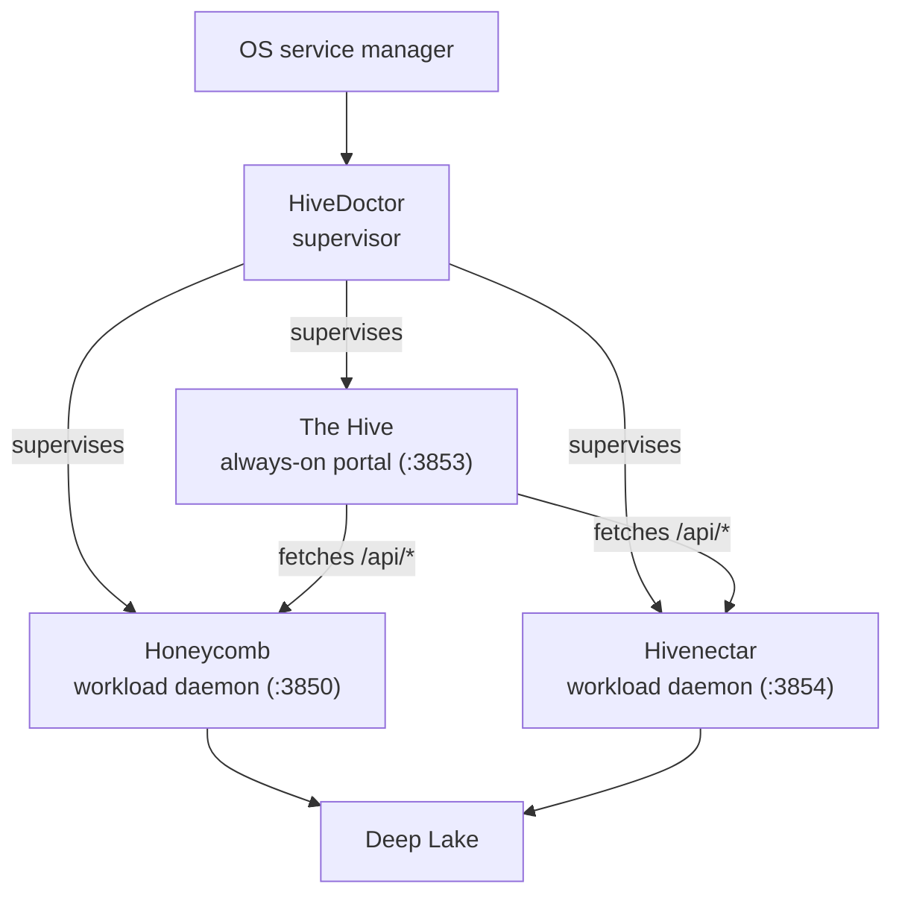

<!-- ───────────────────────────────  HERO  ─────────────────────────────── -->

<p align="center">
  <picture>
    <source media="(prefers-color-scheme: dark)" srcset="https://raw.githubusercontent.com/legioncodeinc/honeycomb/main/assets/logos/honeycomb-mark.svg">
    
  </picture>
</p>

<h1 align="center">The Hive</h1>

<p align="center">
  <strong>The always-on portal for the Apiary.</strong><br>
  One dashboard, up the moment your device boots, that shows every daemon in the hive even when a daemon is not.
</p>

<p align="center">
  
  
  
  <a href="https://deeplake.ai"></a>
  <a href="#license"></a>
</p>

<!-- ──────────────────────────────  PARTNERS  ────────────────────────────── -->

<p align="center">
  <a href="https://github.com/legioncodeinc">
    <picture>
      <source media="(prefers-color-scheme: dark)" srcset="https://raw.githubusercontent.com/legioncodeinc/honeycomb/main/assets/logos/legion-logo-dark.svg">
      
    </picture>
  </a>
  &nbsp;&nbsp;&nbsp;&nbsp;&nbsp;&nbsp;
  <a href="https://activeloop.ai"></a>
</p>

<p align="center"><sub>Part of <a href="https://github.com/legioncodeinc/the-apiary"><strong>The Apiary</strong></a> · a <a href="https://github.com/legioncodeinc"><strong>Legion Code</strong></a> &times; <a href="https://activeloop.ai"><strong>Activeloop</strong></a> collaboration · powered by <a href="https://deeplake.ai">Deep Lake</a></sub></p>

---

**The Hive** (`thehive`) is the always-on **portal daemon** of the [Apiary](https://github.com/legioncodeinc/the-apiary). It boots with your device, sits under [HiveDoctor](https://github.com/legioncodeinc/hivedoctor)'s supervision alongside the workload daemons, and serves one unified dashboard for the whole hive. It does the presenting; the workload daemons ([Honeycomb](https://github.com/legioncodeinc/honeycomb), [Hivenectar](https://github.com/legioncodeinc/hivenectar)) do the work.

Its one load-bearing property is in the name: it is *always on*. The dashboard shell renders the moment The Hive's socket is bound, before any workload daemon is confirmed healthy. A daemon that has not answered yet shows as "starting," never as a broken page. That is the whole reason The Hive is its own process instead of a route inside another daemon.

> **Status: early development.** This repository is greenfield. The design is settled (see [Design references](#design-references)) and implementation is about to begin. This README describes what The Hive is and the contracts it is being built to. Expect the build, CLI, and dashboard sections to fill in as the PRDs land.

---

## Why it exists

Before The Hive, the dashboard lived inside the Honeycomb daemon's HTTP server. That meant the dashboard was only up when Honeycomb was up: exactly when you most need a status surface (a workload daemon is wedged, mid-outage, or still booting) is exactly when it went dark.

The Hive lifts the dashboard into its own always-on process so it survives any single workload daemon's outage. It also splits the fast-moving dashboard surface away from the stability-sensitive supervisor: HiveDoctor stays minimal and rarely updated, while The Hive absorbs the UI that changes often. A dashboard change ships as a Hive release, never a supervisor release.

## Where it sits

The Hive is one of four roles in the Apiary's four-process topology. Two workload daemons do the memory work, The Hive presents it, and HiveDoctor supervises the set.



The Hive talks to the workload daemons over their HTTP APIs and never touches storage directly. Honeycomb and Hivenectar own their Deep Lake clients, tenancy scoping, and query surfaces; The Hive owns only the presentation and aggregation seam.

## The four binding decisions

The Hive's role is defined by four decisions from [ADR-0004](https://github.com/legioncodeinc/the-apiary/blob/main/hivenectar/library/knowledge/private/architecture/ADR-0004-thehive-portal-daemon-role-and-boundaries.md). They are what make The Hive a distinct architectural component rather than "another daemon that happens to serve HTTP."

1. **Always-on, boot-ordered.** The Hive is a supervised daemon in its own right, booted by the OS service manager on device start. It is not a child of any workload and is not gated on any workload's `/health`. The shell renders as soon as the socket binds; unanswered daemons render as "starting," not as errors.
2. **API aggregation, not direct Deep Lake.** The Hive holds no Deep Lake client, resolves no tenancy scope, and runs no queries. It fetches from each registered daemon's `/api/*` and aggregates the responses. The aggregation is fail-soft per daemon: if one daemon is unreachable, its panels render empty while the rest of the dashboard keeps working.
3. **Owns the unified dashboard.** Every dashboard route lives in The Hive, including the workload pages and the new Source Graph page. The Hive owns this surface outright: the dashboard code is copied into this repository and owned here (Honeycomb's in-daemon dashboard is retired), so there is no live shared module to drift and no fork to keep in sync.
4. **Independent update cadence.** The Hive ships on its own release train. A dashboard change does not require a HiveDoctor, Honeycomb, or Hivenectar release, and HiveDoctor's rare updates do not force a Hive redeploy.

## Runtime contract

These are the process facts every sibling daemon and installer is built against.

| Concern | Value | Notes |
|---|---|---|
| Port | `3853` | The next free port after HiveDoctor's status page (3852). Honeycomb is 3850, embeddings 3851, Hivenectar 3854. |
| Health | `GET http://127.0.0.1:3853/health` | Cheap liveness (`status` + `uptimeMs` + `version`), no heavy query, so HiveDoctor's probe gets a fast answer. |
| PID / lock | `~/.honeycomb/thehive.pid` · `~/.honeycomb/thehive.lock` | Single-instance guard, sibling to the other daemons' files under `~/.honeycomb`. |
| Supervision | HiveDoctor registry entry (`~/.honeycomb/hivedoctor.daemons.json`) | Installed at setup time as a one-step file edit; supervised at HiveDoctor's next boot. |
| Service unit | launchd (macOS) · systemd (Linux) · schtasks (Windows) | Starts The Hive on boot/login, restarts on crash, installed and removed independently of HiveDoctor. |

## How it relates to the rest of the Apiary

- **[Honeycomb](https://github.com/legioncodeinc/honeycomb)** is a workload daemon. The Hive renders its pages (memories, graph, sync, ROI, and more) by fetching Honeycomb's `/api/*`. Honeycomb no longer serves its own dashboard; that surface now lives here.
- **[Hivenectar](https://github.com/legioncodeinc/hivenectar)** is a workload daemon. The Hive renders its Source Graph page by fetching Hivenectar's `/api/source-graph/*`.
- **[HiveDoctor](https://github.com/legioncodeinc/hivedoctor)** supervises The Hive as one entry in its daemon registry: it probes The Hive's `/health`, restarts it on crash, and escalates when it cannot. The Hive supervises nothing; it is a supervised peer.

## Development

> Planned. The Hive is a TypeScript / Node (`>= 22`) daemon built on [Hono](https://hono.dev/), modeled on Honeycomb's daemon server shape. The dashboard is copied and owned from Honeycomb's `src/dashboard/web/` (route registry, page components, and the shell), with a Hive-owned `wire` client that routes each request to the owning daemon's API instead of an in-process handler.

```bash
# once the toolchain lands
npm install
npm run build      # tsc to dist/
npm run typecheck
npm test

# run the portal
npm start          # binds :3853, serves the dashboard
```

Until then, the runnable surface is defined by the PRDs below; verbs that invoke not-yet-built mechanics will exit with a clear "owned by PRD-NNN" notice rather than a silent stub.

## Design references

The design is recorded in the Apiary corpus (currently under the `hivenectar` submodule's `library/`).

- **[ADR-0003, three-daemon topology and thehive portal](https://github.com/legioncodeinc/the-apiary/blob/main/hivenectar/library/knowledge/private/architecture/ADR-0003-three-daemon-topology-and-thehive-portal.md)** - why the portal is split out of HiveDoctor into its own always-on daemon.
- **[ADR-0004, thehive portal daemon role and boundaries](https://github.com/legioncodeinc/the-apiary/blob/main/hivenectar/library/knowledge/private/architecture/ADR-0004-thehive-portal-daemon-role-and-boundaries.md)** - what The Hive is: the four binding decisions above.
- **[PRD-001, three-daemon topology](https://github.com/legioncodeinc/the-apiary/blob/main/hivenectar/library/requirements/backlog/prd-001-three-daemon-topology/prd-001-three-daemon-topology-index.md)** - the four-role contract and the locked port and path map.
- **[PRD-004c, thehive portal daemon](https://github.com/legioncodeinc/the-apiary/blob/main/hivenectar/library/requirements/backlog/prd-004-hivedoctor-registry-and-thehive/prd-004c-thehive-portal-daemon.md)** - bootstrap, dashboard serving, and the API-aggregation contract.
- **[PRD-004d, thehive service unit and registration](https://github.com/legioncodeinc/the-apiary/blob/main/hivenectar/library/requirements/backlog/prd-004-hivedoctor-registry-and-thehive/prd-004d-thehive-service-unit-and-registration.md)** - the OS service unit and how installers register The Hive with HiveDoctor.

## License

The Hive is licensed under the **GNU Affero General Public License v3.0 or later** ([AGPL-3.0-or-later](LICENSE)). Use it commercially or privately, free of charge; keep the copyright and license notices intact, and if you run a modified version as a network service you owe its source to its users.

---

<p align="center">
  <sub><strong>Built by <a href="https://github.com/legioncodeinc">Legion Code Inc</a></strong> · <strong>Powered by <a href="https://deeplake.ai">Activeloop Deep Lake</a></strong> · <strong>Built on <a href="https://github.com/activeloopai/hivemind">Hivemind</a></strong></sub><br>
  <sub>Part of <a href="https://github.com/legioncodeinc/the-apiary">The Apiary</a> · <a href="https://theapiary.sh">theapiary.sh</a></sub>
</p>
