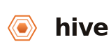
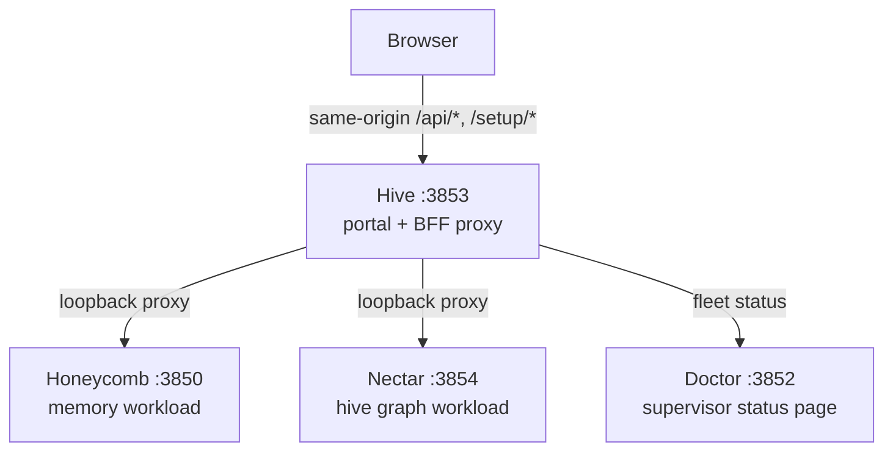

<!-- ───────────────────────────────  HERO  ─────────────────────────────── -->

<p align="center">
  <picture>
    <source media="(prefers-color-scheme: dark)" srcset="assets/brand/hive-wordmark-on-dark.svg">
    
  </picture>
</p>

<h1 align="center">Hive</h1>

<p align="center">
  <strong>The front door to your agents' shared brain.</strong><br>
  One URL, always on, and every daemon in the Apiary is standing behind it.
</p>

<p align="center">
  <a href="https://www.npmjs.com/package/@legioncodeinc/hive"></a>
  
  
</p>

<p align="center">
  <a href="https://linktr.ee/marioaldayuz"></a>
  <a href="https://www.legioncodeinc.com"></a>
  <a href="https://deeplake.ai"></a>
</p>

<p align="center">
  <a href="https://github.com/legioncodeinc/hive"></a>
  <a href="https://discord.gg/GX95YTQypQ"></a>
</p>

<!-- ──────────────────────────────  PARTNERS  ────────────────────────────── -->

<p align="center">
  <a href="https://github.com/legioncodeinc">
    <picture>
      <source media="(prefers-color-scheme: dark)" srcset="assets/brand/legion-logo-dark.svg">
      
    </picture>
  </a>
  &nbsp;&nbsp;&nbsp;&nbsp;&nbsp;&nbsp;
  <a href="https://github.com/activeloopai">
    <picture>
      <source media="(prefers-color-scheme: dark)" srcset="assets/brand/activeloop-full-mark-logo-on-dark.svg">
      
    </picture>
  </a>
</p>

<p align="center"><em>A <a href="https://github.com/legioncodeinc">Legion Code Inc.</a> × <a href="https://github.com/activeloopai">Activeloop</a> collaboration.</em></p>


The Apiary runs four daemons on your machine: Honeycomb doing the memory work, Nectar mapping your sources, Doctor watching all of them, and each one holding its own port. Great architecture. Miserable to look at. Which port was the dashboard again? Is my memory daemon even up, or did it die overnight? Why is my browser juggling origins and tokens for three separate loopback services just to render one status page?

**Hive is the answer to all of it.** One always-on portal daemon at `127.0.0.1:3853`. It boots with your device, renders the moment its socket binds, and serves the entire Apiary dashboard from a single origin. When a workload daemon has not answered yet, its panel says "starting," never a broken page. That failure mode is the whole reason Hive exists: the old dashboard lived inside Honeycomb, so exactly when you needed a status surface most was exactly when it went dark.


> **New here?** One command and you're on a dashboard. [Jump to Install](#-install-one-command). · **Want the docs?** Everything lives at **[theapiary.sh](https://theapiary.sh)**.


<table>
<tr>
<td width="50%" valign="top">

#### 🛹 For AI Augmented Devs
One URL for the whole stack. You bookmark `127.0.0.1:3853` and you're done: memories, graph, sync, hive graph, fleet health, all of it behind one front door. Zero port hunting, zero "which daemon serves that page," zero mental map of the loopback range required.

</td>
<td width="50%" valign="top">

#### 🏢 For Enterprise Teams
One origin, one boundary. The browser never sees a workload daemon's port or holds a credential for it; Hive's server proxies every request over loopback and passes auth headers straight through without storing a thing. Nothing sensitive lives in the browser, and no daemon owes the world a CORS allowance.

</td>
</tr>
</table>


## ✨ What makes Hive different

Plenty of tools bolt a status page onto a daemon. Hive is built the other way around: the portal is the product, and four deliberate decisions make it hold up.

- **A single portal.** Every dashboard route in the Apiary lives here. Honeycomb's in-daemon dashboard is retired; Hive is the one source of always-on UI truth.
- **Server-side BFF proxy.** Per [ADR-0002](library/knowledge/private/architecture/ADR-0002-server-side-bff-proxy-for-dashboard-federation.md), the browser talks to Hive's origin only. The server resolves which daemon owns each `/api/*` and `/setup/*` request, fetches it over loopback, and streams it back. No CORS on any workload daemon, no daemon ports handed to a browser, loopback trust enforced on the server with redirect pinning.
- **Copy-and-own dashboard.** Per [ADR-0001](library/knowledge/private/architecture/ADR-0001-retire-honeycomb-dashboard-and-copy-and-own-into-hive.md), the dashboard code was copied out of Honeycomb once and is owned here outright. No live shared module to drift, no fork to babysit, no second copy left to diverge from.
- **Always on.** Hive is its own supervised OS process, boot-ordered, not gated on any workload daemon's health. It ships on its own release train, so a dashboard change never forces a supervisor or workload release.


## 🐝 Features

- 🖥️ **The unified Apiary dashboard**, served from one process the moment the socket binds.
- 🔀 **Server-side BFF proxy** routing `/api/*` and `/setup/*` to the owning daemon: Honeycomb (`:3850`), Nectar (`:3854`), each resolved from Doctor's registry.
- 🌐 **Single browser origin.** Same-origin fetches only; your browser never learns another daemon's port.
- 🔒 **Credential-free by design.** Transparent auth pass-through; Hive stores no token and holds no Deeplake client.
- 🩹 **Fail-soft aggregation.** One daemon down means one panel shows unreachable while the rest of the dashboard keeps working.
- 🚦 **Fleet readiness via Doctor.** `/api/fleet-status` reads the supervisor's status page server-side, so the portal shows honest per-fleet health instead of guessing from failed fetches.
- ♻️ **Always-on daemon on `:3853`** with `/health`, a PID/lock single-instance guard, and OS service units (launchd, systemd, schtasks) that restart it on crash and start it on boot.
- 🩺 **Supervised by Doctor** through an idempotent registry entry, installed at setup time.


## 🚀 Install (one command)

Hive doesn't install alone; it comes up as part of the Apiary stack. One line, and the installer handles Node, npm, the daemons, and the watchdog.

```bash
# macOS / Linux
curl -fsSL https://get.theapiary.sh | sh
```

```powershell
# Windows (PowerShell)
irm https://get.theapiary.sh/install.ps1 | iex
```

That single line installs the whole Apiary: Honeycomb, Nectar, Doctor, and Hive, which comes up at **`127.0.0.1:3853`** and becomes the one address you ever need to remember. The terminal is just a progress log; the portal is the product.

<details>
<summary><strong>Prefer to build from source?</strong></summary>

```bash
git clone https://github.com/legioncodeinc/hive.git
cd hive
npm install
npm run build        # tsc + esbuild → dist/cli.js

npm start            # runs `node dist/cli.js start`, binds :3853
npm run typecheck    # tsc --noEmit
npm test             # vitest run
```

The portal aggregates its data from the other Apiary daemons over loopback, so a source build of Hive alone gets you the shell and fleet status; the full dashboard lights up when Honeycomb and friends are running.

</details>


## 🖥️ Using the dashboard

<!-- screenshot pending: drop hive dashboard capture into assets/screenshots/dashboard.png -->


Open `http://127.0.0.1:3853` and the shell renders immediately, even on a cold boot. While the fleet is still waking up you get a readiness splash with per-daemon health rows instead of a false "first time setup" screen. Once the fleet is ready, the full portal takes over: the memory pages, the graph, sync, and ROI views migrated from Honeycomb, plus fleet status pulled from Doctor. Every page hydrates through the same-origin wire, proxied server-side to whichever daemon owns the data.


## ⌨️ Using the CLI

The `hive` binary keeps a deliberately small surface. It's a portal daemon, not a Swiss Army knife:

```bash
hive start                # run the portal daemon on :3853 (the default verb)
hive install-service      # install the OS service unit (launchd / systemd / schtasks)
hive uninstall-service    # remove the service unit
hive register             # append Hive to Doctor's daemon registry
```

That's the whole list, on purpose. Day to day you never touch it; the installer wires the service unit and registration, Doctor keeps the process alive, and you live in the browser.


## ✨ Open one URL, see the whole hive

```bash
# One address. No port hunting, no tab juggling.
open http://127.0.0.1:3853

# Honeycomb up, Nectar up, Doctor watching, memories flowing.
# You just checked four daemons without remembering a single port number.
```

Kill a workload daemon mid-session and the dashboard doesn't blink: that daemon's panels go "unreachable," everything else keeps rendering, and the page recovers on its own when Doctor brings the daemon back. That's the moment this thing earns its keep.


## 🏗️ How it works

The browser talks to exactly one origin. Hive's server does the reaching around, over loopback, with the trust checks on its side of the line.



The browser never talks to the back daemons directly. Hive resolves each request's owner from Doctor's registry, guards every resolved base as loopback-only, pins redirects so a daemon can't bounce a proxied fetch off the machine, and forwards your session headers verbatim without keeping any credential of its own.


## 🧭 Why one front door matters

Here's the thing about a stack of loopback daemons: individually they're clean, collectively they're a chore. Four processes means four ports, and four ports means the knowledge of your own tooling lives in your head instead of in the product. Every "wait, which one was 3854" is a small tax, and small taxes compound.

One front door collapses that. Your credentials cross exactly one boundary, enforced by a server you control, instead of being sprayed across browser tabs that each talk to a different origin. Your bookmark bar holds one entry. When something breaks at 2 a.m., you don't run a mental port scan; you open the one page and the sick daemon is the red row.

And there's a quieter payoff: the stack starts feeling like one product. Honeycomb, Nectar, and Doctor stay sharply separated where it counts, in process boundaries and data ownership, while you experience them as a single coherent surface. Separation of concerns for the machine, one front door for the human. That's the trade Hive makes, and it's the right one.


## 🎛️ Other interfaces

Straight talk: Hive ships two surfaces, and that's it for now.

- **Dashboard.** The web portal at `http://127.0.0.1:3853`. This is the product.
- **HTTP portal API.** Hive's own loopback endpoints: `GET /health` for cheap liveness (status, uptime, version) and `GET /api/fleet-status` for fleet health, plus the proxied `/api/*` and `/setup/*` surfaces of the daemons behind it.

No MCP server, no SDK, and none pretending. The workload daemons own those surfaces; Hive owns the door.


<h2 align="center"><a href="https://ideas.theapiary.sh">📍 Status & Roadmap</a></h2>

Hive is **pre-release (v0.1.0)**. The portal daemon, the migrated dashboard, the server-side BFF proxy, and the service-unit plus registry work are in active development under PRD-001 and PRD-002, with the readiness splash, landing gate, and health rail lined up behind them. We document what's real and flag what's in flight; the roadmap and idea board live at [ideas.theapiary.sh](https://ideas.theapiary.sh).


## 🛠️ Development

```bash
npm install
npm run build        # tsc + esbuild → dist/cli.js
npm run typecheck    # tsc --noEmit
npm test             # vitest run
```

Node `>= 22`, TypeScript, Hono on the server, React on the dashboard. The proxy surface (header hygiene, redirect pinning, streaming) carries its own test coverage; keep it that way.


## 🙏 Credits

- **[Activeloop](https://activeloop.ai/)** brings **[Deeplake](https://deeplake.ai/)** (the versioned, multi-modal database for AI with native vector + columnar indexing and hybrid search) and **[Hivemind](https://github.com/activeloopai/hivemind)**, the open-source agent-memory project Honeycomb is built upon.
- **[Legion Code Inc](https://github.com/legioncodeinc)** brings the **multi-tier memory system** (Tier 1 / 2 / 3 keys, summaries, raw), **code base atlas memory architecture**, **auto healing service**, **session priming**, **automatic skill development & propagation**, the **pollinating loop**, the **knowledge graph**, **cross device cross repository cross team skill sharing**, and the daemon architecture that turns Deeplake into a shared brain your coding agents read and write on every turn.


## License

Hive is licensed under the **GNU Affero General Public License v3.0 or later** ([AGPL-3.0-or-later](LICENSE)).

Use it commercially or privately, free of charge. In return: keep the copyright and license notices intact, and if you modify it, your changes ship under the same AGPL license with source available. The "Affero" part is the point: run a modified version as a network service and you owe its source to the users who interact with it. No locking a fork behind a SaaS wall.

© 2026 Legion Code Inc.


<p align="center">
  <sub><strong>Built by <a href="https://github.com/legioncodeinc">Legion Code Inc</a></strong> · <strong>Powered by <a href="https://deeplake.ai/">Activeloop Deeplake</a></strong> · <a href="https://theapiary.sh/">theapiary.sh</a></sub>
</p>

<p align="center"><strong>I am Legion. We are Legion.</strong></p>

<p align="center">#vibewithlegion</p>
