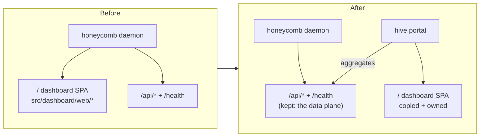

# ADR-0001, retire honeycomb's dashboard and copy-and-own it into hive

> **Status:** Active · **Date:** 2026-07-01
> **Supersedes:** none · **Refines:** nectar `ADR-0004` decision #3 (dashboard ownership + reuse mechanism)
> **Owners:** platform, hive, honeycomb
> **Related:** [`../../../requirements/backlog/prd-001-hive-portal-daemon/prd-001-hive-portal-daemon-index.md`](../../../requirements/backlog/prd-001-hive-portal-daemon/prd-001-hive-portal-daemon-index.md), [`../../../requirements/backlog/prd-001-hive-portal-daemon/prd-001b-dashboard-migration-and-copy-map.md`](../../../requirements/backlog/prd-001-hive-portal-daemon/prd-001b-dashboard-migration-and-copy-map.md), [nectar ADR-0003](../../../../../nectar/library/knowledge/private/architecture/ADR-0003-three-daemon-topology-and-hive-portal.md), [nectar ADR-0004](../../../../../nectar/library/knowledge/private/architecture/ADR-0004-hive-portal-daemon-role-and-boundaries.md)

## Context

The three-daemon topology (nectar [`ADR-0003`](../../../../../nectar/library/knowledge/private/architecture/ADR-0003-three-daemon-topology-and-hive-portal.md)) and hive's role (nectar [`ADR-0004`](../../../../../nectar/library/knowledge/private/architecture/ADR-0004-hive-portal-daemon-role-and-boundaries.md)) were recorded while hive was still framed as a package **inside the honeycomb repository**. ADR-0004's decision #3 said hive owns the unified dashboard and gets there by **reusing honeycomb's dashboard code by runtime import** (the route registry, the page components, the `wire` data-fetch abstraction), on the reasoning that a fork would diverge.

Two facts changed that make the reuse-by-import mechanism unworkable and force this decision:

1. **hive is now a first-class product in its own repository, `hive`** (a submodule of the Apiary umbrella, sibling to `honeycomb` and `nectar`), not a package inside honeycomb. A separate repository cannot import honeycomb's internal `src/dashboard/web/` module at runtime.
2. **honeycomb's dashboard is being retired.** hive becomes the single source of always-on UI truth (the whole point of ADR-0004's decision #1). Once honeycomb stops serving the dashboard, there is no live honeycomb dashboard module left to import.

Today the honeycomb dashboard is a React single-page app served by the honeycomb daemon. The daemon mounts it as an unprotected `/` route (`honeycomb/src/daemon/runtime/server.ts:108`, `{ path: "/", protect: false, session: false }`) alongside `/health` (`honeycomb/src/daemon/runtime/server.ts:319-341`) and the protected `/api/*` groups (`honeycomb/src/daemon/runtime/server.ts:73-107`). The SPA source lives under `honeycomb/src/dashboard/web/` (the route registry `honeycomb/src/dashboard/web/registry.tsx:196-218`, the `wire` client `honeycomb/src/dashboard/web/wire.ts`, `pages/*`, and the shell). When honeycomb is down, the dashboard is down: exactly the failure mode hive exists to survive.

This ADR records how the dashboard physically moves out of honeycomb and into hive.

## Decision drivers

- **hive and honeycomb are separate repositories.** A runtime `import` of honeycomb's `src/dashboard/web/` from hive is not available across a submodule boundary; only a network API (`/api/*`) crosses it.
- **honeycomb's dashboard-serving surface is being retired.** The reuse-by-import mechanism assumed a live honeycomb dashboard module to import; after retirement there is none.
- **The dashboard component layer must survive the move unchanged.** The pages are already origin-agnostic: each takes `PageProps` and hydrates through an injected `wire` (`honeycomb/src/dashboard/web/registry.tsx:10-22, 83-94`), so the same components render whether served by honeycomb or hive as long as `wire` is supplied.
- **Operators must never be dashboard-less during cutover.** honeycomb's `/` mount cannot be removed before hive is serving.

## Decision

Two coupled decisions.

### Decision A, retire honeycomb's dashboard-serving surface

honeycomb stops serving the dashboard. Its unprotected `/` SPA mount (`honeycomb/src/daemon/runtime/server.ts:108`) and the `honeycomb/src/dashboard/web/` subtree are retired from honeycomb. honeycomb **keeps** its data plane: `/health` (`honeycomb/src/daemon/runtime/server.ts:319-341`) and the protected `/api/*` groups (`honeycomb/src/daemon/runtime/server.ts:73-107`) remain, because hive aggregates them (per ADR-0004 decision #2). honeycomb also keeps its non-web ViewBlock/TUI dashboard layer (`honeycomb/src/dashboard/dashboard.ts`, `views.ts`, `html.ts`, `launch.ts`, `logs.ts`, `index.ts`, `CONVENTIONS.md`), which powers the `honeycomb dashboard` CLI and the Cursor webview and is out of scope for the web-portal move.

### Decision B, copy-and-own (not runtime import, not fork)

hive takes ownership of the dashboard by **copying** the `honeycomb/src/dashboard/web/` code into `hive` and owning it thereafter. It does not import honeycomb's module at runtime, and it does not maintain a live fork. Because Decision A retires honeycomb's copy, there is no second live copy to diverge from: this is a one-time ownership transfer paired with source retirement, not an ongoing dual-maintenance fork.

The file-by-file copy-map (dispositions, modifications, retirements) is owned by [`prd-001b-dashboard-migration-and-copy-map.md`](../../../requirements/backlog/prd-001-hive-portal-daemon/prd-001b-dashboard-migration-and-copy-map.md). In summary, of the 36 files under `honeycomb/src/dashboard/**`:

- **24 copy verbatim** to hive (12 `web/` shell/infra files + 12 `web/pages/` files; all origin-agnostic, hydrate through the injected `wire`).
- **4 copy with modification** (`wire.ts` moves from single-origin to federated aggregation, plus `app.tsx`, `main.tsx`, `setup-gate.tsx`).
- **1 copies partially** (`contracts.ts`, only the web-consumed ROI types that `wire.ts` imports at `honeycomb/src/dashboard/web/wire.ts:27`).
- **1 is net-new in hive** (the daemon-side Hono host that serves the bundle; honeycomb served it in-process, hive needs its own).
- **7 stay in honeycomb** (the ViewBlock/TUI layer named in Decision A).
- **28 `web/` files plus the `/` mount are deleted from honeycomb** (the retirement of Decision A).

## Consequences

**Positive.**

- hive can own and evolve the dashboard without a cross-repo import that a separate-repository build cannot satisfy.
- No dual-maintenance fork: honeycomb keeps no dashboard-serving copy, so there is nothing to keep in sync.
- honeycomb's data plane (`/api/*` + `/health`) is unchanged, so the API-aggregation contract (ADR-0004 decision #2) works unmodified.
- The component layer moves unchanged because the pages are already origin-agnostic (`PageProps` + injected `wire`).

**Negative.**

- A one-time copy transfers ~28 files into hive that hive now owns and maintains. Future honeycomb dashboard-component improvements do not automatically flow to hive, but Decision A means honeycomb no longer has a dashboard to improve, so this cost does not recur.
- A **cutover-sequencing constraint** appears: honeycomb must not drop its `/` mount until hive is serving the dashboard, or operators are momentarily dashboard-less. The safe order is: hive ships and serves, then honeycomb removes `/`.
- `contracts.ts` is split (web-consumed types copied to hive; the rest stays honeycomb-side), a small ongoing seam if the ROI view-model shapes change.

**Reversibility.** Moderate. The copy is a one-time operation; reverting would mean re-adding honeycomb's `/` mount and either re-importing or re-copying the components back. The API-aggregation half is untouched by this ADR, so a rollback of the copy does not disturb the data contracts.

## Alternatives considered and rejected

### Import honeycomb's dashboard module at runtime (REJECTED)

This is ADR-0004 decision #3's original mechanism. Rejected here because hive and honeycomb are separate repositories: hive cannot import honeycomb's internal `src/dashboard/web/` module at runtime across the submodule boundary, and Decision A retires that module anyway, so there would be nothing to import.

### Extract the dashboard into a shared package both repos import (REJECTED)

Rejected as disproportionate. It keeps one source of truth, but adds a third published package, a versioning surface, and release coordination between honeycomb and hive, for a component layer that honeycomb is retiring and will no longer consume. Copy-and-own removes the second consumer entirely, so the shared-package machinery has no second consumer to justify it.

### Rewrite the dashboard from scratch in hive (REJECTED)

Rejected because the existing dashboard is a working, mature surface (route registry, `wire`, pages, shell). A rewrite discards proven code and re-introduces bugs for no benefit; the pages are already origin-agnostic and move unchanged.

### Fork honeycomb's dashboard and keep both live (REJECTED)

This is the fork ADR-0004 already rejected, and it is rejected again for a stronger reason: Decision A retires honeycomb's copy, so "both live" is not even on the table. Copy-and-own is distinct from a fork precisely because only one live copy remains after the move.

## Relationship to the corpus ADRs

- **nectar `ADR-0003` (three-daemon topology):** unchanged. This ADR does not alter the topology, the four roles, or the process boundaries. hive is still the always-on portal, honeycomb and nectar are still workload daemons, doctor is still the supervisor.
- **nectar `ADR-0004` (hive role + boundaries):** decision #1 (always-on + boot order), decision #2 (API aggregation, not Deep Lake), and decision #4 (independent update cadence) are unchanged and still binding. This ADR **refines only the mechanism half of decision #3**: "hive owns the unified dashboard" stands; "gets there by reusing honeycomb's code via runtime import" is replaced by copy-and-own, because hive now lives in its own repository and honeycomb's dashboard is retired. ADR-0004 has been annotated with `Refined by:` pointers at the relevant anchors.

## References

- [`prd-001-hive-portal-daemon-index.md`](../../../requirements/backlog/prd-001-hive-portal-daemon/prd-001-hive-portal-daemon-index.md) - the module that implements Decisions A + B.
- [`prd-001b-dashboard-migration-and-copy-map.md`](../../../requirements/backlog/prd-001-hive-portal-daemon/prd-001b-dashboard-migration-and-copy-map.md) - the file-by-file copy-map summarized here.
- [nectar ADR-0003](../../../../../nectar/library/knowledge/private/architecture/ADR-0003-three-daemon-topology-and-hive-portal.md) - the topology this ADR leaves unchanged.
- [nectar ADR-0004](../../../../../nectar/library/knowledge/private/architecture/ADR-0004-hive-portal-daemon-role-and-boundaries.md) - the role ADR whose decision #3 mechanism this refines.
- `honeycomb/src/daemon/runtime/server.ts:73-108` - the `/api/*` groups and the `/` dashboard mount (retired by Decision A).
- `honeycomb/src/dashboard/web/registry.tsx:196-218` - the route registry copied into hive.
- `honeycomb/src/dashboard/web/wire.ts:27` - the ROI-type import that drives the `contracts.ts` partial copy.
