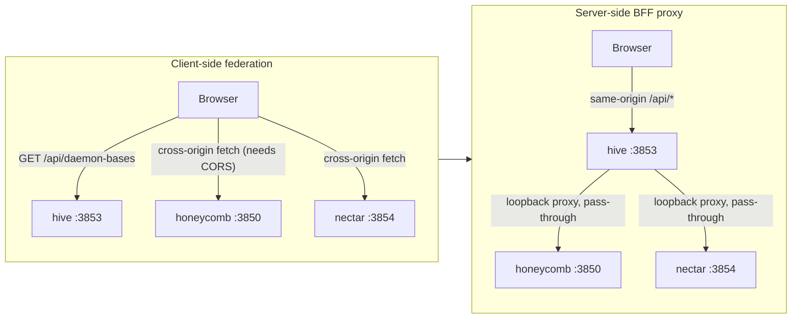

# ADR-0002, federate dashboard data server-side through a hive BFF proxy

> **Status:** Active · **Date:** 2026-07-01
> **Supersedes:** none · **Refines:** [`ADR-0001`](./ADR-0001-retire-honeycomb-dashboard-and-copy-and-own-into-hive.md) Decision B (the copied `wire`'s fetch mechanism) and nectar [`ADR-0004`](../../../../../nectar/library/knowledge/private/architecture/ADR-0004-hive-portal-daemon-role-and-boundaries.md) decision #2 (the aggregation MECHANISM, not the boundary)
> **Owners:** platform, hive, honeycomb
> **Related:** [`prd-001c-api-aggregation-wire.md`](../../../requirements/in-work/prd-001-hive-portal-daemon/prd-001c-api-aggregation-wire.md), [`ADR-0003`](./ADR-0003-future-sse-streaming-for-dashboard-freshness.md)

## Context

[`ADR-0001`](./ADR-0001-retire-honeycomb-dashboard-and-copy-and-own-into-hive.md) moved the dashboard SPA into hive (copy-and-own) and retired honeycomb's `/` mount. It left open HOW hive fetches each dashboard row from the daemon that owns it. The first implementation federated **client-side**: hive served a routing table at `GET /api/daemon-bases`, and the browser `wire` client fetched each workload daemon's origin directly (`http://127.0.0.1:3850` honeycomb, `http://127.0.0.1:3854` nectar) via a `buildFederatedUrl`/`createFederatedFetch` pair.

Client-side federation has two structural costs:

1. **It forces CORS onto every workload daemon.** A browser page served from hive's origin (`:3853`) issuing a JSON `POST` or a custom-header `GET` to honeycomb's origin (`:3850`) triggers a CORS preflight. honeycomb had to grow a dedicated CORS middleware (`honeycomb/src/daemon/runtime/middleware/dashboard-cors.ts`) with an origin allowlist just to let the browser read its own loopback data. Every future workload daemon would owe the same allowance.
2. **It exposes workload daemon ports to a browser context and pushes the loopback-trust boundary into the browser.** The browser learned every daemon's origin from `/api/daemon-bases` and had to re-validate that each base was loopback (`isLoopbackBaseUrl`) before trusting it, because the response (and the session/memory bodies the wire POSTs) could otherwise be redirected to an attacker-influenced origin. The trust check lived in the least-trusted tier.

The product intent (nectar [`ADR-0004`](../../../../../nectar/library/knowledge/private/architecture/ADR-0004-hive-portal-daemon-role-and-boundaries.md) decision #1) is that hive is the always-on single origin of UI truth. A client that reaches around hive to the workload daemons contradicts that framing.

## Decision

**hive federates dashboard data SERVER-SIDE, as a backend-for-frontend (BFF) proxy.**

- The browser talks to **hive's own origin only**. The copied `wire` client (`hive/src/dashboard/web/wire.ts`) fetches same-origin relative paths (`/api/*`, `/setup/*`, `/health`) exactly like honeycomb's original same-origin dashboard did. The client-side `buildFederatedUrl`/`createFederatedFetch`/`loadDaemonBases` federation and the `/api/daemon-bases` route are removed.
- hive's **server** owns federation. A proxy handler (`hive/src/daemon/proxy.ts`, mounted on `app.all("/api/*")` and `app.all("/setup/*")` in `hive/src/daemon/server.ts`) resolves the owning daemon per request from doctor's registry (`resolveEndpointOwner` + `resolveDaemonBases`), fetches that daemon over loopback, and streams the response back. hive's own routes (`/health`, `/api/fleet-status`) are registered ahead of the proxy so they win.
- **Auth is transparent pass-through.** The proxy forwards the browser's own request headers (session headers, and any auth) verbatim to the workload daemon and stores no credential of its own. This preserves honeycomb's existing loopback + local-mode + session-header posture and keeps team/hybrid auth working without hive becoming an auth authority. The `host` and hop-by-hop headers are stripped; `content-encoding`/`content-length` are dropped from the response (fetch already decoded the body).
- **SSRF stays a server-side guard.** `resolveDaemonBases` drops any non-loopback `healthUrl` from the registry and only ever returns loopback origins; the proxy re-checks the resolved base with `isLoopbackBaseUrl` and pins `redirect: "error"` so a workload daemon cannot 3xx-redirect the proxied fetch off loopback. The browser is out of the trust decision entirely.
- **honeycomb's dashboard CORS middleware is removed.** With the browser never issuing a cross-origin request to honeycomb, `dashboard-cors.ts` and its mount in `honeycomb/src/daemon/runtime/server.ts` are deleted.

Data freshness stays **polling** for now (the copied pages hydrate via `usePoll` same-origin, proxied). Moving to server-sent events is recorded as a future direction in [`ADR-0003`](./ADR-0003-future-sse-streaming-for-dashboard-freshness.md).

## Consequences

**Positive.**

- No workload daemon needs CORS. honeycomb's dashboard CORS middleware is deleted, and future workload daemons owe hive only a loopback `/api/*` surface, never a browser-facing CORS allowance.
- One browser origin. The dashboard is genuinely same-origin against hive, matching the always-on single-origin framing (nectar ADR-0004 decision #1).
- Smaller attack surface. Workload daemon ports are never handed to a browser context, and the loopback-trust decision lives on hive's server, the tier that already owns the registry.
- The pages are unchanged. Because honeycomb's dashboard pages were already origin-agnostic (they fetch relative paths through the injected `wire`), same-origin fetching is the pages' original mode; only the `wire`'s base resolution was removed.

**Negative.**

- hive is now on the data path for every dashboard read, not just the shell. If hive is down, the dashboard data is down. This is acceptable because hive is the always-on, doctor-supervised process whose entire purpose is to be up; a workload daemon being down still degrades fail-soft per source (the proxy returns a 502 the wire renders as an empty/unreachable panel).
- hive owns a small proxy surface (header hygiene, redirect pinning, streaming) that must stay correct. It is covered by `hive/tests/daemon/proxy.test.ts`.

**Reversibility.** Moderate. Reverting to client-side federation would mean restoring `/api/daemon-bases` + the federated `wire` and re-adding honeycomb's CORS middleware. The endpoint-to-owner routing table (`resolveEndpointOwner`) and the registry base resolution are shared by both mechanisms, so only the fetch location (browser vs hive server) changes.

## Alternatives considered and rejected

### Client-side federation (the prior mechanism, REJECTED)

The browser fetches each daemon's origin directly using a base table from `/api/daemon-bases`. Rejected for the two structural costs above: it forces CORS onto every workload daemon and pushes the loopback-trust boundary into the browser. It is the mechanism this ADR supersedes.

### hive holds a service credential and authenticates on the dashboard's behalf (REJECTED)

hive stores a local service token and injects it into every proxied request. Rejected as unnecessary: the daemons bind loopback and honeycomb's dashboard data is already reachable under the local-mode + session-header posture the browser sends. Transparent pass-through keeps hive credential-free, so an always-on portal process holds no secret to leak. This could be revisited if a workload daemon ever requires a token even for loopback local-mode reads.

### Keep client-side federation but relax honeycomb's CORS to a wildcard (REJECTED)

Rejected outright: a wildcard CORS allowance on a daemon that serves captured session/memory data is a security regression, and it does not address the port-exposure or trust-boundary problems.

## Relationship to the corpus ADRs

- **nectar [`ADR-0004`](../../../../../nectar/library/knowledge/private/architecture/ADR-0004-hive-portal-daemon-role-and-boundaries.md) decision #2 (API aggregation, not Deep Lake):** unchanged as a BOUNDARY. hive still holds no Deep Lake client and still fetches every row from the owning daemon's `/api/*`. This ADR refines only the MECHANISM: the aggregation happens on hive's server (a proxy) rather than in the browser.
- **[`ADR-0001`](./ADR-0001-retire-honeycomb-dashboard-and-copy-and-own-into-hive.md) Decision B (copy-and-own):** unchanged. hive still owns the copied dashboard. This ADR only changes how the copied `wire` reaches data: same-origin to hive, which proxies, instead of cross-origin to each daemon.

## References

- `hive/src/daemon/proxy.ts` - the server-side proxy handler this ADR introduces.
- `hive/src/daemon/server.ts` - mounts the proxy on `/api/*` and `/setup/*`; the `/api/daemon-bases` route is removed.
- `hive/src/dashboard/web/wire.ts` - the copied wire, now same-origin (client-side federation removed).
- `hive/src/shared/daemon-routing.ts` - `resolveEndpointOwner` (the routing table the proxy uses) and `isLoopbackBaseUrl` (the loopback guard).
- `hive/src/daemon/registry.ts` - `resolveDaemonBases`, the loopback-guarded base resolution from doctor's registry.
- `honeycomb/src/daemon/runtime/server.ts` - the honeycomb daemon whose CORS middleware is removed by this ADR (its `/api/*` + `/health` data plane is unchanged).
- [`prd-001c-api-aggregation-wire.md`](../../../requirements/in-work/prd-001-hive-portal-daemon/prd-001c-api-aggregation-wire.md) - the sub-PRD reconciled to this server-side model.
