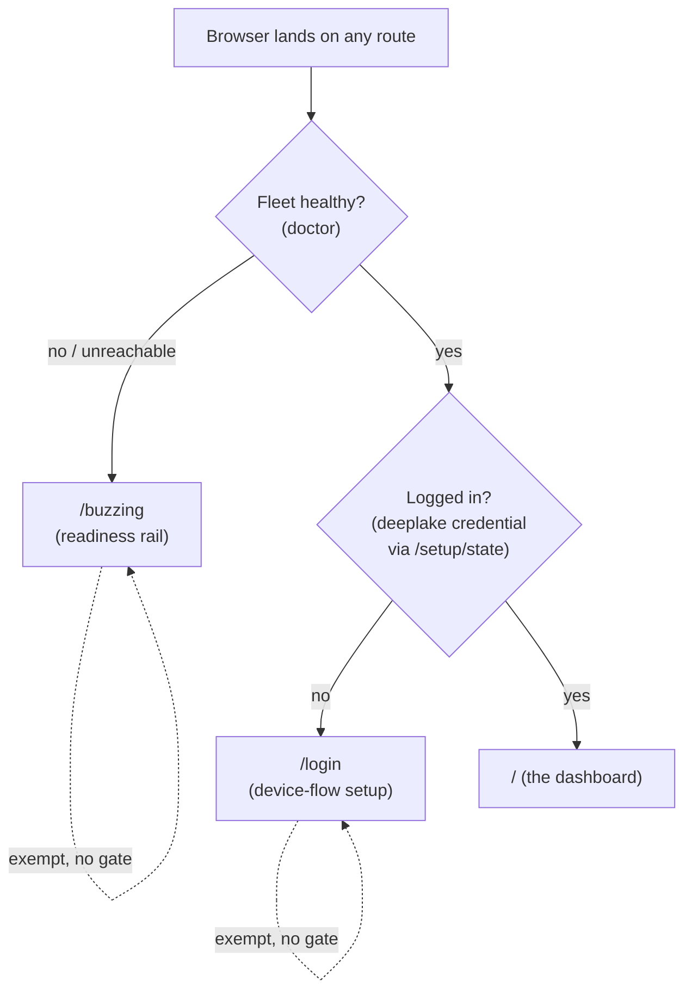

# ADR-0004, gate the portal landing on health-then-auth and serve path-based routes from hive

> **Status:** Active · **Date:** 2026-07-01
> **Supersedes:** honeycomb [`prd-070-first-browser-load-experience`](../../../../../honeycomb/library/requirements/archive/prd-070-first-browser-load-experience/prd-070-first-browser-load-experience-index.md), honeycomb [`prd-068-portal-daemon-boot-shell`](../../../../../honeycomb/library/requirements/archive/prd-068-portal-daemon-boot-shell/prd-068-portal-daemon-boot-shell-index.md) · **Refines:** [`ADR-0003`](./ADR-0003-future-sse-streaming-for-dashboard-freshness.md) (turns its proposed SSE into the health rail's live source)
> **Owners:** platform, hive
> **Related:** [`ADR-0001`](./ADR-0001-retire-honeycomb-dashboard-and-copy-and-own-into-hive.md), [`ADR-0002`](./ADR-0002-server-side-bff-proxy-for-dashboard-federation.md), [`ADR-0003`](./ADR-0003-future-sse-streaming-for-dashboard-freshness.md), [doctor ADR-0001](../../../../../doctor/library/knowledge/private/architecture/ADR-0001-hive-telemetry-transport-and-single-source-of-truth.md), [doctor ADR-0002](../../../../../doctor/library/knowledge/private/architecture/ADR-0002-service-registration-static-registry-plus-runtime-sqlite.md), [`prd-002-portal-readiness-splash`](../../../requirements/in-work/prd-002-portal-readiness-splash/prd-002-portal-readiness-splash-index.md)

## Context

[`ADR-0001`](./ADR-0001-retire-honeycomb-dashboard-and-copy-and-own-into-hive.md) moved the dashboard SPA into hive, and [`ADR-0002`](./ADR-0002-server-side-bff-proxy-for-dashboard-federation.md) made hive the single origin that serves the shell and proxies every `/api/*` and `/setup/*` read to the owning workload daemon. What neither ADR settled is what an operator sees the instant a browser lands on the portal, and how the URL space is shaped.

Today the landing behavior is entirely client-side and unconditional:

1. **Routing is hash-based.** `hive/src/dashboard/web/router.tsx` (`useHashRoute`, `routeFromHash`) resolves the active route from `location.hash`, and `hive/src/dashboard/web/registry.tsx` declares eight routes (`/`, `/projects`, `/harnesses`, `/memories`, `/graph`, `/sync`, `/logs`, `/roi`, `/settings`). The daemon host serves one shell for every load and never sees the fragment, so there is no server route per screen and no server-side decision about which screen is allowed.
2. **There is no `/login` route and no `/health` route in the SPA.** Boot instead flows through two nested React gates. `hive/src/dashboard/web/main.tsx` renders `<ReadinessSplash>` (PRD-002), which polls hive's own `GET /api/fleet-status` (a projection of doctor's fleet status) until the fleet is ready; it then mounts `<SetupGate>`, which polls the proxied honeycomb `GET /setup/state` and, on the `authenticated` bit, decides whether to show device-flow setup or the `<Shell>`.
3. **"Logged in" is credential presence, not a session.** There is no portal cookie or portal session. The `authenticated` bit that honeycomb's `/setup/state` returns is true exactly when a valid `~/.deeplake/credentials.json` exists. hive holds no credential of its own (it is a transparent pass-through proxy per ADR-0002).

Two structural problems follow from doing all of this in the SPA. First, the decision of what to show is made after the shell has already loaded and after React has mounted, so the wrong screen can flash before a gate resolves (the operator briefly sees a dashboard chrome that then swaps to a setup screen, or an empty panel before readiness resolves). Second, the URL is not authoritative: a deep link or refresh always re-runs the client gate from scratch, and nothing at the server tier can enforce that an unhealthy or logged-out visitor cannot reach a data screen. The gate lives in the least-authoritative tier.

Upstream, honeycomb's backlog carried this concern as [`prd-070-first-browser-load-experience`](../../../../../honeycomb/library/requirements/archive/prd-070-first-browser-load-experience/prd-070-first-browser-load-experience-index.md) (what the first browser load should show) and [`prd-068-portal-daemon-boot-shell`](../../../../../honeycomb/library/requirements/archive/prd-068-portal-daemon-boot-shell/prd-068-portal-daemon-boot-shell-index.md) (the boot shell). Both were framed while the portal still lived inside honeycomb. hive is now the always-on single origin of UI truth (ADR-0001, ADR-0002), so the first-load experience and the boot shell belong to hive, not honeycomb.

## Decision

**hive serves path-based routes and gates the landing decision on its own server, health first and auth second. The root URL `/` is the dashboard, and `/buzzing` and `/login` are the only gate-exempt screens.**

### The gate precedence

On landing on ANY route, hive's server evaluates a three-step precedence before it decides what to serve:

1. **If the fleet is not healthy, redirect to `/buzzing`.** "Not healthy" means doctor reports the required services unhealthy, or doctor is itself unreachable. Health is checked before anything else because an unhealthy fleet makes every other screen useless.
2. **Else if the user is not logged in, redirect to `/login`.** "Not logged in" means no valid `~/.deeplake/credentials.json`, determined via the proxied honeycomb `/setup/state` `authenticated` bit (the existing, shared source of truth, no new portal session).
3. **Else serve the requested route, defaulting to `/`, which IS the dashboard.** The root must never be blank and the dashboard is served at `/`, never at `/dashboard`.

`/buzzing` and `/login` are EXEMPT from the gate so the redirect can terminate and never loops:

- **`/buzzing` is the readiness screen.** The existing PRD-002 `ReadinessSplash` concept becomes this route. It reads the service registration and per-service health from doctor and renders a per-service loading state, so an operator watching a cold or degraded fleet sees exactly which service is not yet up.
- **`/login` renders the device-flow guided setup**, reusing honeycomb's existing `/setup/login` (proxied through hive per ADR-0002). It is the same device flow the current `<SetupGate>` drives, now addressable as its own path.

### Server-side, path-based, not client hash

Routes become real server-served paths and the gate is a server redirect, replacing the hash-router-plus-nested-React-gates model. The server is the authority: it decides `/buzzing` vs `/login` vs the requested route before the browser renders anything, so a logged-out or unhealthy visitor never receives dashboard chrome to flash. Deep links and refreshes hit the same authoritative decision, because the path (not a fragment the server never sees) carries the route.

### Health arrives live over SSE

Near-real-time health on the dashboard and on `/buzzing` now arrives via the doctor to hive server-sent-events stream rather than the interval poll of `/api/fleet-status`. This makes the future direction proposed in [`ADR-0003`](./ADR-0003-future-sse-streaming-for-dashboard-freshness.md) real for the health view-model: the health rail is the first concrete SSE-through-proxy consumer beyond the existing Logs tail, sourced from doctor's telemetry (doctor [`ADR-0001`](../../../../../doctor/library/knowledge/private/architecture/ADR-0001-hive-telemetry-transport-and-single-source-of-truth.md)) and its service registry (doctor [`ADR-0002`](../../../../../doctor/library/knowledge/private/architecture/ADR-0002-service-registration-static-registry-plus-runtime-sqlite.md)).

## Rationale

- **Root-is-dashboard.** A blank `/` is unacceptable for an always-on portal. The dashboard is the product, so it owns the root; `/buzzing` and `/login` are transient waystations the operator only sees when the fleet or the credential is not ready.
- **Health-before-auth.** An unhealthy fleet shows `/buzzing` even to a logged-out operator, because when nothing behind the portal will answer, prompting for login is pointless and misleading. Health is the precondition for auth to be meaningful, so it is checked first.
- **Reuse the Deep Lake credential, do not invent a portal session.** "Logged in" is already defined, shared, and observable through the proxied honeycomb `/setup/state` `authenticated` bit. Introducing a portal-specific session would create a second, divergent notion of authentication for hive to store and keep in sync, which contradicts the credential-free pass-through posture ADR-0002 established.
- **Server-side gate over a client hash-gate.** A server redirect is authoritative and cannot flash the wrong screen; a client gate necessarily loads the shell first and decides afterward. Putting the decision on hive's server (the tier that already owns the proxy and the doctor registry) keeps the trust and routing decision where the other authoritative decisions already live.

## Consequences

**Positive.**

- No wrong-screen flash. The operator's first paint is already the correct screen (`/buzzing`, `/login`, or the dashboard) because the server chose it before render.
- Deep links and refreshes are authoritative and refresh-safe against real paths, and the gate re-evaluates identically on every entry.
- One notion of "logged in" across the corpus: the Deep Lake credential, surfaced through the existing `/setup/state` bit. hive stays credential-free.
- The health view-model gets live freshness for free by consuming doctor's SSE stream, proving out the ADR-0003 direction on the screen that needs it most.

**Negative.**

- hive grows a server-side gate and per-route serving (redirect logic, exemptions, a catch-all that serves the shell for gated paths), more server surface than the four static routes the host serves today, and it must stay correct or it can wrongly trap an operator.
- The hash-router (`useHashRoute`) and the nested `ReadinessSplash` / `SetupGate` React gates are replaced by path routing plus the `/buzzing` and `/login` routes, a migration of the copied SPA's routing layer.
- hive now consumes a long-lived SSE connection for health with explicit reconnect and fail-soft, the added moving part ADR-0003 anticipated.

**Reversibility.** Moderate. The gate is server logic and the routes are additive; reverting to the client hash-gate would mean restoring `useHashRoute` as the sole router and moving the health/auth decision back into `ReadinessSplash` / `SetupGate`. The credential-presence definition of "logged in" and the doctor health source are unchanged by a rollback, so only the location and authority of the decision (hive server vs the browser) would move back.

## Alternatives considered and rejected

### Keep client-side hash routing and implement the gate in the SPA (REJECTED)

Leave `useHashRoute` as the router and let `ReadinessSplash` / `SetupGate` (or their successors) keep deciding health and auth in React. Rejected because a client gate loads the shell first and decides afterward, so it can flash the wrong screen, and it is not authoritative: nothing at the server tier enforces that an unhealthy or logged-out visitor cannot request a data screen. Server redirects are cleaner and cannot flash.

### Introduce a new portal session distinct from the Deep Lake credential (REJECTED)

Give hive its own session or cookie that represents "logged into the portal", separate from `~/.deeplake/credentials.json`. Rejected because it duplicates authentication: credential presence is the existing, shared source of truth that honeycomb already exposes via `/setup/state`, and a second notion would have to be stored by hive and kept in sync, breaking the credential-free pass-through posture of ADR-0002 for no gain.

## Relationship to the corpus ADRs

- **hive [`ADR-0002`](./ADR-0002-server-side-bff-proxy-for-dashboard-federation.md) (server-side BFF proxy):** unchanged and depended upon. The gate reads `/setup/state` and the health source through the same proxy this ADR does not modify; hive stays credential-free and the gate adds no cross-origin surface.
- **hive [`ADR-0003`](./ADR-0003-future-sse-streaming-for-dashboard-freshness.md) (future SSE):** this ADR turns its proposed direction into a concrete, Active consumer for the health view-model. ADR-0003 stays the general statement of the SSE-over-proxy pattern; this ADR realizes it for health first.
- **doctor [`ADR-0001`](../../../../../doctor/library/knowledge/private/architecture/ADR-0001-hive-telemetry-transport-and-single-source-of-truth.md) (telemetry source of truth + SSE):** the health the gate checks and the `/buzzing` rail renders originates here; hive consumes it, it does not author health.
- **doctor [`ADR-0002`](../../../../../doctor/library/knowledge/private/architecture/ADR-0002-service-registration-static-registry-plus-runtime-sqlite.md) (service registration):** the per-service registration `/buzzing` reads to show which services are up comes from doctor's registry.
- **honeycomb [`prd-070`](../../../../../honeycomb/library/requirements/archive/prd-070-first-browser-load-experience/prd-070-first-browser-load-experience-index.md) and [`prd-068`](../../../../../honeycomb/library/requirements/archive/prd-068-portal-daemon-boot-shell/prd-068-portal-daemon-boot-shell-index.md):** superseded. The first-browser-load experience and the portal boot shell they scoped for honeycomb move to hive, which is now the always-on single origin (ADR-0001, ADR-0002); this ADR is where that ownership and behavior are decided.

## References

- `hive/src/dashboard/web/router.tsx` - `useHashRoute` / `routeFromHash`, the client hash router this ADR replaces with server path routing.
- `hive/src/dashboard/web/registry.tsx` - the eight-route registry that gains `/buzzing` and `/login` and loses hash addressing.
- `hive/src/dashboard/web/main.tsx` - the boot entry that renders `<ReadinessSplash>` then `<SetupGate>`; the `ReadinessSplash` concept becomes the `/buzzing` route.
- `hive/src/daemon/proxy.ts` - the server proxy the gate reads `/setup/state` through and the SSE health stream rides over (ADR-0002).
- [`prd-002-portal-readiness-splash`](../../../requirements/in-work/prd-002-portal-readiness-splash/prd-002-portal-readiness-splash-index.md) - the readiness splash whose concept becomes `/buzzing`.
- [`prd-003-portal-landing-gate-and-routing`](../../../requirements/backlog/prd-003-portal-landing-gate-and-routing/prd-003-portal-landing-gate-and-routing-index.md), [`prd-004-buzzing-service-loaders`](../../../requirements/backlog/prd-004-buzzing-service-loaders/prd-004-buzzing-service-loaders-index.md), [`prd-005-health-rail-and-page`](../../../requirements/backlog/prd-005-health-rail-and-page/prd-005-health-rail-and-page-index.md) - the forthcoming PRDs that implement the gate, the `/buzzing` loaders, and the health rail and page.
