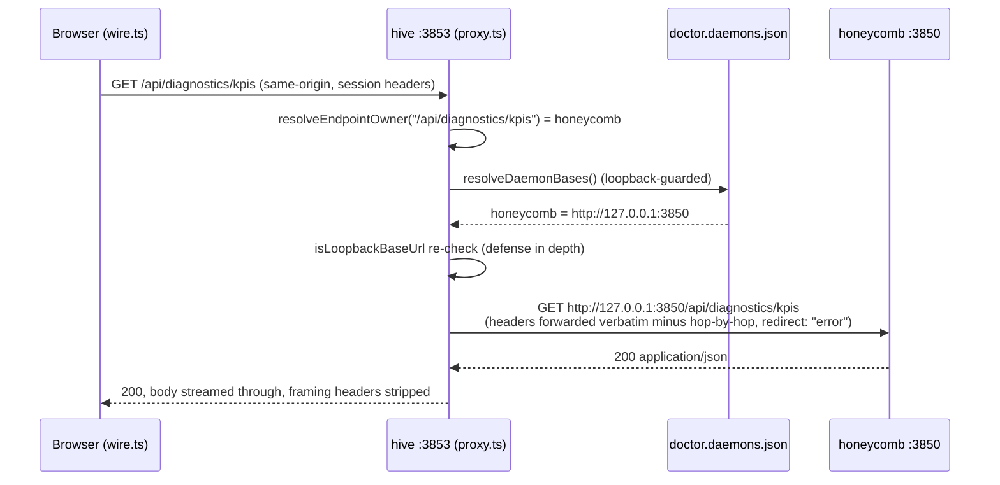

# BFF Proxy Federation

> Category: Architecture | Version: 1.0 | Date: July 2026 | Status: Active | Author: Mario Aldayuz

Read this if you touch `src/daemon/proxy.ts`, `src/daemon/registry.ts`, or `src/shared/daemon-routing.ts`: it explains how every dashboard read reaches the daemon that owns it without the browser ever leaving hive's origin.

**Related:**
- [system-overview.md](./system-overview.md)
- [landing-gate-and-routing.md](./landing-gate-and-routing.md)
- [../security/trust-boundaries.md](../security/trust-boundaries.md)
- [../frontend/dashboard-surface.md](../frontend/dashboard-surface.md)
- [ADR-0002](./ADR-0002-server-side-bff-proxy-for-dashboard-federation.md)
- [ADR-0003](./ADR-0003-future-sse-streaming-for-dashboard-freshness.md)
---

## The model

The browser talks to exactly one origin: `http://127.0.0.1:3853`. The copied `wire` client (`src/dashboard/web/wire.ts`) fetches only relative paths (`/api/*`, `/setup/*`, `/health`). Hive's server owns federation: `createApiProxy` (`src/daemon/proxy.ts`) is mounted with `app.all("/api/*")` and `app.all("/setup/*")` in `src/daemon/server.ts`, resolves which daemon owns each request, fetches it over loopback, and streams the response back.

This replaced the first implementation, which federated client-side: hive served a routing table at `GET /api/daemon-bases` and the browser fetched each workload daemon's origin directly. That model forced a CORS middleware onto honeycomb and handed every daemon's port to a browser context, with the loopback-trust check living in the least-trusted tier. ADR-0002 killed it. The `/api/daemon-bases` route and honeycomb's `dashboard-cors.ts` are gone; no workload daemon emits a CORS header for the dashboard today, and none ever needs to again.

## Target resolution

Ownership is a static routing rule plus a dynamic base lookup.

**The rule** lives in `src/shared/daemon-routing.ts`: nectar owns the hive-graph surface, honeycomb owns everything else.

```typescript
export const DEFAULT_DAEMON_BASES = Object.freeze({
  honeycomb: "http://127.0.0.1:3850",
  nectar: "http://127.0.0.1:3854"
} as const);

const HIVE_GRAPH_PREFIX = "/api/hive-graph";

export function resolveEndpointOwner(endpointPath: string): DaemonName {
  return endpointPath === HIVE_GRAPH_PREFIX || endpointPath.startsWith(`${HIVE_GRAPH_PREFIX}/`)
    ? "nectar"
    : "honeycomb";
}
```

**The bases** come from doctor's registry file. `resolveDaemonBases` (`src/daemon/registry.ts`) reads `~/.honeycomb/doctor.daemons.json`, zod-validates each entry, derives a base URL by stripping the `/health` suffix from the entry's `healthUrl`, and rejects any entry whose host is not loopback before it can become a base. A missing, unreadable, or corrupt registry degrades to the documented loopback defaults above; it never throws and never blocks hive from serving.

Three hive-owned routes are registered before the catch-all proxy so they win by registration order: `/health`, `/api/fleet-status`, `/api/registered-services`, and `/api/telemetry/stream`. Everything else under `/api/*` and `/setup/*` is proxied.

## A request end to end



If the fetch to honeycomb throws (connection refused, network error, blocked redirect), the proxy returns the fail-soft response instead of an exception:

```typescript
function unreachableResponse(daemon: DaemonName): Response {
  return new Response(JSON.stringify({ error: "unreachable", daemon }), {
    status: 502,
    headers: { "content-type": "application/json" }
  });
}
```

## Transparent auth pass-through

Hive forwards the browser's own request headers verbatim to the workload daemon and stores no credential of its own. There is no token minting, no session store, no injected authorization header anywhere in `src/`; the proxy's only header work is subtraction. This preserves honeycomb's existing loopback + local-mode + session-header posture (including the `x-honeycomb-project` scope header the wire sends) without hive becoming an auth authority. "Logged in" for the portal is honeycomb's `/setup/state` `authenticated` bit, which itself just reflects the presence of `~/.deeplake/credentials.json`; hive reads it, never writes it.

Header hygiene is two fixed strip sets in `proxy.ts`. Requests drop `host` (fetch re-derives it from the target) plus the RFC 7230 hop-by-hop headers and `content-length` (recomputed from the forwarded body). Responses drop the hop-by-hop set plus `content-encoding`/`content-length`, because fetch already decompressed the upstream body before hive re-streams it, so the original framing headers would lie.

Bodies are asymmetric by design: the request body is buffered (`await incoming.arrayBuffer()`, small JSON payloads, avoids the `duplex: "half"` dance), while the response body is streamed through (`new Response(upstream.body, ...)`) so SSE tails and large payloads never accumulate in hive's memory.

## Fail-soft aggregation

One dead daemon never blanks the portal. The guarantee is layered:

1. **Per-request**: the proxy converts every upstream failure into the 502 `{ error: "unreachable", daemon }` JSON above. No exception crosses into Hono's error path.
2. **Per-panel**: `wire.ts` parses every payload through a zod schema per endpoint and degrades a non-2xx or malformed response to a typed empty/zero state. A dead nectar means the Hive Graph page shows its empty state while every honeycomb-backed panel keeps rendering, and vice versa.
3. **Per-registry**: a corrupt or missing registry file falls back to default loopback bases rather than taking the proxy down.

`tests/daemon/proxy.test.ts` and `tests/wire/fail-soft.test.ts` pin all three layers.

## Why no CORS on workloads

Same-origin is not just tidier; it is the security posture. A CORS allowance on a daemon that serves captured session and memory data is an attack surface that has to be maintained forever and audited on every new daemon. With the BFF model the browser never issues a cross-origin request, so the question never arises: workload daemons owe hive a loopback `/api/*` surface and nothing else. Every future daemon inherits this for free by registering with doctor; the proxy routes to it the day `resolveEndpointOwner` learns its prefix.

## SSRF posture

The proxy is the one place in the fleet where a server fetches URLs influenced by a file on disk, so it is defended in depth:

- `baseUrlFromHealthUrl` rejects non-loopback registry entries before they can become bases (a tampered `doctor.daemons.json` cannot point the proxy off-machine).
- The proxy re-checks the resolved base with `isLoopbackBaseUrl` immediately before use, so a future refactor of base resolution cannot silently remove the guard.
- Every proxied fetch pins `redirect: "error"`, so a compromised loopback listener cannot 3xx-redirect the request (and its forwarded body) to an external origin after the initial URL passed the loopback check. The same pin exists in `fleet-status.ts`, `setup-auth.ts`, and `telemetry-proxy.ts`.

The trusted hostname set is exactly `127.0.0.1`, `localhost`, `::1`, `[::1]` (`LOOPBACK_HOSTNAMES` in `src/shared/daemon-routing.ts`). See [../security/trust-boundaries.md](../security/trust-boundaries.md) for the full boundary picture.

## Freshness

Data freshness is polling for the copied pages (`usePoll` through the proxy) and SSE for the health surface (`/api/telemetry/stream`, the same-origin relay of doctor's `fleet-telemetry` stream). ADR-0003 records the intent to generalize SSE beyond health and logs when the real-time benefit justifies the added moving parts; the proxy already streams response bodies, so a `text/event-stream` response rides through unchanged, which the Logs tail (`/api/logs/stream`) proves in production today.
