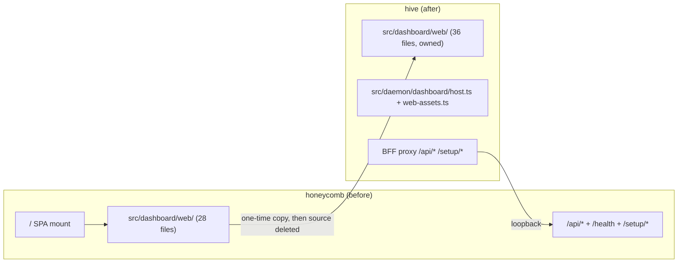

# Copy-And-Own Provenance: Where The Dashboard Came From

> Category: Architecture | Version: 1.0 | Date: July 2026 | Status: Active | Author: Mario Aldayuz

Read this if you need to know which hive file came from which honeycomb file, what was changed in transit, and why there is deliberately no shared package or fork to keep in sync.

**Related:**
- [system-overview.md](./system-overview.md)
- [../frontend/dashboard-surface.md](../frontend/dashboard-surface.md)
- [../../../requirements/in-work/prd-001-hive-portal-daemon/prd-001b-dashboard-migration-and-copy-map.md](../../../requirements/in-work/prd-001-hive-portal-daemon/prd-001b-dashboard-migration-and-copy-map.md)
- [ADR-0001](./ADR-0001-retire-honeycomb-dashboard-and-copy-and-own-into-hive.md)
- [ADR-0002](./ADR-0002-server-side-bff-proxy-for-dashboard-federation.md)
---

## The story in one paragraph

Nectar ADR-0004 originally said hive would reuse honeycomb's dashboard "by runtime import". Two facts killed that mechanism: hive became its own repository (you cannot import another repo's internal module at runtime across a submodule boundary), and honeycomb's dashboard was being retired anyway (there would be nothing left to import). Hive ADR-0001 replaced the mechanism with two coupled decisions: honeycomb stops serving the dashboard (Decision A), and hive copies the `honeycomb/src/dashboard/web/` subtree once and owns it outright (Decision B). Because the source copy was deleted in the same program, this is an ownership transfer, not a fork. There is exactly one live dashboard codebase, and it lives here.

## What was copied, what was adapted, what was retired

Of the 36 files that lived under `honeycomb/src/dashboard/**` at cutover:

- **24 copied verbatim**: the origin-agnostic shell/infra files and the page components. They were already portable because every page takes `PageProps` and hydrates through an injected `wire` client; nothing in them knew which daemon served the bundle.
- **4 copied with modification**: `wire.ts` (federation model changed, see below), `app.tsx`, `main.tsx`, `setup-gate.tsx` (boot and gating model changed).
- **1 copied partially**: `contracts.ts`. Hive took only the web-consumed ROI view-model types that `wire.ts` imports; the daemon-side contract machinery stayed in honeycomb.
- **2 adapted daemon-side files**: honeycomb served the bundle in-process; hive needed its own Hono host. `host.ts` and `web-assets.ts` were adapted rather than copied clean.
- **7 stayed in honeycomb**: the ViewBlock/TUI dashboard layer (`dashboard.ts`, `views.ts`, `html.ts`, `launch.ts`, `logs.ts`, `contracts.ts`, `index.ts` plus `CONVENTIONS.md`), which powers the `honeycomb dashboard` CLI and is out of scope for the web portal.

## Concrete file mapping

Verified against both trees. Honeycomb's `src/dashboard/web/` no longer exists (deleted at cutover, Wave 5 of the PRD-001 execution ledger); the honeycomb paths below are the pre-deletion sources.

| honeycomb source | hive destination | Disposition |
|---|---|---|
| `src/dashboard/web/registry.tsx` | `src/dashboard/web/registry.tsx` | Verbatim, later extended (path routes, `/health`, `/hive-graph`) |
| `src/dashboard/web/router.tsx` | `src/dashboard/web/router.tsx` | Verbatim at copy; rewritten by PRD-003c (hash to path) |
| `src/dashboard/web/sidebar.tsx`, `page-frame.tsx`, `panels.tsx`, `primitives.tsx`, `scope-context.tsx`, `needs-project.tsx`, `folder-picker.tsx`, `harness-strip.tsx`, `build-graph-button.tsx`, `graph-layout.ts` | same paths under `src/dashboard/web/` | Verbatim |
| `src/dashboard/web/pages/*.tsx` (dashboard, projects, harnesses, memories, graph, sync, logs, roi, roi-chart, settings, coming-soon, lifecycle-panel) | `src/dashboard/web/pages/*.tsx` | Verbatim |
| `src/dashboard/web/wire.ts` | `src/dashboard/web/wire.ts` | Modified: single-origin, then briefly client-federated, now same-origin against hive's BFF proxy (ADR-0002) |
| `src/dashboard/web/app.tsx` | `src/dashboard/web/app.tsx` | Modified: hive shell concerns (health rail mount, path router) |
| `src/dashboard/web/main.tsx` | `src/dashboard/web/main.tsx` | Modified: boot entry, now a pure path-keyed screen lookup (`boot-route.ts`) |
| `src/dashboard/web/setup-gate.tsx` | `src/dashboard/web/setup-gate.tsx` | Modified: the nested React gate became the `/login` screen (`LoginScreen`) |
| `src/dashboard/contracts.ts` | `src/dashboard/contracts.ts` | Partial: web-consumed ROI types only |
| `src/daemon/runtime/dashboard/host.ts` | `src/daemon/dashboard/host.ts` | Adapted: serves at `/` not `/dashboard`; shell catch-all split out for the gate |
| `src/daemon/runtime/dashboard/web-assets.ts` | `src/daemon/dashboard/web-assets.ts` | Adapted: font route prefix `/fonts/`, bundle name `app.js` |
| `assets/styles.css`, `assets/tokens/*`, `assets/logos/honeycomb-memory-cluster.svg` | `assets/` (same relative layout) | Copied |
| `src/shared/lifecycle-flags.ts`, `src/shared/memory-types.ts` | `src/shared/` | Copied so two verbatim pages (`settings.tsx`, `memories.tsx`) keep their relative imports byte-identical |

`tests/dashboard/copy-map.test.ts` pins the completeness claim mechanically: it counts exactly 36 files under `src/dashboard/web/` and asserts the presence of every shell/infra file by name. The count grew from the original 28 copied files because hive has since added its own natives: `buzzing-screen.tsx`, `service-icons.tsx`, `use-fleet-telemetry.ts`, `health-rail.tsx`, `boot-route.ts`, `pages/health.tsx`, `pages/hive-graph.tsx`, `hive-graph-projection.ts`. Those are hive-born, not copied; the test comments mark which is which.

## What honeycomb retired

At cutover honeycomb deleted, in one wave, everything that made it a dashboard server:

- The unprotected `/` SPA mount in `honeycomb/src/daemon/runtime/assemble.ts` (the local-mode block now mounts only the setup API routes: `/setup/login`, `/setup/state`, `/setup/migrate-from-hivemind`).
- The 28-file `src/dashboard/web/` subtree, `src/daemon/runtime/dashboard/host.ts`, and `web-assets.ts`.
- The dashboard-web bundle entry in `honeycomb/esbuild.config.mjs`.
- The dashboard CORS middleware (removed by ADR-0002 once the browser stopped issuing cross-origin requests to honeycomb at all).

Honeycomb kept its entire data plane: `/health`, every `/api/*` group, and the setup routes, because hive proxies all of them. It also kept the non-web TUI dashboard layer. `honeycomb install` and its `openDashboard` helper now point operators at `http://127.0.0.1:3853/`.

The cutover sequencing constraint in ADR-0001 (hive must serve before honeycomb drops `/`, so operators are never dashboard-less) was honored: hive's Waves 1-4 landed and were verified before the honeycomb deletion wave ran.

## Auditing the provenance yourself

The claims above are mechanically checkable, and you should re-check them after any large refactor rather than trusting this doc:

```bash
# The copy-map completeness pin (fails if a file is added/removed without updating the map):
npx vitest run tests/dashboard/copy-map.test.ts

# Honeycomb no longer has a web dashboard tree (expect: no such directory):
ls ../honeycomb/src/dashboard/web

# Honeycomb kept its TUI layer and data plane (expect: dashboard.ts, views.ts, html.ts, ...):
ls ../honeycomb/src/dashboard

# Hive holds no Deep Lake client (expect: no matches):
grep -ri "deeplake" src --include="*.ts" -l | grep -v "shared/fleet-telemetry"
```

The last check has one legitimate near-miss: `fleet-telemetry.ts` mentions Deep Lake because doctor's telemetry carries per-service Deep Lake connection stats that the health page renders. Rendering another daemon's stats is not holding a client.

## The divergence policy going forward

There is no sync obligation, because there is nothing to sync with. Honeycomb has no web dashboard; future dashboard improvements happen in hive and only in hive. Three seams remain and are the whole maintenance contract:

1. **`contracts.ts` ROI shapes.** Hive carries a partial copy of honeycomb's view-model types. If honeycomb changes an ROI view-model shape, hive's zod schemas in `wire.ts` degrade fail-soft (empty state, never a React throw), but the copy should be updated deliberately. This is the one place a honeycomb change can silently stale a hive type.
2. **The wire endpoint contract.** `wire.ts` validates what honeycomb's and nectar's `/api/*` routes actually return. Endpoint changes on a workload daemon are API contract changes and get coordinated like any API change, not like shared UI code.
3. **`src/shared/fleet-telemetry.ts`** is a hand-kept copy of doctor's SSE wire shape (doctor `src/telemetry/schema.ts`, Contract C in the execution ledger). Keep it in lockstep if doctor's schema ever changes; the parse is zod-defensive either way.

Everything else in the copied tree is hive's to refactor without asking anyone.


