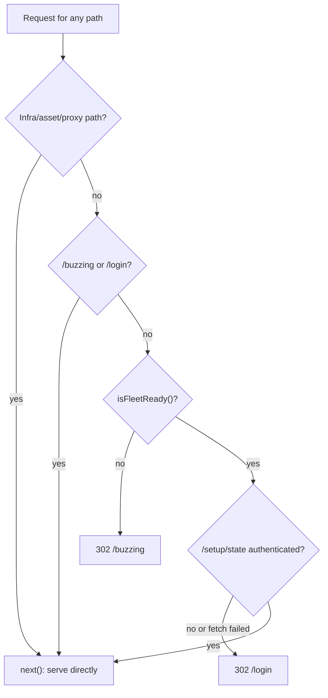

# Landing Gate And Routing

> Category: Architecture | Version: 1.0 | Date: July 2026 | Status: Active | Author: Mario Aldayuz

Read this if you touch `src/daemon/gate.ts`, `src/daemon/server.ts` route registration, or the client boot path: it explains the health-first-auth-second gate, the exact route table, and the redirect semantics.

**Related:**
- [system-overview.md](./system-overview.md)
- [bff-proxy-federation.md](./bff-proxy-federation.md)
- [../frontend/buzzing-and-health-rail.md](../frontend/buzzing-and-health-rail.md)
- [../security/trust-boundaries.md](../security/trust-boundaries.md)
- [../../../requirements/backlog/prd-003-portal-landing-gate-and-routing/prd-003-portal-landing-gate-and-routing-index.md](../../../requirements/backlog/prd-003-portal-landing-gate-and-routing/prd-003-portal-landing-gate-and-routing-index.md)
- [ADR-0004](./ADR-0004-portal-landing-gate-and-path-based-routing.md)
---

## What changed and why

The copied dashboard originally routed from `location.hash` and made its landing decision in React: `main.tsx` mounted `ReadinessSplash` (poll fleet status), which mounted `SetupGate` (poll `/setup/state`), which finally mounted the `Shell`. The server served one shell for every load and never saw the fragment, so nothing authoritative decided what a visitor was allowed to see, and the wrong screen could flash while a client gate resolved.

ADR-0004 moved the decision to the server and made the URL real. Routes are paths, the gate is a Hono middleware registered ahead of every route, and the browser's first paint is already the correct screen. The nested `ReadinessSplash`/`SetupGate` client gates are retired; `main.tsx` now does one pure lookup (`resolveBootScreen` in `src/dashboard/web/boot-route.ts`) from `location.pathname` to a top-level screen and never re-derives health or auth client-side.

## The gate precedence

`createPortalGate` (`src/daemon/gate.ts`) is registered first (`app.use("*", ...)`) and evaluates, for every non-exempt page navigation:

1. **Health first.** `fetchFleetStatus` reads doctor's `GET http://127.0.0.1:3852/status.json` server-side and `isFleetReady()` decides. Not ready means `302` to `/buzzing`. Auth is never even evaluated in this branch: an unhealthy fleet makes a login prompt pointless and misleading.
2. **Auth second.** `fetchSetupAuthenticated` (`src/daemon/setup-auth.ts`) resolves honeycomb's base the same way the proxy does, fetches `GET /setup/state` over loopback, and reads its `authenticated` bit. `false`, or any failure at all (network error, non-OK, bad JSON, schema mismatch, abort), means `302` to `/login`. This fails closed: a transient fault sends you to `/login`, never into the dashboard.
3. **Serve.** Healthy and authenticated: the middleware calls `next()` and the routes behind it serve the request. `/` is the dashboard; the root is never blank.

The readiness rule is one shared predicate, so "healthy" means the same thing to the gate, the `/buzzing` screen's dismissal poll, and anything else that asks:

```typescript
export const V1_REQUIRED_PEERS = ["honeycomb"] as const;

export function isFleetReady(status: FleetStatusResponse): boolean {
  if (status.supervisor !== "reachable") return false;
  if (status.health !== "ok") return false;
  return V1_REQUIRED_PEERS.every((name) =>
    status.daemons.some((daemon) => daemon.name === name && daemon.health === "ok")
  );
}
```

`degraded` blocks exactly like `unreachable`; only `ok` passes. Nectar is not yet a required peer (it joins when a shipped page depends on it); its row is display-only.



## Exemptions: screens vs infra

Two kinds of path bypass the precedence, for two different reasons.

**Exempt screens** (`GATE_EXEMPT_ROUTES = ["/buzzing", "/login"]`): checked before the precedence so they are always served directly. This is the loop-termination proof: the only two redirect targets are themselves exempt from producing another redirect, so the gate can never bounce a browser in a cycle.

**Exempt infra**: paths that are not page navigations at all.

- Fixed assets: `/app.js`, `/styles.css`, `/honeycomb-memory-cluster.svg`. The exempt screens are the same SPA bundle, so the bundle must load even for a visitor the gate just redirected.
- Prefixes: `/api/`, `/setup/`, `/fonts/`. Data-plane traffic belongs to the BFF proxy, which handles its own requests untouched; gating it would break same-origin `/setup/*` flows and add a redirect surface to an API.
- `/health`, conditionally: see below.

**The `/health` double duty.** `/health` is both hive's machine-liveness probe (doctor polls it; monitoring polls it) and the operator-facing health page in the SPA. The gate and `server.ts` make the identical content-negotiation call: a request whose `Accept` header includes `text/html` is a page navigation (gated, served the SPA shell); anything else is a probe (bypasses the gate, gets the liveness JSON `{ status, uptimeMs, version }`). The two code paths cite each other so they stay in lockstep.

## Redirect semantics

Every redirect the gate issues is a `302` to a hard-coded literal, `/buzzing` or `/login`. No `?next=` parameter, no `Referer` echo, no request path reflected anywhere. There is structurally no code path where attacker-influenced input reaches `c.redirect`, which is the whole open-redirect defense: it is not validated away, it is absent. The auth fetch is also tied to the incoming request's abort signal (`c.req.raw.signal`), so a client disconnect aborts the upstream `/setup/state` call instead of pinning it, and an abort reads as fail-closed.

Once `/buzzing` observes readiness it hard-navigates to `/` rather than swapping screens client-side, so the server gate re-evaluates health and auth on a fresh request and routes the operator to the dashboard or `/login`, whichever the now-current state calls for.

## The full route table

Registration order in `createHive` (`src/daemon/server.ts`) is the authority; Hono serves the first matching handler.

| Order | Route | Handler | Gated? |
|---|---|---|---|
| 1 | `*` (middleware) | `createPortalGate` | is the gate |
| 2 | `GET /app.js`, `GET /styles.css`, `GET /honeycomb-memory-cluster.svg`, `GET /fonts/:name` | `mountDashboardAssets` (host.ts) | no (infra) |
| 3 | `GET /health` | liveness JSON, or the SPA shell when `Accept` includes `text/html` | probe: no; page: yes |
| 4 | `GET /api/fleet-status` | `fetchFleetStatus` projection of doctor's status page | no (`/api/` prefix) |
| 5 | `GET /api/registered-services` | `resolveRegisteredServiceNames` from doctor's registry file | no |
| 6 | `GET /api/telemetry/stream` | `createTelemetryStreamHandler`, the SSE relay of doctor's `/events` | no |
| 7 | `ALL /api/*`, `ALL /setup/*` | `createApiProxy` (BFF, honeycomb or nectar) | no |
| 8 | `GET *` | `mountDashboardShellFallback`: the SPA shell for every page path | yes |

The shell catch-all serves one byte-identical shell for every authorized path (`/`, `/projects`, `/harnesses`, `/memories`, `/graph`, `/hive-graph`, `/sync`, `/logs`, `/health`, `/roi`, `/settings`, plus `/buzzing`, `/login`, and any unknown deep link). The bundle self-hydrates from `location.pathname`: `resolveBootScreen` mounts `BuzzingScreen`, `LoginScreen`, or the `Shell`, and inside the shell `usePathRoute` (`router.tsx`) plus `matchRoute` (`registry.tsx`) resolve the specific page, with unknown paths falling back to the Dashboard entry rather than a blank screen. Client navigation uses `history.pushState` and a broadcast `hive:pathchange` event; there is no react-router and no new dependency.

## Implementation status

PRD-003 (gate, `/login` device-flow screen, hash-to-path migration) is implemented on main and covered by `tests/daemon/gate.test.ts`, `tests/dashboard/boot-route.test.ts`, `tests/dashboard/router.test.tsx`, and `tests/dashboard/login-screen.test.tsx`. The `/buzzing` content (PRD-004) and the health rail and `/health` page (PRD-005) are also implemented on main; see [../frontend/buzzing-and-health-rail.md](../frontend/buzzing-and-health-rail.md) for the paperwork caveat (the PRD folders still sit in `library/requirements/backlog/` with no QA close-out recorded).
