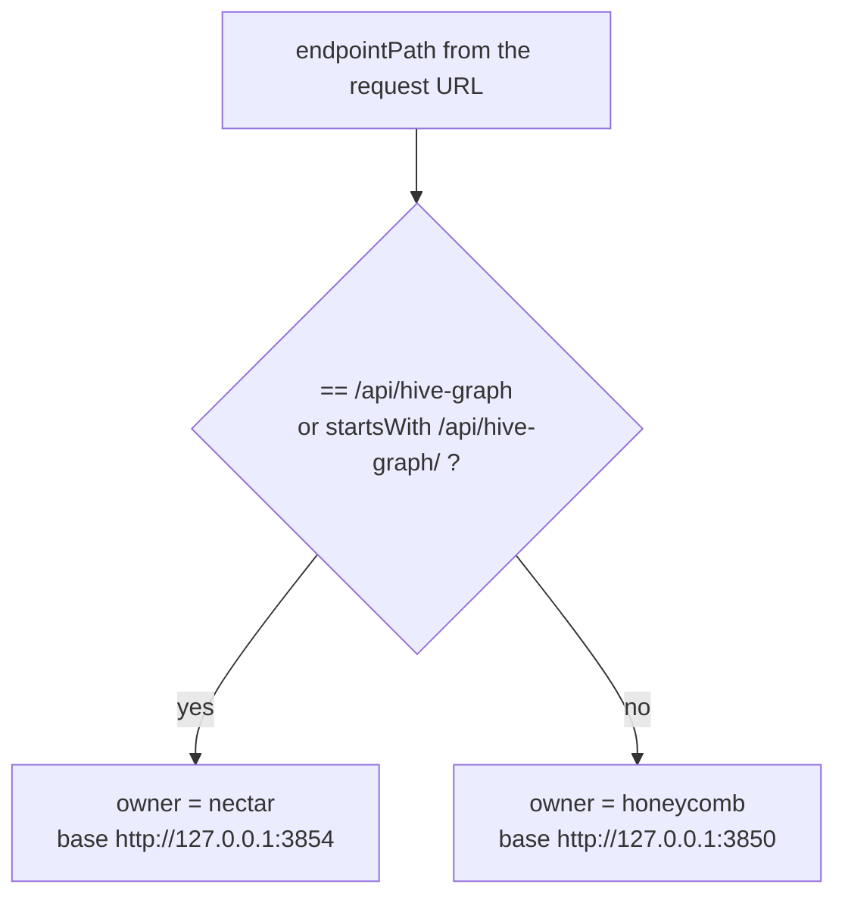

# Shared Contracts And Routing

> Category: Architecture | Version: 1.0 | Date: July 2026 | Status: Active | Author: Mario Aldayuz

Read this if you touch anything under `src/shared/`, or if you need to know how a URL path becomes a decision about which daemon owns it: this is the contract layer every other hive module builds on, and the place the fleet-wide pinned contracts land in hive.

**Related:**
- [system-overview.md](./system-overview.md)
- [bff-proxy-federation.md](./bff-proxy-federation.md)
- [landing-gate-and-routing.md](./landing-gate-and-routing.md)
- [copy-and-own-provenance.md](./copy-and-own-provenance.md)
- [../frontend/fleet-telemetry-client.md](../frontend/fleet-telemetry-client.md)
- [../integrations/workload-endpoint-inventory.md](../integrations/workload-endpoint-inventory.md)
- [ADR-0002](./ADR-0002-server-side-bff-proxy-for-dashboard-federation.md)
- [ADR-0004](./ADR-0004-portal-landing-gate-and-path-based-routing.md)
---

## Why a shared layer exists at all

`src/shared/` is the set of modules that both the node server and the browser bundle import. That dual-consumption is the whole reason the directory is separate: `constants.ts` pins the port that `server.ts` binds and that `wire.ts` never needs to know, `service-status.ts` derives the same five bee states whether the SSE model or the coarse REST row produced the signal, and `fleet-telemetry.ts` is a hand-kept copy of doctor's wire shape that has to compile in a browser and in Node. Nothing here reaches for `node:fs` or the DOM, because a module that both sides import cannot depend on either side's runtime.

The layer is also where the fleet's three pinned cross-daemon contracts surface inside hive. The superproject's `library/ledger/EXECUTION_LEDGER.md` pins Contracts A, B, and C in writing so honeycomb, nectar, and hive could all build against them in parallel without waiting on doctor's code to exist. Hive consumes two of the three: Contract A (the extended registry entry) through `registry.ts`, and Contract C (the doctor-to-hive SSE event shape) through `fleet-telemetry.ts`. Contract B (the per-service SQLite schema) is doctor's and each workload's business; hive only ever sees its projection arrive over Contract C.

## The routing rule: one prefix, two daemons

Every dashboard read has exactly one owning daemon, and the ownership rule is a single function in `src/shared/daemon-routing.ts`. Nectar owns the hive-graph surface; honeycomb owns everything else.

```typescript
const HIVE_GRAPH_PREFIX = "/api/hive-graph";

export function resolveEndpointOwner(endpointPath: string): DaemonName {
  return endpointPath === HIVE_GRAPH_PREFIX || endpointPath.startsWith(`${HIVE_GRAPH_PREFIX}/`)
    ? "nectar"
    : "honeycomb";
}
```

`DaemonName` is `keyof typeof DEFAULT_DAEMON_BASES`, and the default bases are the only two workload daemons hive proxies to:

```typescript
export const DEFAULT_DAEMON_BASES = Object.freeze({
  honeycomb: "http://127.0.0.1:3850",
  nectar: "http://127.0.0.1:3854"
} as const);
```

This is a deliberately blunt rule. There is no per-endpoint registry, no wildcard table, no config file: a path is nectar's if and only if it is `/api/hive-graph` or begins with `/api/hive-graph/`, and honeycomb's otherwise. Adding a third workload daemon means teaching `resolveEndpointOwner` one more prefix and adding one more base; the proxy, the gate, and the wire all inherit the routing for free because they all call this one function.



## The loopback trust boundary lives here

`daemon-routing.ts` also owns the one hostname allow-list the whole server tier defends against SSRF with. The trusted set is exactly four names:

```typescript
const LOOPBACK_HOSTNAMES = new Set(["127.0.0.1", "localhost", "::1", "[::1]"]);

export function isLoopbackBaseUrl(baseUrl: string): boolean {
  try {
    return LOOPBACK_HOSTNAMES.has(new URL(baseUrl).hostname);
  } catch {
    return false;
  }
}
```

Every server-side fetch in the codebase (the proxy, the gate's auth check, the fleet-status fetch, the SSE relay) re-checks its resolved target with `isLoopbackBaseUrl` immediately before firing. A URL that does not parse returns `false`, so a garbage base fails closed. The rationale is documented right in the source: hive forwards request bodies that can carry captured session and memory content, so a base that points off-machine would be an exfiltration primitive. `normalizeBaseUrl` and `normalizeDaemonBases` round out the module, trimming trailing slashes and filling absent daemons from the defaults so downstream code always sees a complete `DaemonBases` record. The full boundary picture is in [../security/trust-boundaries.md](../security/trust-boundaries.md); this module is where the predicate itself is defined.

## Constants: the pins with no env override

`src/shared/constants.ts` is short on purpose. The host, port, and doctor URLs are hard-pinned literals with no environment-variable path, which is a security decision as much as a simplicity one: there is no operator surface that can move the listener off loopback or point the relay at another host.

```typescript
export const HIVE_HOST = "127.0.0.1" as const;
export const HIVE_PORT = 3853 as const;
export const HIVE_VERSION = packageJson.version;
export const DOCTOR_STATUS_URL = "http://127.0.0.1:3852/status.json" as const;
export const DOCTOR_EVENTS_URL = "http://127.0.0.1:3852/events" as const;
export const HONEYCOMB_HOME_DIR = join(homedir(), ".honeycomb");
export const HIVE_PID_PATH = join(HONEYCOMB_HOME_DIR, "hive.pid");
export const HIVE_LOCK_PATH = join(HONEYCOMB_HOME_DIR, "hive.lock");
```

`HIVE_VERSION` reads straight off `package.json`, so the liveness probe, the telemetry payload, and the release guard all report one number. `HONEYCOMB_HOME_DIR` is the shared `~/.honeycomb` directory hive co-locates its state in; the full on-disk story is in [../operations/on-disk-footprint.md](../operations/on-disk-footprint.md).

## Fleet readiness: one predicate, three callers

`src/shared/fleet-readiness.ts` defines what "the fleet is ready" means, and it means the same thing to the landing gate, the `/buzzing` dismissal poll, and any future caller. The predicate is strict: the supervisor must be reachable, doctor's coarse health must be exactly `ok`, and every required peer must report `ok`.

```typescript
export const V1_REQUIRED_PEERS = ["honeycomb"] as const;

export function isFleetReady(status: FleetStatusResponse): boolean {
  if (status.supervisor !== "reachable") return false;
  if (status.health !== "ok") return false;
  return V1_REQUIRED_PEERS.every((name) =>
    status.daemons.some((daemon) => daemon.name === name && daemon.health === "ok")
  );
}
```

`degraded` blocks exactly like `unreachable`; only `ok` passes. Nectar is not in `V1_REQUIRED_PEERS`, so a down nectar does not send an operator to `/buzzing`; its row is display-only until a shipped page hard-depends on it. `FleetStatusResponse` is a discriminated union on `supervisor`: the reachable arm carries `health`, a `daemons` array, and `asOf`; the unreachable arm carries only an empty `daemons` tuple, which is the fail-soft shape `fetchFleetStatus` returns when doctor cannot be reached. That derivation happens in `src/daemon/fleet-status.ts`; readiness is defined in shared so both server and any client consumer agree on it.

## Service status: the five-state derivation

`src/shared/service-status.ts` turns a raw health signal into one of five locked bee states, and it is source-agnostic by construction. Both the rich SSE `FleetServiceModel` and the coarse REST daemon row normalize into the same `ServiceSignal` first, so the same condition always yields the same state regardless of which feed reported it.

```typescript
export const SERVICE_STATES = ["error", "degraded", "starting", "warming", "active"] as const;
export type ServiceState = (typeof SERVICE_STATES)[number];

export interface ServiceSignal {
  readonly health: FleetHealth;                        // "ok" | "degraded" | "unreachable" | "unknown"
  readonly lastSeen: string | null;                    // ISO-8601, null on the coarse REST feed
  readonly telemetryFault: TelemetryFaultReason | null; // "missing" | "locked" | "malformed" | "read-error"
}

export function deriveServiceState(input: ServiceDerivationInput): ServiceState;
export function nextFirstActiveAt(health: FleetHealth, previous: number | null, now: number): number | null;
```

The rule order inside `deriveServiceState` is: no signal at all is `starting`; a per-service telemetry fault is `degraded` (isolated, never contagious); `unreachable` health or a `lastSeen` staler than the stale window is `error`; `degraded` health is `degraded`; `unknown` health is `starting`; `ok` is `warming` inside the grace window and `active` after it. The function is per-service by construction: it never reads a sibling's state, which is exactly what makes "one bad service flips only its own tile" a property rather than a promise. The consuming UI (the `/buzzing` tiles, the health rail, the `/health` page) is documented in [../frontend/fleet-telemetry-client.md](../frontend/fleet-telemetry-client.md) and [../frontend/buzzing-and-health-rail.md](../frontend/buzzing-and-health-rail.md).

## Fleet telemetry: Contract C, hand-kept

`src/shared/fleet-telemetry.ts` is hive's copy of doctor's `src/telemetry/schema.ts`, the SSE wire shape pinned as Contract C. Hive does not depend on the doctor npm package (each fleet member is its own package), so this module is a browser-and-server-safe hand-kept copy that must stay in lockstep if doctor's schema ever changes. It exports the shape and a defensive parser:

```typescript
export const FLEET_TELEMETRY_EVENT_NAME = "fleet-telemetry" as const;

export interface FleetTelemetryEvent {
  readonly asOf: string;
  readonly services: readonly FleetServiceModel[];
  readonly logs: readonly FleetLogEntry[];
}

export function parseFleetTelemetryEvent(raw: string): FleetTelemetryEvent | null;
```

The load-bearing design choice is that `metrics` is typed `Readonly<Record<string, number>>`, not a fixed shape. Honeycomb ships three counters (`actionsTaken`, `filesProcessed`, `memoriesCreated`) and nectar ships five (`filesRegistered`, `nectarsMinted`, `descriptionsGenerated`, `hiveGraphVersions`, `embeddingsComputed`), and nothing in hive hardcodes either set. Every reader is schema-tolerant, so a workload can add a counter and hive's `/health` page renders it with no code change. `parseFleetTelemetryEvent` returns `null` on anything malformed rather than throwing, so one bad SSE frame never crashes the consuming hook. `FleetServiceModel` carries `name`, `health`, `lastSeen`, `metrics`, a nullable `deeplake` block, and a nullable `telemetryFault`; `FleetLogEntry` is `{ service, ts, level, message }`, and the event's `logs` field is a bounded slice of only the rows new since the previous tick, never a history.

## Copied contract types

Two shared modules exist purely so that copied-verbatim pages keep their imports byte-identical. `src/shared/lifecycle-flags.ts` and `src/shared/memory-types.ts` came over from honeycomb with the dashboard so that `settings.tsx` and `memories.tsx` did not have to be edited on copy; they are part of the copy-and-own transfer documented in [copy-and-own-provenance.md](./copy-and-own-provenance.md). They are contract-shaped (enumerations and record types the pages branch on) rather than behavioral, and they carry no server logic.

## The maintenance contract

The shared layer has exactly one standing obligation to another repo: `fleet-telemetry.ts` mirrors doctor's `schema.ts` (Contract C), so if doctor's SSE shape changes, this copy must be updated deliberately. The parse is zod-defensive either way, so a drift degrades to empty rather than crashing, but a silently stale copy would drop fields the UI could otherwise render. Everything else in `src/shared/` is hive's own and moves only when hive's own code moves. `tests/shared/service-status.test.ts` and `tests/shared/fleet-telemetry.test.ts` pin the derivation and the parse; `tests/wire/federation.test.ts` pins `resolveEndpointOwner`'s ownership split.
