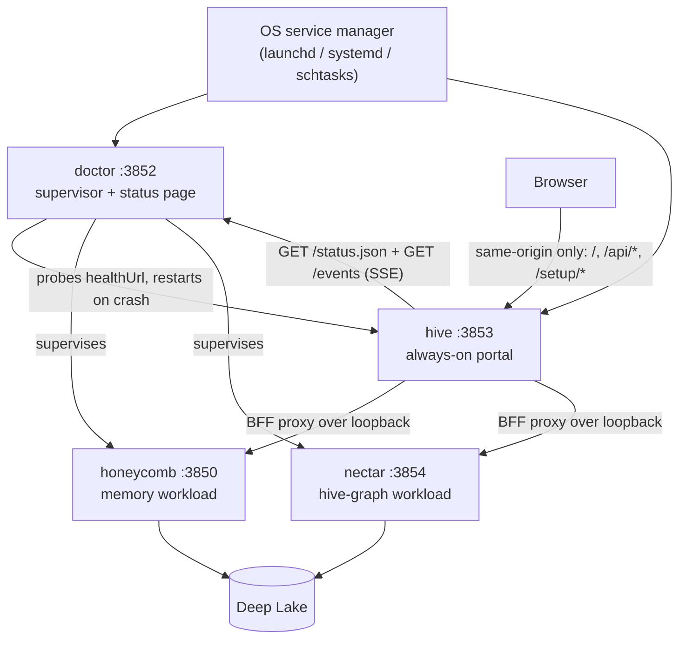

# Hive System Overview

> Category: Architecture | Version: 1.0 | Date: July 2026 | Status: Active | Author: Mario Aldayuz

Read this first if you work on any part of hive: it explains why the portal daemon exists, where it sits in the Apiary fleet, and what happens from OS boot to a rendered dashboard.

**Related:**
- [copy-and-own-provenance.md](./copy-and-own-provenance.md)
- [bff-proxy-federation.md](./bff-proxy-federation.md)
- [landing-gate-and-routing.md](./landing-gate-and-routing.md)
- [doctor-registration-and-lifecycle.md](./doctor-registration-and-lifecycle.md)
- [../frontend/dashboard-surface.md](../frontend/dashboard-surface.md)
- [ADR-0001](./ADR-0001-retire-honeycomb-dashboard-and-copy-and-own-into-hive.md)
- [ADR-0002](./ADR-0002-server-side-bff-proxy-for-dashboard-federation.md)
- [ADR-0004](./ADR-0004-portal-landing-gate-and-path-based-routing.md)
---

## Why hive exists

The Apiary runs four daemons on one machine: honeycomb (the memory workload, `:3850`), nectar (the hive-graph workload, `:3854`), doctor (the supervisor, status page on `:3852`), and hive (the portal, `:3853`). Before hive, the dashboard lived inside honeycomb. That put the status surface inside the process most likely to be the thing you are trying to diagnose. When honeycomb was down, the dashboard was down, which is exactly when an operator needs it most.

Hive fixes that failure mode with a velocity/stability split. Doctor is the "can't-crash" watchdog: zero runtime dependencies, updated rarely, deliberately boring. The portal is the opposite: it is UI, it changes often, and it must never force a supervisor release. So the dashboard gets its own always-on daemon with its own release train. Doctor supervises hive like any other daemon, but a dashboard change ships as a hive release and touches nothing else. That split is nectar ADR-0004 decision #4, and it is the reason hive is a separate repository and a separate npm package (`@legioncodeinc/hive`, version 0.1.0).

The second reason is origin consolidation. Four daemons means four loopback ports, and the browser should not have to know any of them except one. Hive is the single origin of UI truth: the browser bookmarks `http://127.0.0.1:3853`, and hive's server reaches every other daemon over loopback on its behalf. No CORS on workloads, no port hunting, no credential in the browser beyond what honeycomb's own session posture already sends. Mario Aldayuz designed hive around that one bet: the portal is the product, not a status page bolted onto a daemon, so it gets a process, a gate, and a proxy built for exactly that job.

## Fleet position



Hive holds no Deep Lake client and persists nothing of its own beyond a PID/lock pair and a telemetry dedupe ledger. Every row the dashboard renders comes from a workload daemon's API (proxied server-side) or from doctor's status page and SSE stream. `tests/wire/*` and the PRD-001 QA audit both verify the no-Deep-Lake constraint.

## The four decisions that shape the codebase

1. **Copy-and-own the dashboard** (hive ADR-0001). The React SPA was copied out of honeycomb once, honeycomb's copy was deleted, and hive owns the code outright. No shared package, no fork, no drift. See [copy-and-own-provenance.md](./copy-and-own-provenance.md).
2. **Server-side BFF proxy** (hive ADR-0002). The browser talks to hive's origin only. `src/daemon/proxy.ts` resolves the owning daemon per request from doctor's registry and forwards over loopback with transparent auth pass-through. See [bff-proxy-federation.md](./bff-proxy-federation.md).
3. **Health-first, auth-second landing gate** (hive ADR-0004). `src/daemon/gate.ts` runs ahead of every route: unhealthy fleet redirects to `/buzzing`, logged-out operator redirects to `/login`, everything else falls through to the requested path. See [landing-gate-and-routing.md](./landing-gate-and-routing.md).
4. **Doctor is the single health source** (doctor ADR-0001, hive ADR-0003). Hive never probes workload `/health` endpoints itself. It reads doctor's `status.json` for the gate and relays doctor's `fleet-telemetry` SSE stream to the browser at `/api/telemetry/stream`. See [../frontend/buzzing-and-health-rail.md](../frontend/buzzing-and-health-rail.md).

## Lifecycle: boot to dashboard

Hive boots with the device and serves immediately. Nothing about a workload daemon's health delays the socket bind.

1. **OS start.** The service unit (`com.legioncode.hive` on macOS, `hive.service` user unit on Linux, the `hive` Scheduled Task on Windows) runs `node <cli.js> start` at boot/login and restarts it on crash. `hive install-service` writes the unit; see [doctor-registration-and-lifecycle.md](./doctor-registration-and-lifecycle.md).
2. **Single-instance lock.** `startHive()` (`src/daemon/server.ts`) calls `acquireSingleInstanceLock()` (`src/lock.ts`), which creates `~/.honeycomb/hive.lock` with the `wx` flag and writes `~/.honeycomb/hive.pid`. A live lock holder makes the second start exit with `DaemonAlreadyRunningError`; a stale lock (dead PID) is reclaimed.
3. **Bind `127.0.0.1:3853`.** The Hono app serves the shell the moment the socket binds. The constants are hard-pinned in `src/shared/constants.ts`:

```typescript
export const HIVE_HOST = "127.0.0.1" as const;
export const HIVE_PORT = 3853 as const;
export const DOCTOR_STATUS_URL = "http://127.0.0.1:3852/status.json" as const;
export const DOCTOR_EVENTS_URL = "http://127.0.0.1:3852/events" as const;
```

4. **Doctor supervision.** Doctor probes `http://127.0.0.1:3853/health` every 30 seconds (the registry entry hive's installer wrote) and restarts the process if it stops answering. Registration happened at install time, not at boot; boot does not touch the registry.
5. **First browser load.** The landing gate evaluates health then auth and serves `/buzzing`, `/login`, or the requested page. A cold fleet shows per-service bee tiles on `/buzzing`, never a false "first time setup" screen. That failure mode and its fix are the subject of [../frontend/portal-readiness-splash.md](../frontend/portal-readiness-splash.md) and its successor screens.

There is no runtime env configuration for host or port. The only env vars hive reads are the telemetry opt-outs (`HONEYCOMB_TELEMETRY=0`, `DO_NOT_TRACK`); everything else is injectable only through code options, which is a test seam, not an operator surface.

## Provenance and the rename

Hive began life as "the-hive", a planned package inside the honeycomb repository (nectar ADR-0003/ADR-0004 era). Two things changed: hive became a first-class product in its own repository, and honeycomb's dashboard was retired rather than shared. The rename left one visible scar the code still handles: the pre-decision-#32 OS service names (`thehive`, `thehive.service`) are deregistered best-effort at the start of every `install-service` run (`legacyUninstallCommands` in `src/service/commands.ts`) so a re-run migrates a legacy unit instead of leaving two units racing over one daemon. The dashboard itself is a copy-and-own transfer from honeycomb, documented file-by-file in [copy-and-own-provenance.md](./copy-and-own-provenance.md).

## Repo map

Where things live, so you can go from this overview to the code in one hop:

```
src/
  cli.ts, cli-commands.ts      # the four verbs: start | install-service | uninstall-service | register
  lock.ts, errors.ts           # single-instance PID/lock guard
  daemon/
    server.ts                  # createHive/startHive: the route table, in registration order
    gate.ts                    # the landing gate (health then auth)
    proxy.ts                   # the BFF proxy for /api/* and /setup/*
    registry.ts                # doctor registry reader: daemon bases + registered service names
    fleet-status.ts            # GET /api/fleet-status projection of doctor's status.json
    setup-auth.ts              # the gate's auth input (honeycomb /setup/state, fail-closed)
    telemetry-proxy.ts         # GET /api/telemetry/stream, the SSE relay of doctor's /events
    dashboard/host.ts          # shell + asset routes; web-assets.ts locates/reads assets
  dashboard/
    contracts.ts               # partial copy of honeycomb's web-consumed ROI types
    web/                       # the SPA: 36 files (registry, router, wire, pages/, screens)
  install/registry.ts          # idempotent upsert into ~/.honeycomb/doctor.daemons.json
  service/                     # per-OS unit plans, templates, manager commands
  shared/                      # constants, daemon-routing, fleet-readiness, fleet-telemetry, service-status
  telemetry/emit.ts            # the single telemetry-egress chokepoint
tests/                         # 33 files mirroring the src domains
assets/                        # design tokens CSS, brand mark, fonts (served by host.ts)
```

Every domain above has a deeper doc in this knowledge base; start from the Related list at the top or the [private README index](../README.md).

## Program state

PRD-001 (portal daemon) and PRD-002 (readiness splash) are implemented and QA-verified on main (PRD-001: 26 of 27 ACs verified, the release-train AC closed later by `ci.yaml` + `release.yaml`; PRD-002: 19 of 19). PRD-003 (landing gate + path routing), PRD-004 (buzzing loaders), and PRD-005 (health rail + page) are implemented on main with full test coverage, though their PRD folders still sit in `library/requirements/backlog/` and their `qa/` folders are empty: the code is ahead of the paperwork. The `@legioncodeinc/hive` package is `published: false` in the superproject's `hive-release.json`, pending the one-time manual npm bootstrap the release workflow documents. See [../infrastructure/build-and-release.md](../infrastructure/build-and-release.md).
