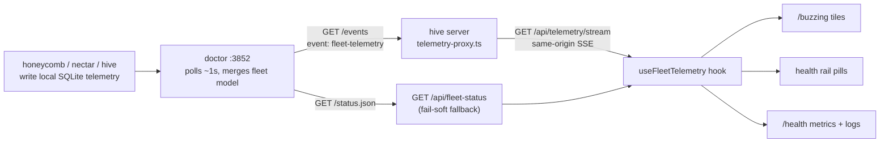

# Buzzing Screen And Health Rail

> Category: Frontend | Version: 1.1 | Date: July 2026 | Status: Active | Author: Mario Aldayuz

Read this if you work on the fleet-health UI: the `/buzzing` readiness screen, the always-present health rail, the `/health` page, and the SSE pipeline that feeds all three from doctor.

**Related:**
- [dashboard-surface.md](./dashboard-surface.md)
- [fleet-telemetry-client.md](./fleet-telemetry-client.md)
- [portal-readiness-splash.md](./portal-readiness-splash.md)
- [../architecture/shared-contracts-and-routing.md](../architecture/shared-contracts-and-routing.md)
- [../architecture/landing-gate-and-routing.md](../architecture/landing-gate-and-routing.md)
- [../../../requirements/backlog/prd-004-buzzing-service-loaders/prd-004-buzzing-service-loaders-index.md](../../../requirements/backlog/prd-004-buzzing-service-loaders/prd-004-buzzing-service-loaders-index.md)
- [../../../requirements/backlog/prd-005-health-rail-and-page/prd-005-health-rail-and-page-index.md](../../../requirements/backlog/prd-005-health-rail-and-page/prd-005-health-rail-and-page-index.md)
- [ADR-0003](../architecture/ADR-0003-future-sse-streaming-for-dashboard-freshness.md)
- [ADR-0004](../architecture/ADR-0004-portal-landing-gate-and-path-based-routing.md)
---

## Status, up front

PRD-004 (buzzing loaders) and PRD-005 (health rail + page) are shipped, QA-verified, and fully tested in live scenarios, with test coverage across `tests/dashboard/buzzing-screen.test.tsx`, `health-rail.test.tsx`, `health-page.test.tsx`, `service-icons.test.tsx`, `use-fleet-telemetry*.test.*`, `tests/daemon/telemetry-proxy.test.ts`, and `tests/shared/service-status.test.ts`. Every behavior below is production behavior. Doctor's side of the contract is live too: `doctor/src/ingestion/sse.ts` emits the `fleet-telemetry` event this pipeline consumes, and the end-to-end path from a booting fleet to a settled dashboard has been exercised on real machines.

## The SSE pipeline

Doctor is the single source of fleet-telemetry truth (doctor ADR-0001): services write local SQLite, doctor polls them and maintains one SSE stream. Hive consumes that stream through its own server, realizing hive ADR-0003's SSE-over-proxy direction for the health view-model, exactly as ADR-0004 called for.



**The relay** (`src/daemon/telemetry-proxy.ts`, mounted at `GET /api/telemetry/stream` before the generic proxy) connects hive's server to the pinned constant `DOCTOR_EVENTS_URL` (`http://127.0.0.1:3852/events`) and pipes the raw SSE bytes through (`new Response(upstream.body, ...)`). Memory-bounded by construction: nothing is buffered between upstream and downstream. Fail-soft: doctor unreachable, non-2xx, or a non-loopback URL all yield an empty 502. The upstream fetch is tied to the incoming request's abort signal, so a closed browser EventSource closes hive's connection to doctor too, and `redirect: "error"` is pinned like every other server-side fetch. The browser never opens `:3852` directly.

**The wire shape** (`src/shared/fleet-telemetry.ts`) is a hand-kept, zod-parsed copy of doctor's `src/telemetry/schema.ts` (Contract C in the execution ledger). One event type, `fleet-telemetry`, carrying `{ asOf, services, logs }` where each `FleetServiceModel` is `{ name, health, lastSeen, metrics, deeplake, telemetryFault }`. `metrics` is deliberately `Readonly<Record<string, number>>` so consumers stay schema-tolerant: honeycomb ships three counters, nectar ships five, and nothing in hive hardcodes either set. `logs` is a bounded slice of only the rows new since the previous tick, never a history.

**The hook** (`src/dashboard/web/use-fleet-telemetry.ts`) is the one shared view-model all three surfaces consume, so the sourcing precedence is written once:

1. `EventSource("/api/telemetry/stream")`, live and auto-reconnecting (the browser primitive, no hand-rolled retry).
2. While SSE is unavailable or erroring, poll `GET /api/fleet-status` every 2 s. Coarser (no metrics, no `lastSeen`), but every tile and pill keeps rendering.

Registered service identity comes from `GET /api/registered-services` (`resolveRegisteredServiceNames` over doctor's registry file), so a registered-but-silent service still gets a tile in `starting`, never an omitted row. Logs accumulate in a capped ring buffer (`LOG_RING_BUFFER_CAP = 500`, oldest dropped); `services` holds only current state. Every state transition is a pure exported function (`applySseEvent`, `applyRestFallback`, `appendLogs`, `deriveServiceViews`), unit-testable without an EventSource.

## The loader state model

Five locked states (`src/shared/service-status.ts`): `error`, `degraded`, `starting`, `warming`, `active`. Derivation is one pure function, `deriveServiceState`, shared by every surface and source-agnostic: both the rich SSE model and the coarse REST row normalize into the same `ServiceSignal` (`{ health, lastSeen, telemetryFault }`) first, so the same condition yields the same state regardless of which feed reported it. The timing rules: a service first observed healthy stays `warming` for a 10 s grace window (`DEFAULT_WARMING_GRACE_MS`) before `active`; a `lastSeen` staler than 20 s (`DEFAULT_STALE_AFTER_MS`) overrides reported health to `error`; a registered service with no signal at all is `starting`.

The derivation's real signature and rules, from `src/shared/service-status.ts`:

```typescript
export const SERVICE_STATES = ["error", "degraded", "starting", "warming", "active"] as const;
export type ServiceState = (typeof SERVICE_STATES)[number];

export interface ServiceSignal {
  readonly health: FleetHealth;                       // "ok" | "degraded" | "unreachable" | "unknown"
  readonly lastSeen: string | null;                   // ISO-8601, null on the coarse REST feed
  readonly telemetryFault: TelemetryFaultReason | null; // "missing" | "locked" | "malformed" | "read-error"
}

export function deriveServiceState(input: ServiceDerivationInput): ServiceState;
export function nextFirstActiveAt(health: FleetHealth, previous: number | null, now: number): number | null;
```

The rule order inside `deriveServiceState`: no signal at all is `starting`; a per-service telemetry fault is `degraded` (isolated, never contagious); `unreachable` health or a stale `lastSeen` is `error`; `degraded` health is `degraded`; `unknown` health is `starting`; `ok` is `warming` inside the grace window and `active` after. The function is per-service by construction: it never reads a sibling's state, which is what makes "one bad service flips only its own tile" a property instead of a promise. `nextFirstActiveAt` records the first flip to `ok` and resets on leaving `ok`, so a re-activation honestly re-enters warming.

Each state maps to a distinct bee-motif SVG (`src/dashboard/web/service-icons.tsx`), differing in shape, not only color, so the set reads in grayscale and for color-vision-deficient operators: `starting` is an empty dashed honeycomb cell, `warming` a bee with half-folded wings, `active` a bee with wide-spread wings, `degraded` a one-winged bee with a caution mark, `error` a bee on its back with wings crossed into an X. `ServiceStateIcon` is the single resolver every consumer renders through, with a fail-safe fallback for any unexpected value, and every stroke uses `currentColor`.

## The `/buzzing` screen

`BuzzingScreen` (`src/dashboard/web/buzzing-screen.tsx`) is the addressable successor to PRD-002's `ReadinessSplash` (retired; see [portal-readiness-splash.md](./portal-readiness-splash.md) for the cold-boot bug it fixed). It keeps two concerns deliberately separate:

- **Tiles**: one per registered service via the shared hook, each showing the bee-state icon, the service name, and the state label. A single bad service changes only its own tile; the list is keyed by name and independent per row. Before any registration is known it shows a distinct "Waiting on doctor. No services are registered yet." indicator rather than lying with an empty grid.
- **Dismissal**: its own `GET /api/fleet-status` poll (default 1500 ms) through the identical `isFleetReady()` predicate the server gate uses, so "ready" means one thing everywhere. On ready it hard-navigates to `/`, forcing the server gate to re-evaluate health and auth on a fresh request and land the operator on the dashboard or `/login` as the current state warrants.

## The health rail

`HealthRail` (`src/dashboard/web/health-rail.tsx`) is mounted once in the `Shell` (`app.tsx`), so it is present on every in-app route. Each pill renders the shared state icon plus the service name, colored by state but never color-only (the accessible text carries the state; the rail is an aria-live region with visually-hidden state text). It is fed by the same hook, so it inherits SSE-first with REST fallback and never disappears when the stream drops. It renders only the hook's current `services` snapshot, holding no history of its own, and links through to `/health` for detail.

## The `/health` page

`HealthPage` (`src/dashboard/web/pages/health.tsx`) is a normal registry route; the same literal path doubles as hive's machine-liveness probe via server-side content negotiation (see [../architecture/landing-gate-and-routing.md](../architecture/landing-gate-and-routing.md)). Per service it renders:

- **Metrics since last restart**, generically over whatever camelCase counter keys the service reports (`humanizeMetricKey` turns `filesProcessed` into "files processed"); no service's key names are hardcoded, and "No metrics reported yet." is the honest empty state.
- **Deep Lake stats**: connection state and last communication time, straight off the `deeplake` block of the fleet model.
- **Live logs with selectable verbosity**: `LOG_LEVELS = ["debug", "info", "warn", "error"]`, filtered client-side by `filterLogsByVerbosity` over the hook's bounded ring buffer, rendering at most `VISIBLE_LOG_LINES = 200` newest-first. Changing verbosity re-filters without a reload and without a second fetch loop.

The whole page rides the one shared hook; it introduces no additional polling and holds nothing unbounded, which is the parent PRD's hard memory constraint made structural.
