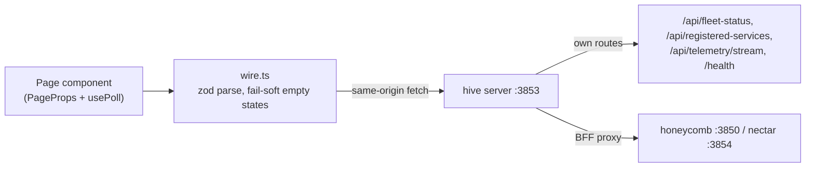

# Dashboard Surface

> Category: Frontend | Version: 1.0 | Date: July 2026 | Status: Active | Author: Mario Aldayuz

Read this if you work on the React SPA under `src/dashboard/web/` or the daemon host under `src/daemon/dashboard/`: it inventories the pages, explains how assets are built and served, and traces how data reaches a panel.

**Related:**
- [spa-architecture.md](./spa-architecture.md)
- [wire-and-data-fetch.md](./wire-and-data-fetch.md)
- [pages-inventory-deep-dive.md](./pages-inventory-deep-dive.md)
- [hive-graph-and-graph-pages.md](./hive-graph-and-graph-pages.md)
- [portal-readiness-splash.md](./portal-readiness-splash.md)
- [buzzing-and-health-rail.md](./buzzing-and-health-rail.md)
- [../architecture/copy-and-own-provenance.md](../architecture/copy-and-own-provenance.md)
- [../architecture/bff-proxy-federation.md](../architecture/bff-proxy-federation.md)
- [../architecture/landing-gate-and-routing.md](../architecture/landing-gate-and-routing.md)
- [ADR-0001](../architecture/ADR-0001-retire-honeycomb-dashboard-and-copy-and-own-into-hive.md)
---

## Page inventory

`ROUTES` in `src/dashboard/web/registry.tsx` is the single extension point: one ordered list of `{ route, label, icon, component, dynamic? }` entries that both the sidebar and the router outlet read. Adding a page is one entry plus one component; no sidebar or router edit.

| Route | Label | Component | Notes |
|---|---|---|---|
| `/` | Dashboard | `DashboardPage` | The home overview; the default every unknown path falls back to |
| `/projects` | Projects | `ProjectsPage` | Bound-folder management (add/import/unbind/open) |
| `/harnesses` | Harnesses | `HarnessesPage` | Carries the one dynamic group: per-installed-harness sub-items resolved at render (`resolveHarnessSubItems`) |
| `/memories` | Memories | `MemoriesPage` | Memory list/store/modify/forget surface |
| `/graph` | Memory Graph | `GraphPage` | The memory/knowledge graph (the codebase-graph view was removed as too dense) |
| `/hive-graph` | Hive Graph | `HiveGraphPage` | Hive-born, not copied; the nectar-backed file-nectar/provenance view |
| `/sync` | Sync | `SyncPage` | Skill/agent propagation, follows the `/api/logs/stream` SSE tail |
| `/logs` | Logs | `LogsPage` | The request-log ring buffer + live tail |
| `/health` | Health | `HealthPage` | Hive-born; per-service metrics, Deep Lake stats, verbosity-filtered live logs |
| `/roi` | ROI | `RoiPage` | The Net-ROI ledger with rollups |
| `/settings` | Settings | `SettingsPage` | Provider/model/vault settings |

Outside the registry sit the two gate-exempt screens, mounted directly by `main.tsx` via `resolveBootScreen`: `BuzzingScreen` at `/buzzing` and `LoginScreen` (in `setup-gate.tsx`) at `/login`. `matchRoute` resolves deep sub-routes (like `/harnesses/claude-code`) to their top-level parent by prefix, and unknown paths mount the Dashboard rather than a blank screen.

## How assets are built

`npm run build` is `tsc && node esbuild.config.mjs`. tsc compiles the node-side tree to `dist/`; esbuild then bundles the browser app directly from the `.tsx` source:

- Entry `src/dashboard/web/main.tsx`, output `dist/daemon/dashboard/app.js`.
- `platform: "browser"`, `format: "esm"`, `target: es2022`, `jsx: "automatic"`, minified, `process.env.NODE_ENV` defined to `"production"`.
- React and ReactDOM (18.3.1) are bundled in. No CDN React, no `@babel/standalone`, no `type="text/babel"`: the shell references only same-origin loopback assets.

The bundle is one file (~672 KB at the PRD-001 build) that the host serves as a single static `<script type="module">`.

## How assets are served

The host (`src/daemon/dashboard/host.ts` + `web-assets.ts`) registers four fixed asset routes ahead of the shell catch-all:

| Route | Source | Cache |
|---|---|---|
| `GET /app.js` | `dist/daemon/dashboard/app.js`, resolved beside the compiled module | `no-cache` |
| `GET /styles.css` | The five token files under `assets/tokens/` concatenated in `@import` order (`fonts`, `colors`, `typography`, `spacing`, `base`) into one payload | `no-cache` |
| `GET /honeycomb-memory-cluster.svg` | `assets/logos/` brand mark | `no-cache` |
| `GET /fonts/:name` | `assets/logos/fonts/`, allow-list of exactly six filenames (Inter variable x2, JetBrains Mono x4) | `public, max-age=31536000, immutable` |

Two deliberate quirks. First, the CSS is concatenated server-side instead of shipping the `@import` chain, because `@import url('tokens/...')` resolves relative to the served URL; one payload means one request and no relative-resolution surprises across install layouts. The `@font-face` URLs inside it are rewritten from the on-disk `../logos/fonts/` prefix to the served `/fonts/` route (`rewriteFontUrls`). Second, everything except fonts is `no-cache`: the filenames are not content-hashed, so an upgrade rebuilds `app.js` in place at the same URL, and revalidation over loopback is free while a heuristically cached stale bundle is not.

`renderShell()` emits the complete index page: doctype, the `/styles.css` link, a small inline layout-CSS block ported verbatim from honeycomb (`.wrap`, `.grid2`, `.kpirow`, `.mem-enter`, `.col`), `<div id="root" data-asset-base="">`, and the `app.js` script tag. No inline data, no token, no secret. The shell catch-all serves this same HTML for every page path; the app self-hydrates from `location.pathname`. Every read fails soft: a not-yet-built bundle or stripped install 404s the asset route rather than 500ing the page.

## How data flows

The SPA is a thin client. `wire.ts` (2,454 lines, the largest module in the tree) is the single typed boundary between `fetch` and React props:

- `ENDPOINTS` freezes every path the app ever fetches, all same-origin relative (`/api/diagnostics/*`, `/api/memories/*`, `/api/hive-graph/*`, `/setup/*`, `/health`, `/api/logs`, ...).
- One zod schema per endpoint validates the payload; a malformed or failed response degrades to a typed empty/zero state, never a throw into React.
- The `x-honeycomb-project` header (`PROJECT_HEADER`) carries the active project scope on scoped reads.

Server-side, hive's BFF proxy routes each of those paths to the owning daemon (nectar for `/api/hive-graph/*`, honeycomb for the rest) over loopback with transparent auth pass-through; see [../architecture/bff-proxy-federation.md](../architecture/bff-proxy-federation.md). The pages hydrate on `usePoll` intervals, except the two SSE consumers: the Logs/Sync tail (`/api/logs/stream`, proxied to honeycomb) and the health surface (`/api/telemetry/stream`, hive's own relay of doctor's stream).



## Theming

The design system is CSS custom properties, not a component library. `assets/tokens/` defines fonts, colors, typography, spacing, and base component styles; components style themselves inline against the variables (`var(--bg-elevated)`, `var(--text-secondary)`, `var(--radius-lg)`, `var(--dur-base)`, ...). Nav icons are inline SVGs stroked in `currentColor`, so the sidebar tints an active row by setting `color`. There is no runtime theme switcher; the token files are the theme.

## What differs from honeycomb's original

The component layer moved essentially unchanged (that portability was the whole reason copy-and-own was cheap). What changed around it:

- **Served at the root.** Honeycomb mounted the SPA under its daemon at `/dashboard` semantics; hive serves at `/` with the asset base empty. `main.tsx` sanitizes the DOM-read `data-asset-base` against a safe-path regex before it can reach any URL sink.
- **Path routing, server gate.** The hash router (`useHashRoute`) and the nested `ReadinessSplash`/`SetupGate` boot gates are retired. Routing is `location.pathname` + History API (`usePathRoute`, with a broadcast `hive:pathchange` event because `pushState` fires no browser event), and the landing decision is the server's.
- **Same-origin wire.** The brief client-side federation (`/api/daemon-bases`, `buildFederatedUrl`) is gone; the wire fetches relative paths exactly like honeycomb's original, and hive's server does the reaching.
- **Hive-born additions.** `pages/health.tsx`, `health-rail.tsx`, `buzzing-screen.tsx`, `service-icons.tsx`, `use-fleet-telemetry.ts`, `boot-route.ts`, and the Hive Graph page/projection have no honeycomb ancestor.
- **The shell chrome.** `app.tsx` mounts the always-present `HealthRail` above every page and wires its "health details" link to `/health`.

The cold-boot failure that motivated the readiness work (a booting fleet misread as "first time setup") is documented in the pinned sibling note [portal-readiness-splash.md](./portal-readiness-splash.md); the screens that fix it are documented in [buzzing-and-health-rail.md](./buzzing-and-health-rail.md).

## Adding a page

The contract the registry defines, verbatim from the codebase's own conventions:

1. Write a page component taking the shared props and wrapping its content in the frame:

```typescript
export interface PageProps {
  readonly wire: WireClient;      // the ONE shared client the shell passes down; never createWireClient in a page
  readonly daemonUp: boolean;     // shell-owned liveness; a page may gate its polling on it
  readonly assetBase: string;
  readonly pollinating?: boolean; // shell-owned Pollinate flag, passed down; defaults false
}

function MyPage({ wire, daemonUp, assetBase }: PageProps): React.JSX.Element {
  return <PageFrame title="My Page">{/* hydrate via usePoll + wire */}</PageFrame>;
}
```

2. Add one `RouteEntry` to `ROUTES` in nav order: `{ route: "/my-page", label: "My Page", icon: MyIcon, component: MyPage }`. The sidebar renders the nav item and the outlet routes the path; you touch neither `sidebar.tsx` nor `router.tsx`. `tests/dashboard/registry.test.ts` proves the seam with a throwaway entry.

3. If the page's data comes from a new daemon endpoint, add the path to `ENDPOINTS` in `wire.ts` with a zod schema and a fail-soft empty return. If the endpoint belongs to a new daemon, `resolveEndpointOwner` in `src/shared/daemon-routing.ts` needs to learn its prefix; otherwise honeycomb owns it by default and the proxy just works.

A dynamic group (children computed from live state, like the per-harness items) sets `dynamic: { resolve: (live) => SubItem[] }` on its entry; the children are render-time only and never top-level routes.
