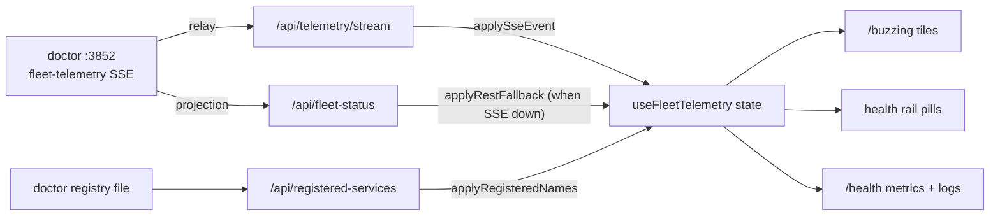

# Fleet Telemetry Client

> Category: Frontend | Version: 1.0 | Date: July 2026 | Status: Active | Author: Mario Aldayuz

Read this if you touch `use-fleet-telemetry.ts`, `shared/fleet-telemetry.ts`, or any surface that renders fleet health: it explains the one view-model hook that feeds the `/buzzing` tiles, the health rail, and the `/health` page, including the SSE-first / REST-fallback sourcing and the pure state transitions.

**Related:**
- [buzzing-and-health-rail.md](./buzzing-and-health-rail.md)
- [spa-architecture.md](./spa-architecture.md)
- [wire-and-data-fetch.md](./wire-and-data-fetch.md)
- [../architecture/shared-contracts-and-routing.md](../architecture/shared-contracts-and-routing.md)
- [../integrations/workload-endpoint-inventory.md](../integrations/workload-endpoint-inventory.md)
- [ADR-0003](../architecture/ADR-0003-future-sse-streaming-for-dashboard-freshness.md)
- [ADR-0004](../architecture/ADR-0004-portal-landing-gate-and-path-based-routing.md)
---

## One hook, three surfaces

Three UI surfaces render fleet health: the `/buzzing` readiness tiles, the always-present health rail, and the `/health` page. All three consume one hook, `useFleetTelemetry` in `src/dashboard/web/use-fleet-telemetry.ts`, so the sourcing precedence, the reconnect behavior, and the state derivation are written once and shared. This doc covers the client mechanics; the visual/behavioral detail of each surface is in [buzzing-and-health-rail.md](./buzzing-and-health-rail.md), which this doc deliberately does not duplicate.

The hook does not go through the `WireClient`. Fleet telemetry has its own three same-origin endpoints and its own reconnect/fallback logic that does not fit the wire's request/response-and-degrade shape, so it is a separate module.

## The three endpoints it consumes

```typescript
export const TELEMETRY_STREAM_ENDPOINT = "/api/telemetry/stream";
export const FLEET_STATUS_ENDPOINT = "/api/fleet-status";
export const REGISTERED_SERVICES_ENDPOINT = "/api/registered-services";
```

- `/api/telemetry/stream` is the live SSE feed: hive's server relays doctor's `GET :3852/events` `fleet-telemetry` stream to the browser same-origin (`telemetry-proxy.ts`). The browser never opens doctor's `:3852` directly.
- `/api/fleet-status` is the coarse REST fallback: hive's own projection of doctor's `status.json` (`fleet-status.ts`). It carries per-daemon health but no metrics and no `lastSeen`.
- `/api/registered-services` returns the full list of doctor-registered service names from the registry file, so a registered-but-silent service still gets a tile in `starting` before any telemetry has arrived.

All three are hive-owned routes, registered ahead of the generic BFF proxy in `server.ts` so they win. The exact upstream shapes are in [../integrations/workload-endpoint-inventory.md](../integrations/workload-endpoint-inventory.md).

## Sourcing precedence: SSE first, REST fallback

The hook prefers the rich SSE feed and falls back to coarse polling only when the stream is unavailable. The precedence is written into the module as pure transitions:

1. Open `EventSource(TELEMETRY_STREAM_ENDPOINT)`. The browser primitive auto-reconnects; there is no hand-rolled retry loop. Each frame's `data:` JSON is parsed by `parseFleetTelemetryEvent` (the shared, defensive parser) and folded in with `applySseEvent`.
2. While SSE is unavailable or erroring, poll `GET /api/fleet-status` every `DEFAULT_REST_POLL_MS = 2000` and fold each response in with `applyRestFallback`. Coarser (no metrics, no `lastSeen`), but every tile and pill keeps rendering.

A mid-stream drop is handled by the same fallback path as a stream that never opened: when the EventSource errors, the hook polls REST until the stream comes back. This is ADR-0003's SSE-over-proxy direction realized for the health view-model, exactly as ADR-0004 called for.



## Pure transitions over a testable state

Every state change is a pure exported function over a `TelemetryState`, so the hook is unit-testable without ever constructing an `EventSource`:

```typescript
export function createInitialTelemetryState(registeredNames?: readonly string[]): TelemetryState;
export function applyRegisteredNames(state: TelemetryState, names: readonly string[]): TelemetryState;
export function applySseEvent(state: TelemetryState, event: FleetTelemetryEvent, now: number): TelemetryState;
export function applyRestFallback(state: TelemetryState, status: FleetStatusResponse, now: number): TelemetryState;
export function appendLogs(existing, incoming): readonly FleetLogEntry[];
export function deriveServiceViews(state: TelemetryState, now: number): readonly ServiceView[];
export function toFleetTelemetryView(state: TelemetryState, now: number): FleetTelemetryView;
export function filterLogsByVerbosity(logs, minLevel: LogLevel): readonly FleetLogEntry[];
```

The hook itself is a thin shell that opens the EventSource, wires the poll fallback, threads `Date.now()` into these functions, and returns `toFleetTelemetryView(...)`. `tests/dashboard/use-fleet-telemetry.test.ts` exercises the transitions directly and `tests/dashboard/use-fleet-telemetry-hook.test.tsx` exercises the mounted hook in jsdom.

## Service views: the five-state derivation applied

The hook does not itself decide a service's bee state; it defers to `deriveServiceState` in `src/shared/service-status.ts` (documented in [../architecture/shared-contracts-and-routing.md](../architecture/shared-contracts-and-routing.md)). Both feeds normalize into the same `ServiceSignal` first, so a service reported over SSE and the same service reported over REST derive to the same state from the same condition. `deriveServiceViews` produces one `ServiceView` per known service (name, derived state, metrics, `lastSeen`, Deep Lake stats), and the surfaces render through those views. Because the derivation is per-service and never reads a sibling, a single faulty service flips only its own tile.

Service identity is seeded from `/api/registered-services` via `applyRegisteredNames`, so a service doctor says should exist gets a `starting` tile immediately, before any telemetry tick has enumerated it. A never-registered, never-seen service simply does not appear.

## Bounded logs

The SSE event's `logs` field is a bounded slice of only the rows new since the previous tick, never a history. The hook accumulates them in a capped ring buffer, `LOG_RING_BUFFER_CAP = 500`, dropping the oldest beyond the cap; `services` holds only current state, never a log history. This is the parent PRD's hard memory constraint made structural: nothing in the hook grows without bound. The `/health` page filters this buffer client-side by verbosity (`LOG_LEVELS = ["debug", "info", "warn", "error"]`) with `filterLogsByVerbosity` and renders a display-capped tail; changing verbosity re-filters the same buffer without a second fetch loop.

## The view model the surfaces read

`useFleetTelemetry(options?)` returns a `FleetTelemetryView` exposing the derived `services`, the accumulated `logs`, and a `source` discriminator (`"sse" | "rest" | "none"`) so a surface can show which feed is live if it wants to. `EMPTY_FLEET_TELEMETRY_VIEW` is the pre-hydration value. The three surfaces consume this view identically: the health rail renders the current `services` snapshot as pills, `/buzzing` renders them as tiles with its own dismissal poll, and `/health` renders per-service metric/Deep Lake cards plus the verbosity-filtered log tail. None of them holds any history of its own; they render the hook's current snapshot, which is what keeps the rail from disappearing when the stream briefly drops.

## What the wire copy guarantees

The event shape the hook parses is `FleetTelemetryEvent` from `src/shared/fleet-telemetry.ts`, hive's hand-kept copy of doctor's Contract C schema. The `metrics` field is `Readonly<Record<string, number>>`, so the hook and the `/health` render never hardcode honeycomb's three counters or nectar's five; a workload can add a counter and it renders with no client change. Keeping that copy in lockstep with doctor's `schema.ts` is the one standing cross-repo obligation, and the defensive `parseFleetTelemetryEvent` means a drift degrades one frame to `null` rather than crashing the hook.
