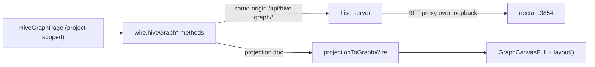

# Hive Graph And Graph Pages

> Category: Frontend | Version: 1.0 | Date: July 2026 | Status: Active | Author: Mario Aldayuz

Read this if you work on either graph page (`/graph`, `/hive-graph`) or the shared graph machinery: it explains the one deterministic layout function both pages reuse, how nectar's portable projection becomes a renderable graph client-side, and the pan/zoom/filter/search surface the pages build on top.

**Related:**
- [pages-inventory-deep-dive.md](./pages-inventory-deep-dive.md)
- [wire-and-data-fetch.md](./wire-and-data-fetch.md)
- [spa-architecture.md](./spa-architecture.md)
- [../architecture/bff-proxy-federation.md](../architecture/bff-proxy-federation.md)
- [../integrations/workload-endpoint-inventory.md](../integrations/workload-endpoint-inventory.md)
- [ADR-0002](../architecture/ADR-0002-server-side-bff-proxy-for-dashboard-federation.md)
---

## Two graph pages, one engine

The dashboard has two graph routes. `/graph` (`pages/graph.tsx`, `GraphPage`) is the memory/knowledge graph, honeycomb-backed. `/hive-graph` (`pages/hive-graph.tsx`, `HiveGraphPage`) is hive-born and nectar-backed: it renders the file-provenance graph nectar mints. They look similar on screen because they share one engine: the same pure `layout` function, the same pan/zoom/filter machinery exported from `graph.tsx`, and the same `GraphWire` node/edge shape. Only the data source and the detail panel differ.

`/graph` once carried a Codebase / Memory toggle; the codebase view was removed because it was too dense to read, so the page now renders only `wire.memoryGraph()`. The codebase graph is still built in the background on the daemon side to feed the stale-ref diagnostic; it simply no longer has a viewer here.

## The layout function

`src/dashboard/web/graph-layout.ts` is a pure, deterministic node-placement function shared by both pages and the dashboard's mini-widget. Determinism is the contract: placement is a pure function of `(node order, count, viewBox)` with no randomness, no animation loop, and no time input, so a render is stable and a unit test can assert exact coordinates.

```typescript
export function layout(
  nodes: readonly LayoutNode[],
  _edges: readonly LayoutEdge[],
  viewBox: ViewBox
): Map<string, Point>;
```

The placement has two branches. At or below `RING_MAX = 36` nodes it is radial: the first node is centered, the rest sit evenly on a ring around it starting at the top and stepping clockwise, at the largest radius that fits inside a `PADDING = 28` inset. Above `RING_MAX` a single ring collapses into an unreadable smear, so `layout` switches to an even row-major grid where every node gets its own cell. Both branches keep every coordinate inside `[PADDING, extent - PADDING]` so marks never clip the canvas border. The `edges` argument is accepted for signature stability with a future force-directed variant but is not consulted by the deterministic placement.

Two more pure helpers derive relationships for the detail panels: `neighborsOf(id, edges)` returns the de-duplicated neighbor ids in first-seen order, and `splitNeighbors(id, edges)` returns `{ outgoing, incoming }`, each a list of `RelationGroup` (`{ kind, ids }`) grouped by edge kind. `splitNeighbors` works for any relation kind with no special-casing, so the codebase graph's `imports`/`calls` and the memory graph's `depends_on`/`supersedes`/`mentions` both render through it.

## The shared canvas and controls

`pages/graph.tsx` exports the full-page graph machinery that `hive-graph.tsx` imports and reuses rather than forks:

- `GraphCanvasFull`, the SVG canvas with hand-rolled pan/zoom over the `viewBox` transform (no dependency added).
- `ViewTransform` (`{ scale, tx, ty }`), `IDENTITY_TRANSFORM`, and `centerOn(point, scale)`, the pan/zoom view state and the focus helper.
- `GRAPH_VIEW = { width: 1600, height: 1000 }`, the base layout box the SVG scales into.
- `MIN_ZOOM = 0.25`, `MAX_ZOOM = 4`, `ZOOM_STEP = 1.15`, the zoom bounds so the graph can never invert or vanish.
- `KindToggle`, `ToolButton`, `applyKindFilter(graph, hiddenKinds)`, `distinctKinds(graph)`, the per-kind filter chips and the tool buttons.

Both pages cap density with `capGraphForRender(graph, MAX_RENDER_NODES)` from `wire.ts` (`MAX_RENDER_NODES = 1500`), rendering a truncation notice when the cap fires and directing the operator to search and kind filters to focus.

## The Hive Graph page end to end

`HiveGraphPage` is project-scoped: it reads `useScope().scope.project` and shows `NeedsProjectSelection` until a project is chosen. With a project it polls three things on `HIVE_GRAPH_POLL_MS = 8000` (paused when the tab is hidden):

- `wire.hiveGraphFileGraph(project)` returns the graph plus the projection's `files` and `derived` maps and an `unreachable` flag.
- `wire.hiveGraphStatus(project)` returns pipeline status: `queueDepth`, `describeStatus` (`described`/`pending`/`failed`), `costSpentUsd`, and `degraded`, rendered as badges by `StatusWidgets`.
- `wire.hiveGraphSearch(query, project)` runs on submit and renders hits; selecting a hit calls `focusNode`, which centers the canvas on that node via `layout` + `centerOn`.

A build button (`HiveGraphBuildButton`) calls `wire.hiveGraphBuild()` and reports the ack state (`accepted`, `already_running`, or an error). The file-node detail panel (`FileNodeDetailPanel`) reads the selected node's entry out of the `files` and `derived` maps to show its path, description, and provenance (`derived from <nectar id>`). Every value renders as React text and every color is an existing design-system variable; the page adds no token and no dependency.



## The projection transform

Nectar does not serve a nodes/edges graph endpoint. Per the fleet decision that closed the Hive Graph page's open question (superproject decision #39), the page hydrates from nectar's existing portable projection document at `GET /api/hive-graph/projection` and transforms it into `GraphWire` client-side, so no new nectar endpoint was added. That transform is `src/dashboard/web/hive-graph-projection.ts`:

```typescript
export interface PortableProjectionWire {
  readonly version: number;
  readonly generated_at: string;
  readonly generator: string;
  readonly project: { readonly org_id: string; readonly workspace_id: string; readonly project_id: string };
  readonly files: Readonly<Record<string, ProjectionFileEntry>>;
  readonly derived: Readonly<Record<string, ProjectionDerivedEntry>>;
}

export function projectionToGraphWire(projection: PortableProjectionWire): GraphWire;
export function fileKindFromPath(path: string): string;
```

The mapping is direct: nodes come from the `files` map (the nectar ULID key becomes the node `id`, `files[id].path` becomes the `label`, and `fileKindFromPath` derives a kind client-side from the extension or top-level directory), and edges come from the `derived` map (the derived nectar id becomes `from`, its `from_nectar` becomes `to`, with kind `derived_from`). The projection is complete (latest-per-nectar) and carries no server-side truncation; density is bounded solely by the client `capGraphForRender` cap. `ProjectionFileEntry` also carries the description and model metadata the detail panel renders.

## Fail-soft, like everything else

Both graph pages inherit the wire's fail-soft posture. `hiveGraphFileGraph`, `hiveGraphSearch`, and `hiveGraphStatus` all carry an `unreachable` flag and degrade to empty on a dead nectar, so the page renders a clear "Nectar is unreachable" empty state (or "No Hive Graph yet for this project") rather than a blank canvas or a thrown error. This is the per-panel fail-soft guarantee at work: nectar being down affects only the Hive Graph surfaces; every honeycomb-backed page keeps rendering. `tests/dashboard/hive-graph-projection.test.ts`, `tests/dashboard/hive-graph-wire.test.ts`, and `tests/dashboard/hive-graph-page.test.tsx` pin the transform, the wire seam, and the page's states respectively.
