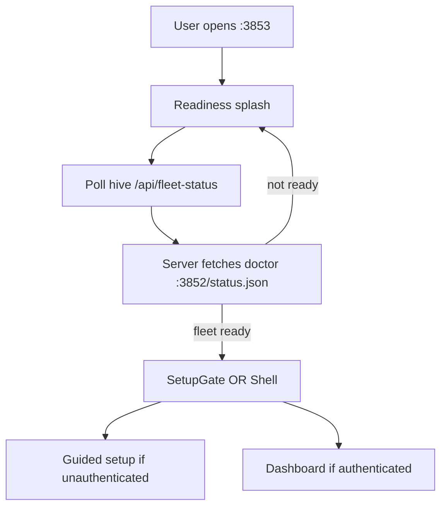

# Portal readiness splash (pinned product note)

> Category: Architecture | Version: 1.2 | Date: July 2026 | Status: Superseded (historical product note)

The pre-implementation product note that pinned the readiness-splash intent: until required workload daemons are reachable, the portal must show fleet readiness instead of guided setup or dashboard pages. Kept for provenance; the mechanisms below are the pre-PRD-002 sketch, not the shipped code.

**Where this landed (read these instead for current behavior):** the intent shipped, but not in the shape sketched below. There is no nested `ReadinessSplash`/`SetupGate` React tree and no client-side federation; the shipped implementation is the server-side landing gate in `src/daemon/gate.ts` (health first, auth second, per hive ADR-0004) plus the `/buzzing` screen (`src/dashboard/web/buzzing-screen.tsx`). The `/api/daemon-bases` client-federation endpoint referenced below was retired by the BFF proxy (hive ADR-0002). The per-daemon status the sketch asked doctor for arrived as doctor's `services[]` model and the `fleet-telemetry` SSE stream. Current docs: [`buzzing-and-health-rail.md`](buzzing-and-health-rail.md), [`../architecture/landing-gate-and-routing.md`](../architecture/landing-gate-and-routing.md), [`../architecture/bff-proxy-federation.md`](../architecture/bff-proxy-federation.md).

**Decision (locked, still true): Option B.** The portal uses **doctor as the single fleet-health source** via the status page API, not direct per-daemon `/health` probes from hive.

**Related:** [`buzzing-and-health-rail.md`](buzzing-and-health-rail.md), [`fleet-telemetry-client.md`](fleet-telemetry-client.md), [`../architecture/landing-gate-and-routing.md`](../architecture/landing-gate-and-routing.md), [ADR-0004 (hive)](../architecture/ADR-0004-portal-landing-gate-and-path-based-routing.md), [ADR-0004 decision #1 (nectar)](../../../../../nectar/library/knowledge/private/architecture/ADR-0004-hive-portal-daemon-role-and-boundaries.md), [`prd-001-hive-portal-daemon-index.md`](../../../requirements/in-work/prd-001-hive-portal-daemon/prd-001-hive-portal-daemon-index.md), [`qa-report-prd-001-hive-portal-daemon.md`](../../../requirements/in-work/prd-001-hive-portal-daemon/qa/qa-report-prd-001-hive-portal-daemon.md) (Warning: honeycomb-scoped `daemonUp` gate)

---

Everything below this line is the original pinned note, preserved as written. Section headings that say "today" describe the pre-PRD-002 state of the code, not the current state.

---

## Problem (observed today)

On a cold device, hive binds `:3853` and serves the React bundle immediately (correct per ADR-0004 #1). The top-level UI is still **`SetupGate`**, copied from honeycomb's in-daemon dashboard:

1. `SetupGate` polls `GET /setup/state` on **honeycomb** (`:3850`) via the federated `wire`.
2. When honeycomb is not up yet, `wire.setupState()` **fail-softs to `FRESH_SETUP_STATE`** (`authenticated: false`).
3. The UI renders **"First time setup"** / guided setup, as if this were a fresh install.
4. Clicking setup tries `POST /setup/login` against a dead honeycomb and errors.

That is the wrong phase. A first-time user with services still booting should see **"The hive is waking up"**, not onboarding.

The authenticated **`Shell`** (sidebar + pages) only mounts after `setupState.authenticated === true`. There is no portal-level gate that says "wait until the supervisor reports the fleet ready" before setup or dashboard.

---

## Intended behavior (pinned)



**Readiness splash** (minimum):

- hive itself is up (always true once the page loads).
- Per-daemon rows for each **required** peer (at minimum **honeycomb**; add **nectar** when Hive Graph ships).
- State per row: `starting`, `up`, `degraded`, `unreachable` (mapped from doctor supervisor truth).
- Copy: short "Waiting for the hive…" plus optional motion (spinner, bees, etc.).
- **Block** guided setup and dashboard routes until doctor reports required deps ready.

**Do not** infer fresh install from a failed `/setup/state` while the fleet is not ready.

---

## Decision: Option B (doctor status, locked)

**Rejected:** Option A (hive probes each workload `/health` directly). That duplicates probe logic doctor already owns and splits operator truth across two systems.

**Chosen:** Option B — hive reads **doctor's status page** as the fleet-health source of truth.

| Piece | Responsibility |
|---|---|
| **doctor** | Supervises registered daemons, probes registry `healthUrl`s, owns fleet health state |
| **doctor `:3852`** | Serves `GET /status.json` (today: coarse fleet health + escalation + suggested commands) |
| **hive server** | `GET /api/fleet-status` — server-side fetch of `http://127.0.0.1:3852/status.json` (loopback-only, same trust model as `daemon-bases`); never expose raw doctor URL to the browser if CORS is awkward |
| **Browser** | `ReadinessSplash` polls `/api/fleet-status` every 1 to 2s; mounts `SetupGate` only when fleet gate passes |

**React tree order:** `ReadinessSplash` wraps `SetupGate`. `SetupGate` must not poll `/setup/state` until readiness passes.

---

## doctor contract today vs what the splash needs

Today `GET http://127.0.0.1:3852/status.json` returns only **coarse** fleet health:

```json
{
  "health": "ok" | "degraded" | "unreachable" | "unknown",
  "escalation": { ... } | null,
  "suggestedCommands": [ "..." ],
  "asOf": "2026-07-01T12:00:00.000Z"
}
```

Source: `doctor/src/status-page/server.ts`.

That is enough for a **binary gate** ("fleet not ok → stay on splash") but **not** enough for a per-daemon grid (honeycomb row vs nectar row).

**Follow-up on doctor (PRD-004a / status-page extension):** extend `/status.json` with a `daemons` array, for example:

```json
{
  "health": "degraded",
  "daemons": [
    { "name": "honeycomb", "health": "ok", "healthUrl": "http://127.0.0.1:3850/health" },
    { "name": "nectar", "health": "starting", "healthUrl": "http://127.0.0.1:3854/health" },
    { "name": "hive", "health": "ok", "healthUrl": "http://127.0.0.1:3853/health" }
  ],
  "asOf": "..."
}
```

Until that lands, the splash can:

1. Show coarse fleet badge from `health` alone, plus registry-derived daemon **names** as all `starting` when `health !== "ok"`, or
2. Ship the grid only after doctor exposes `daemons[]` (preferred; avoids lying about per-row state).

**Fail-soft:** if doctor is unreachable (`:3852` down), `/api/fleet-status` returns `{ supervisor: "unreachable", daemons: [] }` and the splash stays up (never fall through to guided setup).

---

## How health works today (baseline before this feature)

| Layer | What it does | Source of truth |
|---|---|---|
| **hive process** | `GET :3853/health` | Own uptime only |
| **hive server** | `GET :3853/api/daemon-bases` | Registry **file** (`~/.honeycomb/doctor.daemons.json`) for wire routing |
| **Browser `wire`** | Dashboard data fetches | Workload APIs via federated bases |
| **doctor** | Supervision + status page | `:3852/status.json` (not consumed by portal UI yet) |

---

## Acceptance sketch (when implemented)

- [ ] With honeycomb stopped and doctor reporting `degraded`/`unreachable`, `:3853` shows readiness splash only (no "First time setup").
- [ ] When doctor reports fleet `ok` (and required `daemons[]` rows are `up`), splash dismisses into setup or dashboard.
- [ ] With honeycomb up but no DeepLake credentials, user reaches guided setup (correct phase).
- [ ] Splash renders before any `/setup/state` or dashboard page fetch.
- [ ] doctor down → splash persists; no setup mis-detection.
- [ ] `/api/fleet-status` rejects non-loopback doctor URLs (tamper-safe, mirrors security fix on `daemon-bases`).

---

## Out of scope for this note

- Visual design of bees/spinner (ux-ui-worker-bee when implementing).
- Whether `degraded` fleet health allows setup (product call; default: block setup until `ok` or explicit per-daemon `up`).
- CI/release train (m-AC-5).
- Option A (direct workload `/health` probes from hive).
