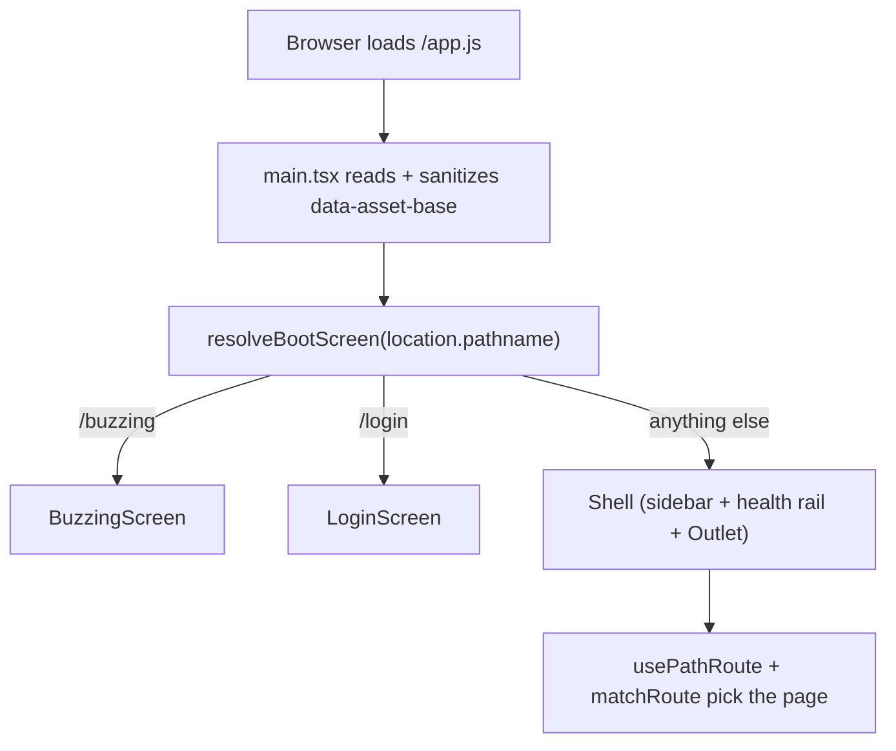

# SPA Architecture

> Category: Frontend | Version: 1.0 | Date: July 2026 | Status: Active | Author: Mario Aldayuz

Read this if you work on the React shell under `src/dashboard/web/`: it traces the app from the one byte-identical HTML shell through boot-screen resolution, the page registry, path routing, the frame primitives, and scope context, and it shows the exact contract for adding a page.

**Related:**
- [dashboard-surface.md](./dashboard-surface.md)
- [wire-and-data-fetch.md](./wire-and-data-fetch.md)
- [pages-inventory-deep-dive.md](./pages-inventory-deep-dive.md)
- [fleet-telemetry-client.md](./fleet-telemetry-client.md)
- [../architecture/landing-gate-and-routing.md](../architecture/landing-gate-and-routing.md)
- [../architecture/copy-and-own-provenance.md](../architecture/copy-and-own-provenance.md)
- [ADR-0004](../architecture/ADR-0004-portal-landing-gate-and-path-based-routing.md)
---

## One shell, self-hydrating

Hive serves one byte-identical HTML shell for every page path. `renderShell()` in `src/daemon/dashboard/host.ts` emits a complete document: a `<link>` to `/styles.css`, an inline layout-CSS block, `<div id="root" data-asset-base="">`, and `<script type="module" src="/app.js">`. There is no server-side templating of page content, no inline data, and no token. The catch-all `mountDashboardShellFallback` returns exactly this for `/`, `/projects`, `/health`, `/buzzing`, `/login`, and any unknown deep link; the bundle decides what to render by reading `location.pathname`. This is what lets the landing gate redirect purely on the server while the client always boots into the correct screen: the URL is real, and the same bundle knows how to interpret it.

The whole client is one esbuild bundle (React and ReactDOM bundled in, no CDN, no in-browser Babel). How it is built and served is covered in [dashboard-surface.md](./dashboard-surface.md); this doc is about what that bundle does once it loads.

## Boot: pathname to top-level screen

`main.tsx` is the entry point and does the smallest possible amount of work. It reads `data-asset-base` off the `#root` element, sanitizes it against `/^[A-Za-z0-9._/-]*$/` before it can reach any URL sink, then mounts one of three top-level screens chosen by `resolveBootScreen` in `boot-route.ts`:

```typescript
export type BootScreen = "buzzing" | "login" | "shell";
export const BUZZING_PATH = "/buzzing";
export const LOGIN_PATH = "/login";
export function resolveBootScreen(pathname: string): BootScreen;
```

`/buzzing` mounts `BuzzingScreen`, `/login` mounts `LoginScreen` (from `setup-gate.tsx`), and every other path mounts the `Shell`. This is a pure lookup: there is no client-side health poll or auth poll at the top level anymore. The retired honeycomb design nested a `ReadinessSplash` around a `SetupGate` around the shell, each polling before the next could mount; that could flash the wrong screen while a client gate resolved. ADR-0004 moved the health and auth decision to the server gate, so `main.tsx` never re-derives either.



## The shell

`Shell` (`app.tsx`) is the in-app chrome that wraps every registry page. It builds the single shared `WireClient` via `createWireClient()` and passes it down; a page must never call `createWireClient` itself. It owns the pieces that are the same on every route: the `HealthRail` mounted above the outlet, the `Sidebar`, the coarse daemon-liveness poll (`usePoll(wire.health(), 5000)` producing `{ up, reasons }`), the "Pollinate now" action (`POST /api/diagnostics/pollinate`), and the `ScopeProvider` that wraps everything. It hands each page a `PageProps` bag and renders the current page through an `Outlet`. Because these concerns live in the shell, individual pages render no header, no health pill, and no scope switcher of their own.

## The page registry

`ROUTES` in `registry.tsx` is the single extension point. One ordered array of `RouteEntry` objects drives both the sidebar and the outlet:

```typescript
export interface RouteEntry {
  route: string;
  label: string;
  icon: IconComponent;
  component: PageComponent;
  dynamic?: DynamicGroup;
}
export const ROUTES: readonly RouteEntry[];   // Dashboard, Projects, Harnesses, Memories,
                                              // Memory Graph, Hive Graph, Sync, Logs, Health, ROI, Settings
export const DEFAULT_ROUTE: RouteEntry;
export function matchRoute(pathname: string, routes?: readonly RouteEntry[]): RouteEntry;
```

`matchRoute` resolves a pathname to its owning entry, mapping deep sub-routes (like `/harnesses/claude-code`) to their top-level parent by prefix and falling back to `DEFAULT_ROUTE` (the Dashboard) for anything unknown, so an unknown deep link renders the home page rather than a blank screen. The Harnesses entry carries the one dynamic group: `dynamic: { resolve: (live) => SubItem[] }` computes per-installed-harness sub-items at render time; those children are never top-level routes.

## Path routing without a router library

`router.tsx` is the whole routing runtime, and it adds no dependency. It exposes `usePathRoute()` returning `{ route, navigate }`, `routeFromPath(pathname)`, and the event name `ROUTE_CHANGE_EVENT = "hive:pathchange"`:

```typescript
export function usePathRoute(): { route: string; navigate: (r: string) => void };
export const ROUTE_CHANGE_EVENT = "hive:pathchange";
```

Navigation calls `history.pushState` and then dispatches the custom `hive:pathchange` event, because `pushState` fires no browser event of its own. Every mounted `usePathRoute` listens for both `popstate` and that custom event and re-syncs, so a nav click updates every subscriber (the sidebar highlight, the outlet) without a shared store or a `react-router`. This is the client half of ADR-0004: the server owns the landing decision, the client owns intra-app navigation, and both speak `location.pathname`.

## Frame primitives

Three modules supply the shared building blocks every page composes from, so pages stay thin and consistent:

- `page-frame.tsx` exports `PageFrame` (the title/eyebrow/right-slot wrapper every page's content sits inside), the shared `PageProps` interface, `usePoll(fn, ms)` (the polling hook every hydrating page uses), and `isTabHidden()` (so polls pause on a backgrounded tab). `PAGE_MAX_WIDTH = 1180` fixes the content column.
- `primitives.tsx` supplies the low-level UI atoms (`Badge`, `Button`, `Input`, `Kpi`, `MemoryCard`, and friends), styled inline against the design-system CSS variables.
- `panels.tsx` supplies the composite panels several pages reuse (`Panel`, `LiveLog`, `RulesPanel`, `SessionsPanel`, `SettingsPanel`, `SkillSyncPanel`, the `GraphCanvas` mini-widget) plus the `KIND_COLOR` map the graph pages share.

`sidebar.tsx` renders the nav from `ROUTES` (widths `SIDEBAR_WIDTH = 220`, `SIDEBAR_RAIL_WIDTH = 56`), tinting the active row by setting `color` on `currentColor`-stroked inline SVG icons; `service-icons.tsx` supplies the five bee-state icons the health surfaces render. There is no component library and no runtime theme switcher: the `assets/tokens/` CSS variables are the theme.

## Scope context

`scope-context.tsx` holds the active org/workspace/project scope that project-scoped pages read. It exposes two contexts and their hooks: `ScopeContext`/`useScope()` for the current `DashboardScope` (`{ org, workspace, project? }`), and `ScopeSwitcherContext`/`useScopeSwitcher()` for the switcher UI (orgs, workspaces, projects, hydration flags, and the select actions). The default scope is `{ org: "local", workspace: "default" }`, and the viewer-side selection persists to `localStorage` under `SCOPE_STORAGE_KEY = "honeycomb.dashboard.scope"`. Org and workspace switches also persist server-side through the wire (`switchOrg` / `switchWorkspace`); project selection is a viewer-side filter. `ScopeProvider` takes the shared wire and hydrates the switcher; pages call `useScope()` to read `scope.project` and gate their polling on it.

## The `/login` screen

`setup-gate.tsx` is the retired nested React gate reworked into the `/login` boot screen. `LoginScreen` polls honeycomb's `/setup/state` on `SETUP_POLL_MS = 2500` through the wire and renders `GuidedSetup` for a fresh (unauthenticated) box. It also carries the migration helpers `isMigrationInterrupted` and `hasUnmigratedPriorHivemind` (the `NON_TERMINAL_MIGRATION_PHASES` set is `backup`, `uninstall`, `link`), which detect and offer to resume an interrupted honeycomb-to-hivemind migration. Once `/setup/state` reports authenticated, the screen hard-navigates to `/`, forcing the server gate to re-evaluate on a fresh request and land the operator on the dashboard. That hard-navigate (rather than a client screen swap) is the same pattern `/buzzing` uses on readiness, and it is what keeps the server the single authority on the landing decision.

## Adding a page

The contract the registry enforces, verbatim from the codebase's conventions:

1. Write a component taking `PageProps` and wrapping its body in `PageFrame`. Use the injected `wire` (never `createWireClient`); gate polling on `daemonUp` and, for project-scoped data, on `useScope().scope.project`.

```typescript
export interface PageProps {
  readonly wire: WireClient;
  readonly daemonUp: boolean;
  readonly assetBase: string;
  readonly pollinating?: boolean;
  readonly healthReasons?: HealthReasonsWire;
}
```

2. Add one `RouteEntry` to `ROUTES` in nav order: `{ route: "/my-page", label: "My Page", icon: MyIcon, component: MyPage }`. The sidebar renders the item and the outlet routes the path; you touch neither `sidebar.tsx` nor `router.tsx`.

3. If the page needs new data, add the endpoint to `ENDPOINTS` in `wire.ts` with a zod schema and a fail-soft empty return (see [wire-and-data-fetch.md](./wire-and-data-fetch.md)). If that endpoint belongs to a new daemon, teach `resolveEndpointOwner` its prefix; otherwise honeycomb owns it by default and the proxy just works.

`tests/dashboard/registry.test.ts` proves the seam with a throwaway entry, and `tests/dashboard/router.test.tsx` pins path routing, so a broken registry or router contract fails CI rather than shipping a blank page.
