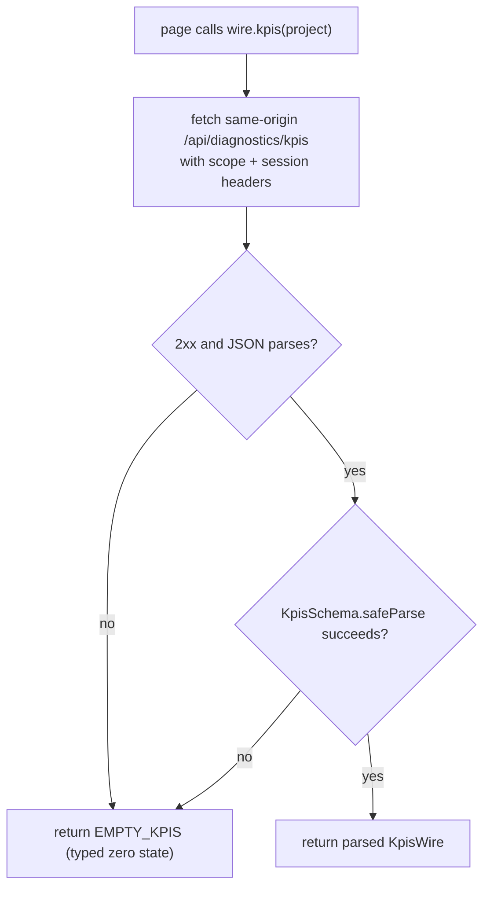

# Wire And Data Fetch

> Category: Frontend | Version: 1.0 | Date: July 2026 | Status: Active | Author: Mario Aldayuz

Read this if you touch `src/dashboard/web/wire.ts` or add a page that fetches data: it explains the single typed boundary between `fetch` and React props, the fail-soft posture, the project-scope header, and how every same-origin path maps to a workload daemon endpoint through hive's proxy.

**Related:**
- [spa-architecture.md](./spa-architecture.md)
- [pages-inventory-deep-dive.md](./pages-inventory-deep-dive.md)
- [dashboard-surface.md](./dashboard-surface.md)
- [../architecture/bff-proxy-federation.md](../architecture/bff-proxy-federation.md)
- [../architecture/shared-contracts-and-routing.md](../architecture/shared-contracts-and-routing.md)
- [../integrations/workload-endpoint-inventory.md](../integrations/workload-endpoint-inventory.md)
- [ADR-0002](../architecture/ADR-0002-server-side-bff-proxy-for-dashboard-federation.md)
---

## The one boundary

`wire.ts` is the single typed seam between the network and React. It is the largest module in the tree (roughly 2,600 lines), and nothing else in the SPA calls `fetch` directly. The shell builds exactly one `WireClient` (via `createWireClient()`) and passes it down through `PageProps`; a page reads props off that client and never constructs its own. That single-client rule matters because the client is where the fail-soft contract, the scope header, and the session headers are applied uniformly; a page that hand-rolled a fetch would bypass all three.

Every path the wire ever fetches is same-origin and relative. The browser talks only to hive's origin (`http://127.0.0.1:3853`); hive's server resolves the owning daemon and reaches it over loopback. That server-side federation is [bff-proxy-federation.md](../architecture/bff-proxy-federation.md); this doc is the client half.

## ENDPOINTS: the frozen path list

`ENDPOINTS` is a frozen object mapping a short key to a same-origin path literal. It is the exhaustive list of everything the app can fetch, and it is worth reading as an inventory of the dashboard's data dependencies. The paths fall into a few families:

- **Diagnostics (honeycomb):** `/api/diagnostics/kpis`, `/sessions`, `/settings`, `/rules`, `/skills`, `/harnesses`, `/assets`, `/sync`, `/pollinate`, `/memory-graph`, `/roi`, `/roi/trend`, and the scope + filesystem-browse + project-bind endpoints under `/api/diagnostics/scope/*`, `/api/diagnostics/fs/browse`, and `/api/diagnostics/projects/*`.
- **Memories (honeycomb):** `/api/memories`, `/api/memories/recall`, and the lifecycle endpoints `/conflicts`, `/stale-refs`, `/history`, `/calibration`.
- **Hive graph (nectar):** `/api/hive-graph/search`, `/status`, `/projection`, `/build`.
- **Logs (honeycomb):** `/api/logs` and the SSE tail `/api/logs/stream`.
- **Setup and vault (honeycomb):** `/setup/state`, `/setup/login`, `/setup/migrate-from-hivemind` (+ `/rollback`), `/api/settings`, `/api/secrets`, `/api/auth/status`.
- **Actions (honeycomb):** `/api/actions/logout`, `/embeddings`, `/restart`, `/uninstall`.
- **Hive-owned:** `/health` (hive's own liveness/health surface). The fleet-telemetry endpoints (`/api/fleet-status`, `/api/registered-services`, `/api/telemetry/stream`) are consumed by the telemetry hook, not this client; see [fleet-telemetry-client.md](./fleet-telemetry-client.md).

The prefix `/api/hive-graph` is the only one that routes to nectar; everything else routes to honeycomb. That split is `resolveEndpointOwner` in the shared layer, and it is applied server-side, so the wire itself does not encode ownership: it fetches a relative path and hive's proxy decides who answers.

## WireClient: one method per data need

`createWireClient(options?)` returns a `WireClient` with a method per data operation. The signatures read like the dashboard's data contract:

```typescript
kpis(projectId?: string): Promise<KpisWire>
recall(query: string, projectId?: string): Promise<{ memories: RecalledMemory[]; degraded: boolean }>
listMemories(limit?: number, projectId?: string): Promise<MemoryRecordWire[]>
addMemory(input: { content: string; type?: string; agentId?: string }): Promise<StoreAckWire | null>
roi(projectId?: string): Promise<RoiView>
roiTrend(range: string, projectId?: string): Promise<RoiTrendView>
harnesses(): Promise<HarnessStatusWire[]>
assetsView(): Promise<AssetSyncViewWire>
syncAction(action, input): Promise<SyncActionResultWire | null>
logs(limit?: number): Promise<LogRecordWire[]>
logsStream(onRecord: (r: LogRecordWire) => void): () => void
health(): Promise<HealthProbe>
hiveGraphFileGraph(projectId?: string): Promise<HiveGraphFileGraphWire>
hiveGraphSearch(query: string, projectId?: string): Promise<HiveGraphSearchResultWire>
hiveGraphStatus(projectId?: string): Promise<HiveGraphStatusResultWire>
hiveGraphBuild(): Promise<HiveGraphBuildAck>
setupState(): Promise<SetupStateWire>
scopeOrgs(): Promise<ScopeOrgWire[]>
bindProject(input: { path: string; name?: string }): Promise<BindAckWire>
// ...and roughly forty more, one per data operation
```

Two patterns recur across the surface. Read methods that can legitimately return nothing degrade to a typed empty value (`kpis` returns `EMPTY_KPIS`, `hiveGraphStatus` returns `EMPTY_HIVE_GRAPH_STATUS`). Write and action methods that can fail return `T | null` (`addMemory`, `syncAction`, `uninstall`) or a typed failure ack (`bindProject` returns `FAILED_BIND_ACK`), so a caller can branch on the failure explicitly rather than catch an exception. There is no method on the client that rejects on a normal daemon-down or malformed-payload condition.

## Fail-soft: zod parse, then degrade

Every method fetches, then parses the body through a zod schema for that endpoint, and a non-2xx or malformed response degrades to the endpoint's empty/zero state. There is one schema per endpoint (`KpisSchema`, `RoiViewSchema`, `MemoryListResponseSchema`, `HiveGraphSearchResultSchema`, `SetupStateSchema`, and so on), and one exported empty constant per fail-soft return (`EMPTY_KPIS`, `EMPTY_GRAPH`, `EMPTY_VAULT_SETTINGS`, `EMPTY_ROI_VIEW`, `FRESH_SETUP_STATE`, `DISCONNECTED_AUTH_STATUS`, `EMPTY_HIVE_GRAPH_STATUS`, and the `FAILED_*_ACK` family). The result is that a dead nectar makes the Hive Graph page show its empty state while every honeycomb-backed panel keeps rendering, and vice versa: one down daemon never blanks the page.



This posture is one of the two coordination seams that survives the copy-and-own transfer. The wire validates what honeycomb's and nectar's `/api/*` routes actually return, so an endpoint shape change on a workload is an API contract change; hive degrades fail-soft rather than crashing, but the schema should be updated deliberately. See [copy-and-own-provenance.md](../architecture/copy-and-own-provenance.md).

## Headers: scope and session, never a credential

The wire attaches two header sets and mints nothing. Session identity is a fixed pair sent on every request:

```typescript
export const DASHBOARD_SESSION_HEADERS = {
  "x-honeycomb-runtime-path": "plugin",
  "x-honeycomb-session": "dashboard-web"
};
```

Project scope is a single header attached only when a project is selected:

```typescript
export const PROJECT_HEADER = "x-honeycomb-project";
export function projectHeader(projectId?: string): Record<string, string>;
```

A scoped read (`kpis(project)`, `recall(query, project)`, `hiveGraphFileGraph(project)`) sends `x-honeycomb-project` carrying the active project so honeycomb (or nectar) filters to it; an unscoped read omits it. The wire never sends an `Authorization` header, never reads a credential file, and never stores a token: "logged in" is honeycomb's own session posture, which the proxy passes through verbatim. Hive is not an auth authority, and the wire is where that shows up on the client: it forwards what the browser already has and adds only scope and session tags.

## Non-JSON transports

Two wire operations are not request/response JSON. `logsStream(onRecord)` opens an `EventSource` against `/api/logs/stream` (proxied to honeycomb), parses each frame through `parseLogRecordEvent`, and returns an unsubscribe function; `formatLogLine` and the sync-activity helpers (`isSyncActivityRecord`, `syncActivityVerb`) format those records for the Logs and Sync pages. These ride the proxy unchanged because the proxy streams response bodies through, so a `text/event-stream` response tails without buffering. The other SSE consumer, fleet telemetry, does not go through this client at all; it has its own hook (see [fleet-telemetry-client.md](./fleet-telemetry-client.md)).

## Render-side helpers

A few exported helpers keep render logic out of the pages. `capGraphForRender(graph, limit)` bounds a graph to `MAX_RENDER_NODES = 1500` / `MAX_RENDER_EDGES = 5000` and reports whether it capped, so the graph pages can render a truncation notice; `formatRecallSnippet(text, kind)` trims recall hits to `MAX_SNIPPET_CHARS = 280`; `buildHistoryQueryString(filters)` builds the Logs-history query. `BUILD_GRAPH_TIMEOUT_MS = 120_000` bounds the graph-build action, and `DEFAULT_MEMORY_LIST_LIMIT = 50` is the memory-list default. These are pure and unit-testable, which is why the fail-soft and federation behavior is pinned in `tests/wire/fail-soft.test.ts`, `tests/wire/federation.test.ts`, and `tests/wire/registry.test.ts` without a live daemon.

## Adding an endpoint

The four-step contract: add the path literal to `ENDPOINTS`; write a zod schema for the response and an exported empty/failure constant; add a `WireClient` method that fetches, parses, and degrades to that constant; and if the endpoint belongs to a new daemon, teach `resolveEndpointOwner` its prefix (otherwise honeycomb owns it by default). The method should attach `projectHeader(projectId)` if the read is project-scoped, and it should return `T | null` or a typed failure ack if it is a write that can fail. Nothing else in the SPA needs to change: the page calls the new method through the injected client, and the server-side proxy routes the relative path.
