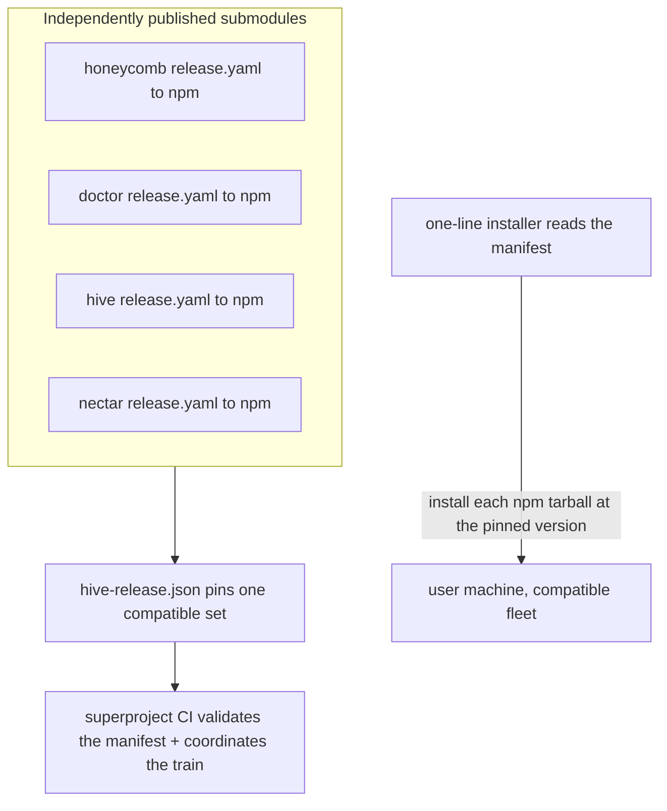

# Release Train And Manifest

> Category: Infrastructure | Version: 1.0 | Date: July 2026 | Status: Active | Author: Mario Aldayuz

Read this if you cut a hive release or need to understand where hive sits in the fleet's combined release train: it explains the superproject's `hive-release.json` manifest, hive's `published: false` status and the one-time npm bootstrap it is waiting on, and how a hive tag relates to the fleet pin.

**Related:**
- [build-and-release.md](./build-and-release.md)
- [../architecture/system-overview.md](../architecture/system-overview.md)
- [../operations/cli-and-runbook.md](../operations/cli-and-runbook.md)
- [../telemetry/telemetry-egress.md](../telemetry/telemetry-egress.md)
- [ADR-0001](../architecture/ADR-0001-retire-honeycomb-dashboard-and-copy-and-own-into-hive.md)
---

## Two release systems, one product

Hive participates in two release systems at once, and it helps to keep them separate. The first is hive's own OIDC release pipeline (`.github/workflows/release.yaml`), which publishes `@legioncodeinc/hive` to npm on a `vX.Y.Z` tag; that pipeline is documented in [build-and-release.md](./build-and-release.md). The second is the superproject's combined release train, which does not build or repackage hive at all: it pins one tested, compatible set of the four products' already-published versions. This doc is about hive's place in that second system.

The Apiary is an umbrella git repository aggregating four independently-versioned products as submodules: honeycomb, doctor, hive, and nectar. Each releases on its own cadence, which is deliberate: a honeycomb patch should not force a doctor bump, and each product owns its own tarball, changelog, and tag namespace. What the manifest adds is a notion of a compatible set, so that installing "the latest of everything" cannot land an untested combination of four products that share contracts (the loopback port map, doctor's registry schema, hive's proxy routing, the telemetry SSE shape).

## The manifest

`hive-release.json` at the superproject root is the single source of truth for what ships together. It is a pinning artifact, not a build output: it never rebuilds or repackages a product, and every pinned version must already exist (or be validated to soon exist) as its own npm tarball. Hive's current pin:

```json
{
  "manifestVersion": "0.1.0",
  "products": {
    "honeycomb": { "version": "0.1.13", "packageName": "@legioncodeinc/honeycomb", "published": true },
    "doctor":    { "version": "0.1.10", "packageName": "@legioncodeinc/doctor",    "published": false },
    "hive":      { "version": "0.1.0",  "packageName": "@legioncodeinc/hive",      "published": false },
    "nectar":    { "version": "0.0.1",  "packageName": "@legioncodeinc/nectar",    "published": false }
  }
}
```

The `products` map must contain exactly the four required keys, and each entry is an object (not a bare version string) so future per-product metadata is purely additive. `manifestVersion` is the version of the fleet release itself, independent of any product's own version, bumped every time the pinned set changes. The slugs match the installer's `--products=` tokens so product selection maps to a manifest pin with no translation table. The full schema is in the companion `hive-release.schema.md` at the superproject root.



## The `published: false` flag and hive's status

Hive is pinned `published: false`. That flag is exactly the mechanism that lets the manifest exist and validate cleanly before hive has published its first real version. When `published` is `false`, the superproject's validation (`manifest-validate.yaml` / `release-train.yaml`) skips live npm-registry resolution for that product and only checks internal consistency (valid semver, required fields present). It flips to `true` the moment hive cuts its first real tag; from then on CI enforces full registry resolution for hive, exactly as honeycomb has today. Honeycomb (`0.1.13`, `published: true`) is the only product in the manifest CI resolves against the live registry right now; doctor, hive, and nectar are all `published: false` pending their own first publishes.

## The bootstrap hive is waiting on

Hive's release pipeline is fully built and tokenless-by-design (OIDC Trusted Publishing, no `NPM_TOKEN` anywhere), but it cannot fire its first publish, and that is expected. npm's trusted-publisher configuration requires the package to already exist on the registry, so the first publish of `@legioncodeinc/hive` is necessarily a manual 2FA `npm publish`. After that one human step registers the trusted publisher, every subsequent `vX.Y.Z` tag push publishes tokenless. Until the bootstrap happens, a real tag push will fail the OIDC handshake, and the `publishConfig` in `package.json` (`access: public`, `provenance: true`) is already in place for the day it does. This is the same bootstrap doctor and nectar are also waiting on; honeycomb is the only one past it.

## How a hive release relates to a fleet pin

Cutting a hive release and promoting a fleet release are two deliberate, ordered acts:

1. Cut the hive release: bump `package.json`, tag `vX.Y.Z`, and let hive's own `release.yaml` publish `@legioncodeinc/hive` to npm (once the bootstrap above is done). The tag/version guard means a mismatched tag dies in hive's CI, not on the registry.
2. Promote the fleet release: a maintainer (or an agent under maintainer direction) hand-edits `hive-release.json` to pin hive to the new version and bumps `manifestVersion`, then tags the superproject. The manifest versions are hand-pinned, never inferred from submodule pointers, which keeps promotion an explicit auditable act.

The two are decoupled on purpose. A hive publish makes a version installable; a manifest bump makes it part of a named, reproducible fleet release. A released manifest is immutable: once a superproject `v*` tag has run the release train, that manifest content is the permanent record of that fleet release, so two installer runs against the same manifest version resolve to the same four pins. You cut a new `manifestVersion` and a new tag rather than editing a released one.

## What this means for hive today

Hive is code-complete and CI-covered on `main` but not yet on npm. The dashboard changes ship as hive releases and touch nothing else in the fleet, which is the whole velocity/stability split the portal exists for (see [../architecture/system-overview.md](../architecture/system-overview.md)): a UI change is a hive tag, never a supervisor release. The manifest is where the fleet records that a given hive version was tested alongside a specific honeycomb, doctor, and nectar, so when hive does bootstrap onto npm, the first thing that changes operationally is that its `published` flag flips to `true` and CI starts resolving its pin against the registry like the other published products.
