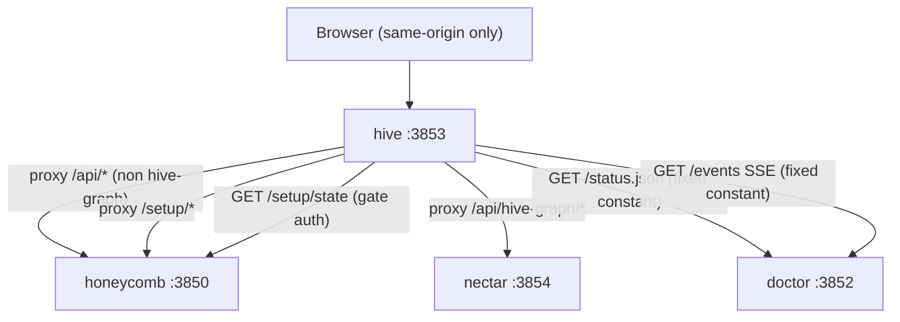

# Workload Endpoint Inventory

> Category: Integrations | Version: 1.0 | Date: July 2026 | Status: Active | Author: Mario Aldayuz

Read this if you need to know exactly which upstream endpoints hive depends on: it inventories every honeycomb, nectar, and doctor endpoint hive consumes, the request/response shapes it relies on, and how the browser's own auth rides through the proxy without hive ever holding a credential.

**Related:**
- [../architecture/bff-proxy-federation.md](../architecture/bff-proxy-federation.md)
- [../architecture/shared-contracts-and-routing.md](../architecture/shared-contracts-and-routing.md)
- [../frontend/wire-and-data-fetch.md](../frontend/wire-and-data-fetch.md)
- [../frontend/fleet-telemetry-client.md](../frontend/fleet-telemetry-client.md)
- [../security/trust-boundaries.md](../security/trust-boundaries.md)
- [ADR-0002](../architecture/ADR-0002-server-side-bff-proxy-for-dashboard-federation.md)
---

## Hive is a consumer, not a provider

Hive owns no data plane. It serves the dashboard and reaches every other daemon over loopback on the browser's behalf. This doc is the catalog of those upstream dependencies, drawn from the four hive modules that actually fetch: the BFF proxy (`proxy.ts`), the fleet-status fetch (`fleet-status.ts`), the setup-auth fetch (`setup-auth.ts`), and the SSE relay (`telemetry-proxy.ts`), plus the wire's `ENDPOINTS` list that names every proxied path. Everything below is a contract hive depends on, not an API hive owns.

Two integration surfaces exist. Doctor is reached through fixed loopback constants (its status page and its SSE stream); honeycomb and nectar are reached through the proxy, with the owning daemon resolved per request. Both surfaces re-verify their target is loopback before fetching and pin `redirect: "error"`.



## Doctor (`:3852`)

Doctor is the supervisor and the single source of fleet-health truth. Hive reaches it at two fixed loopback constants, never derived from the registry or env, pinned in `src/shared/constants.ts`:

```typescript
export const DOCTOR_STATUS_URL = "http://127.0.0.1:3852/status.json" as const;
export const DOCTOR_EVENTS_URL = "http://127.0.0.1:3852/events" as const;
```

**`GET /status.json`** is doctor's coarse fleet-health projection, consumed by `fetchFleetStatus` (`fleet-status.ts`). Hive's zod schema requires `health` (`ok` | `degraded` | `unreachable` | `unknown`), an optional `daemons` array of `{ name, health, escalation? }`, and an `asOf` string. Hive normalizes this into the `FleetStatusResponse` union (a `supervisor: "reachable"` arm or, on any failure, the `supervisor: "unreachable"` fallback), and `isFleetReady` reads it for the landing gate and the `/buzzing` dismissal. Hive treats doctor's per-daemon `escalation` as an opaque pass-through it never interprets. This feeds `GET /api/fleet-status`, hive's own re-exposed projection.

**`GET /events`** is doctor's `text/event-stream` carrying the one event type `fleet-telemetry`, consumed by the SSE relay (`telemetry-proxy.ts`) and re-served to the browser at `/api/telemetry/stream`. Its payload is Contract C in the superproject ledger: `{ asOf, services, logs }`, where each service model is `{ name, health, lastSeen, metrics, deeplake, telemetryFault }` and `metrics` is an open `Record<string, number>`. Doctor emits it about once per poll tick (~1s). A registered-but-silent service appears with `health: "unknown"`; a never-registered service is absent. The shape and the hand-kept copy that parses it are in [../architecture/shared-contracts-and-routing.md](../architecture/shared-contracts-and-routing.md) and [../frontend/fleet-telemetry-client.md](../frontend/fleet-telemetry-client.md).

Doctor's registry file, `~/.honeycomb/doctor.daemons.json`, is also a doctor-owned input hive reads (not an HTTP endpoint). Hive derives daemon bases from it (`resolveDaemonBases`) and the full registered-service-name list from it (`resolveRegisteredServiceNames`, re-served at `/api/registered-services`). Every entry is zod-validated and loopback-filtered before it can become a base. That file is also the entry hive's installer upserts into; see [../operations/on-disk-footprint.md](../operations/on-disk-footprint.md).

## Honeycomb (`:3850`)

Honeycomb is the memory workload and owns everything the proxy routes that is not the hive-graph prefix. The gate reaches honeycomb directly for one thing, and the proxy reaches it for the rest.

**`GET /setup/state`** is the gate's auth input, fetched by `fetchSetupAuthenticated` (`setup-auth.ts`) at the honeycomb base the proxy resolves. Hive reads only its `authenticated` boolean (schema `{ authenticated: z.boolean().catch(false) }`). That bit reflects the presence of `~/.deeplake/credentials.json`; hive reads it and holds nothing. Any failure at all (non-loopback base, network error, non-OK, bad JSON, schema mismatch, client abort) resolves `false`, which fails closed to `/login`. The same route is also consumed by the `/login` screen through the wire (`wire.setupState()`, richer than the gate's one-bit read).

**The proxied `/api/*` and `/setup/*` surface.** Every path in the wire's `ENDPOINTS` except the hive-graph group routes to honeycomb through `createApiProxy`. Grouped by area:

| Area | Paths (relative, proxied to honeycomb) |
|---|---|
| Diagnostics | `/api/diagnostics/kpis`, `/sessions`, `/settings`, `/rules`, `/skills`, `/harnesses`, `/assets`, `/sync`, `/pollinate`, `/compact`, `/memory-graph`, `/roi`, `/roi/trend` |
| Scope + projects | `/api/diagnostics/scope/{orgs,workspaces,projects,org-switch,workspace-switch}`, `/api/diagnostics/fs/browse`, `/api/diagnostics/projects/{bind,bind-existing,unbind}` |
| Memories | `/api/memories`, `/api/memories/recall`, `/conflicts`, `/stale-refs`, `/history`, `/calibration` |
| Logs | `/api/logs`, `/api/logs/stream` (SSE), `/api/logs/history` |
| Graph (memory/codebase) | `/api/graph`, `/api/graph/build` |
| Setup | `/setup/state`, `/setup/login`, `/setup/migrate-from-hivemind`, `/setup/migrate-from-hivemind/rollback` |
| Vault + auth + actions | `/api/settings`, `/api/secrets`, `/api/auth/status`, `/api/actions/{logout,embeddings,restart,uninstall}` |

Hive does not define these shapes; it validates what honeycomb returns through per-endpoint zod schemas in `wire.ts` and degrades fail-soft on a mismatch. The one place a honeycomb change can silently stale a hive type is the ROI view-model, of which `src/dashboard/contracts.ts` carries a partial copy; see [../architecture/copy-and-own-provenance.md](../architecture/copy-and-own-provenance.md).

## Nectar (`:3854`)

Nectar is the hive-graph workload. It owns exactly the `/api/hive-graph` prefix, resolved by `resolveEndpointOwner`. Four proxied paths:

| Path | Wire method | Returns |
|---|---|---|
| `/api/hive-graph/projection` | `hiveGraphFileGraph` | The portable projection document (`{ version, generated_at, generator, project, files, derived }`), transformed to `GraphWire` client-side |
| `/api/hive-graph/search` | `hiveGraphSearch` | `{ hits, degraded, unreachable }` |
| `/api/hive-graph/status` | `hiveGraphStatus` | `{ queueDepth, describeStatus{described,pending,failed}, costSpentUsd, degraded, unreachable }` |
| `/api/hive-graph/build` | `hiveGraphBuild` | An ack `{ state, message }` (`accepted` | `already_running` | error) |

The projection is the one nectar endpoint whose shape hive transforms rather than renders directly: per superproject decision #39 the Hive Graph page hydrates from nectar's existing projection-read endpoint and turns it into a graph client-side, so no nodes/edges endpoint was added to nectar. The transform is `projectionToGraphWire`; see [../frontend/hive-graph-and-graph-pages.md](../frontend/hive-graph-and-graph-pages.md). A dead nectar sets the `unreachable` flag on each of these and the page shows its empty state; every honeycomb-backed page keeps rendering.

## Auth pass-through: the browser's session, never hive's

Hive stores, mints, and injects no credential. The proxy's only header work is subtraction: it forwards the browser's own request headers verbatim minus a fixed hop-by-hop strip set, and forwards the response back minus the framing headers fetch already consumed. This preserves honeycomb's existing loopback plus local-mode plus session-header posture, including the `x-honeycomb-project` scope header and the `x-honeycomb-runtime-path`/`x-honeycomb-session` session headers the wire attaches. "Logged in" for the portal is honeycomb's `/setup/state` `authenticated` bit, which itself just reflects a credentials file on disk; hive reads it and never writes it.

The consequence for this inventory is that no workload daemon owes hive a CORS header, an auth endpoint, or a service credential. A future daemon inherits the integration for free by registering with doctor: the day `resolveEndpointOwner` learns its prefix, the proxy routes to it, and the browser's own session rides through. The verification of the "no credential anywhere" claim, plus the SSRF and redirect-pinning defenses that guard every one of these fetches, is in [../security/trust-boundaries.md](../security/trust-boundaries.md).
