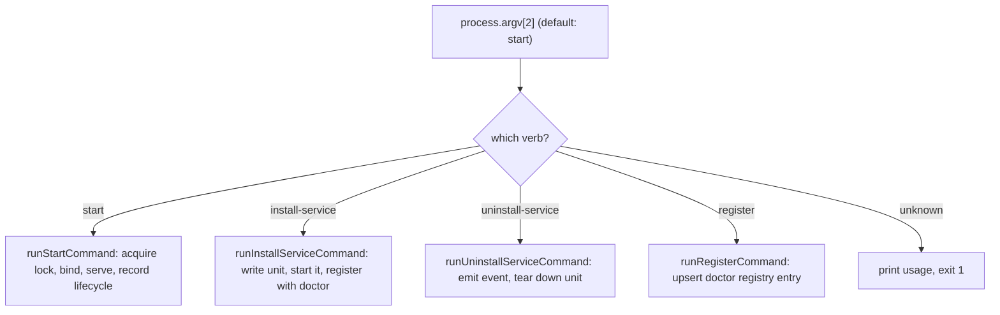

# CLI And Runbook

> Category: Operations | Version: 1.0 | Date: July 2026 | Status: Active | Author: Mario Aldayuz

Read this if you run or operate hive: it documents the four CLI verbs, how argv is dispatched, the exit codes, the environment variables hive reads, and the day-to-day operator runbook (where the lock and pid live, how to inspect a running hive, and the common failure modes).

**Related:**
- [on-disk-footprint.md](./on-disk-footprint.md)
- [../architecture/doctor-registration-and-lifecycle.md](../architecture/doctor-registration-and-lifecycle.md)
- [../architecture/system-overview.md](../architecture/system-overview.md)
- [../infrastructure/build-and-release.md](../infrastructure/build-and-release.md)
- [../telemetry/telemetry-egress.md](../telemetry/telemetry-egress.md)
- [../security/trust-boundaries.md](../security/trust-boundaries.md)
---

## The four verbs

Hive's whole CLI is four verbs, dispatched in `src/cli.ts` and implemented in `src/cli-commands.ts`:

```
hive start                # run the daemon on 127.0.0.1:3853 (the default verb)
hive install-service      # write + start the OS unit, then register with doctor
hive uninstall-service    # deregister + remove the OS unit (registry entry stays)
hive register             # upsert hive's entry into doctor's registry, standalone
```

`cli.ts` reads `process.argv[2]`, defaulting to `start` when none is given, and routes to the matching runner. Any unknown verb prints `Usage: hive <start|install-service|uninstall-service|register>` to stderr and exits 1. The dispatcher wraps every runner in one try/catch: a `DaemonAlreadyRunningError` or any other `Error` is printed to stderr and sets exit code 1; a non-Error throw re-throws. There are no flags: host and port are hard-pinned constants with no argv or env override, which is a deliberate design decision, not a missing feature.



## `hive start`

The default verb. `runStartCommand` calls `startHive`, which acquires the single-instance lock before binding the socket, then binds `127.0.0.1:3853` and serves the shell immediately. It prints `hive listening on http://127.0.0.1:3853`, then records lifecycle telemetry after the readiness line (`recordStartLifecycle`, which never rejects, so a telemetry failure cannot alter the exit code). It installs `SIGINT` and `SIGTERM` handlers that close the server, release the lock and pid, and exit 0. A second `hive start` while a live daemon holds the lock exits 1 with `hive is already running (pid N) and holds lock ...`. Returns exit code 0 on a clean start.

## `hive install-service`

`runInstallServiceCommand` resolves the per-platform service plan, writes the unit, and runs the manager commands, then upserts hive's registry entry with doctor and prints whether it created or updated the entry. Telemetry (`hive_installed`) fires only after the user-facing success and never alters the exit code. It returns 1 if the service install failed (a unit-file write error or a manager-command failure), 0 otherwise. The install begins by best-effort deregistering the pre-decision-#32 `thehive` legacy units so a re-run migrates rather than races. Full unit and registration detail is in [../architecture/doctor-registration-and-lifecycle.md](../architecture/doctor-registration-and-lifecycle.md).

## `hive uninstall-service`

`runUninstallServiceCommand` initiates the `hive_uninstalled` telemetry emit before teardown (fire-and-forget, awaited only so the bounded POST can flush before the process exits), then runs the manager's deregister command and removes the unit file, and prints the result. It returns the service result's exit code (0 on success, 1 if a deregister command reported an error). It deliberately does not remove hive's entry from doctor's registry; that asymmetry is a known, documented gap (see the runbook below and the lifecycle doc).

## `hive register`

`runRegisterCommand` upserts hive's registry entry into `~/.honeycomb/doctor.daemons.json` standalone, without touching the OS service, and prints whether it created or updated the entry. It always returns 0. Use it to (re)register hive with doctor on a box where the service is managed some other way, or to repair a hand-edited registry.

## Exit codes, at a glance

| Verb | 0 | 1 |
|---|---|---|
| `start` | clean start (or clean shutdown on signal) | lock held by a live daemon, or a bind error |
| `install-service` | unit written, started, and registered | unit-file write error, or a manager-command failure |
| `uninstall-service` | unit removed and deregistered | a deregister command reported an error |
| `register` | always | (never) |
| unknown verb | | always |

Telemetry never contributes to an exit code: every emit helper resolves rather than rejects.

## Environment variables

Hive reads exactly two environment variables, both telemetry opt-outs, both honored by the single egress chokepoint (`src/telemetry/emit.ts`):

- `HONEYCOMB_TELEMETRY=0` silences all telemetry.
- `DO_NOT_TRACK` (the cross-tool standard) silences all telemetry for any value other than empty or `0`.

There is no environment variable for the host, the port, the doctor URLs, or any file path. Those are code constants. This is the operator surface in full; anything else you might expect to configure is either a code option (a test seam, not an operator knob) or simply pinned. Telemetry behavior is documented in [../telemetry/telemetry-egress.md](../telemetry/telemetry-egress.md).

## Runbook: inspect a running hive

The daemon binds `127.0.0.1:3853`. The cheapest liveness check is the machine-probe form of `/health`, which returns `{ status, uptimeMs, version }` when the `Accept` header does not ask for HTML:

```bash
curl -s http://127.0.0.1:3853/health           # liveness JSON: status, uptimeMs, version
curl -s http://127.0.0.1:3853/api/fleet-status # doctor's coarse fleet projection, as hive sees it
curl -s http://127.0.0.1:3853/api/registered-services  # the names doctor has registered
```

The running process identity lives in two files under `~/.honeycomb`: `hive.lock` (holds the PID, created with an exclusive flag) and `hive.pid` (a mirror the doctor registry entry's `pidPath` points at). Both are removed on a clean shutdown. To confirm which process is "the" hive, read `~/.honeycomb/hive.pid` and check that PID. The full on-disk catalog is [on-disk-footprint.md](./on-disk-footprint.md).

Service logs, when hive runs as a launchd unit, are at `~/.honeycomb/hive/launchd.out.log` and `launchd.err.log`. systemd routes to the journal (`journalctl --user -u hive.service`). The Windows task runs headless.

## Runbook: common failure modes

- **`hive is already running (pid N)` on start.** A live daemon holds the lock. If `N` is genuinely dead (crash, power loss) the next start reclaims the stale lock automatically; if the message persists, the PID is alive. This is PID-probe based, not flock-based, which is exactly what lets a crashed daemon's lock be reclaimed without manual cleanup.
- **Dashboard redirects to `/buzzing` and stays.** The fleet is not ready per doctor: either the supervisor is unreachable or a required peer (honeycomb) is not `ok`. Check `curl :3853/api/fleet-status`. Hive is serving correctly; it is honestly reporting a booting or degraded fleet.
- **Dashboard redirects to `/login`.** Honeycomb's `/setup/state` reports not-authenticated, or the auth fetch failed (which fails closed to `/login`). If honeycomb is up, log in via the CLI honeycomb prints; if honeycomb is down, expect `/buzzing` first.
- **Panels for one daemon are empty while others render.** That daemon is unreachable and the wire degraded its panels to empty states fail-soft. A dead nectar blanks only the Hive Graph surfaces; a dead honeycomb blanks the honeycomb-backed panels. Hive itself is healthy.
- **Doctor still probes hive after `uninstall-service`.** Expected: uninstall does not remove hive's registry entry. Doctor keeps probing `:3853/health` and reports hive unreachable. To make doctor forget hive, edit `~/.honeycomb/doctor.daemons.json` by hand and remove the `name: "hive"` entry. This is a known operational wart, documented in [../architecture/doctor-registration-and-lifecycle.md](../architecture/doctor-registration-and-lifecycle.md).
- **A stale bundle serves after an upgrade.** The shell, `app.js`, and `styles.css` are served `no-cache` precisely so an in-place rebuild is picked up on the next load; a hard refresh forces it. If the asset routes 404, the bundle was not built (or the install was stripped); rebuild with `npm run build`.
