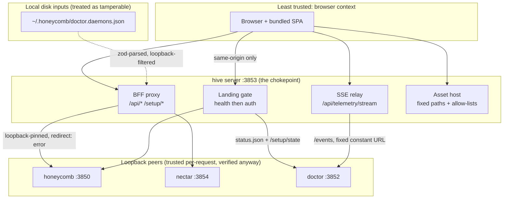

# Trust Boundaries

> Category: Security | Version: 1.0 | Date: July 2026 | Status: Active | Author: Mario Aldayuz

Read this before changing anything that fetches, redirects, serves a file, or forwards a header: it maps hive's trust boundaries and the invariants that keep the portal from becoming the fleet's weakest link.

**Related:**
- [../architecture/bff-proxy-federation.md](../architecture/bff-proxy-federation.md)
- [../architecture/landing-gate-and-routing.md](../architecture/landing-gate-and-routing.md)
- [../architecture/doctor-registration-and-lifecycle.md](../architecture/doctor-registration-and-lifecycle.md)
- [../../../requirements/in-work/prd-001-hive-portal-daemon/qa/security-report.md](../../../requirements/in-work/prd-001-hive-portal-daemon/qa/security-report.md)
- [ADR-0002](../architecture/ADR-0002-server-side-bff-proxy-for-dashboard-federation.md)
- [ADR-0004](../architecture/ADR-0004-portal-landing-gate-and-path-based-routing.md)
---

## The trust map

## Loopback binding

Hive binds `127.0.0.1:3853`, hard-pinned in `src/shared/constants.ts` with no env override. Nothing off-machine can reach the portal, and hive itself refuses to talk to anything off-machine: every server-side fetch target is either a fixed loopback constant (`DOCTOR_STATUS_URL`, `DOCTOR_EVENTS_URL`) or a registry-derived base filtered through `isLoopbackBaseUrl` (`src/shared/daemon-routing.ts`), whose trusted hostname set is exactly `127.0.0.1`, `localhost`, `::1`, `[::1]`.

## The proxy is the single auth chokepoint

Every byte of dashboard data crosses one seam: the BFF proxy in `src/daemon/proxy.ts` (plus its two specialized siblings, the fleet-status fetch and the SSE relay). That concentration is the design. There is one place to audit header handling, one place to pin redirects, one place where the loopback decision is made, and it lives on the server tier that already owns the registry, not in the browser.

**Hive never mints or stores workload credentials.** Verified in code: there is no token generation, no credential file read or write, no session store, and no injected auth header anywhere under `src/`. The proxy forwards the browser's own headers verbatim (minus a fixed hop-by-hop strip set) and the response back (minus framing headers fetch already consumed). "Logged in" is honeycomb's `/setup/state` `authenticated` bit, which reflects the presence of `~/.deeplake/credentials.json`; hive reads the bit through the same proxy path and holds nothing. An always-on process that stores no secret has no secret to leak, which is precisely why ADR-0002 rejected giving hive a service credential.

Header handling, exactly:

- Request strip set: `host`, `connection`, `keep-alive`, `proxy-authenticate`, `proxy-authorization`, `te`, `trailer`, `transfer-encoding`, `upgrade`, `content-length`.
- Response strip set: the hop-by-hop set plus `content-encoding` and `content-length` (fetch decompressed the body; the original framing would lie).
- Nothing is added in either direction.

## SSRF defense in depth

The registry file on disk is treated as tamperable input, because it is one: any local process in the user's account can edit `~/.honeycomb/doctor.daemons.json`. Three independent layers keep a tampered registry from turning the proxy into an exfiltration primitive for the session/memory bodies it forwards:

1. **Parse-time filter**: `baseUrlFromHealthUrl` (`src/daemon/registry.ts`) drops any entry whose `healthUrl` host is not loopback before it can become a daemon base. Corrupt JSON parses to defaults, never a throw.
2. **Use-time re-check**: the proxy, the setup-auth fetch, the fleet-status fetch, and the SSE relay each re-verify their resolved target with `isLoopbackBaseUrl` immediately before fetching, so no future refactor of base resolution can silently bypass the guard.
3. **Redirect pinning**: every server-side fetch sets `redirect: "error"`. Native fetch follows 3xx by default and the loopback check only validates the first hop, so without the pin a compromised loopback listener could redirect hive's request (headers and body included) to an external origin. With it, any redirect rejects the fetch, which degrades fail-soft.

This exact class of bug is hive's security history: the PRD-001 audit found and fixed the missing loopback gate (High), and the PRD-002 audit found and fixed the missing redirect pin on the doctor status fetch (Medium). Both reports live under the PRD `qa/` folders.

## What the landing gate protects

The gate (`src/daemon/gate.ts`) is a UX authority more than a hard authorization boundary, and it is important to be honest about which. It guarantees a logged-out or unhealthy visitor never receives dashboard chrome: the server decides `/buzzing` vs `/login` vs the page before anything renders. Its own hardening:

- **No open redirect, structurally.** Both redirect targets are hard-coded literals. No `?next=`, no `Referer` echo, no path reflection; there is no code path where attacker-influenced input reaches `c.redirect`.
- **Fail-closed auth.** Any failure of the `/setup/state` read (network, non-OK, bad JSON, schema mismatch, client abort) resolves to "not logged in" and redirects to `/login`. A transient fault can never fail-soft an unauthenticated visitor into the dashboard.
- **No gate on the data plane.** `/api/*` and `/setup/*` bypass the gate by design; their protection is the workload daemons' own loopback + session posture, passed through transparently. The gate protects screens; the daemons protect data. Requests to the data plane are loopback-only in the first place because hive binds loopback.

## The asset surface

The static host serves fixed paths only. The one parameterized route, `GET /fonts/:name`, matches against a frozen allow-list of six filenames; anything else, including any traversal attempt, is `null` and 404s, because the name is never joined to a path unless it is a known leaf filename. The shell HTML carries no inline data, no token, and no third-party reference; the bundle is compiled at build time (no in-browser Babel, no CDN script). `main.tsx` sanitizes the one DOM-read value (`data-asset-base`) against `/^[A-Za-z0-9._/-]*$/` before it can flow into an asset URL, closing the DOM-text-to-sink taint path even though the host, not the user, writes that attribute.

## Telemetry egress

The only outbound-to-internet call hive can ever make is the lifecycle telemetry POST in `src/telemetry/emit.ts`, and it is fenced: a closed five-key property allow-list (`package`, `version`, `os`, `arch`, `node`; no hostname, no paths), a build-injected public write-only PostHog key that compiles to hard-disabled when unset, `HONEYCOMB_TELEMETRY=0` / `DO_NOT_TRACK` opt-outs, a dedupe ledger, and a 2 s bounded fire-and-forget POST that never throws and never alters an exit code. See [../infrastructure/build-and-release.md](../infrastructure/build-and-release.md).

## The invariants, as a review checklist

If a PR touches the server tier, check the diff against these. Every one of them is currently true and tested; breaking any of them is a security regression, not a style call.

- [ ] Hive binds `127.0.0.1` only; no listener gains an env-configurable host or port.
- [ ] Every server-side fetch target is a fixed loopback constant or passes `isLoopbackBaseUrl` at the point of use.
- [ ] Every server-side fetch pins `redirect: "error"` (proxy, gate auth, fleet status, SSE relay).
- [ ] The proxy adds no header in either direction; strip sets only grow deliberately.
- [ ] No code path stores, mints, or logs a credential; `grep -ri "authorization" src` should keep returning only the hop-by-hop strip entries.
- [ ] Gate redirects remain hard-coded literals; no request-derived value reaches `c.redirect`.
- [ ] The auth check stays fail-closed: every new failure mode of `fetchSetupAuthenticated` resolves `false`.
- [ ] Parameterized asset routes stay allow-listed; no user-supplied string is path-joined.
- [ ] Telemetry properties stay inside the closed five-key allow-list; no free-form property path is introduced.
- [ ] Service-manager invocations stay `execFile` with argv arrays; no shell string interpolation.

## Known gaps, stated plainly

- The registry file's permissions are not tightened by hive (documented Low in the PRD-001 audit); the loopback filter is the compensating control.
- Unauthenticated loopback GETs (`/health`, `/api/fleet-status`, `/api/registered-services`) expose coarse fleet metadata to any local process. Accepted: it is health data, on loopback, in the user's own account.
- `hive uninstall-service` leaves the doctor registry entry behind (see [../architecture/doctor-registration-and-lifecycle.md](../architecture/doctor-registration-and-lifecycle.md)); stale registry entries are an operational wart, not a privilege issue.
