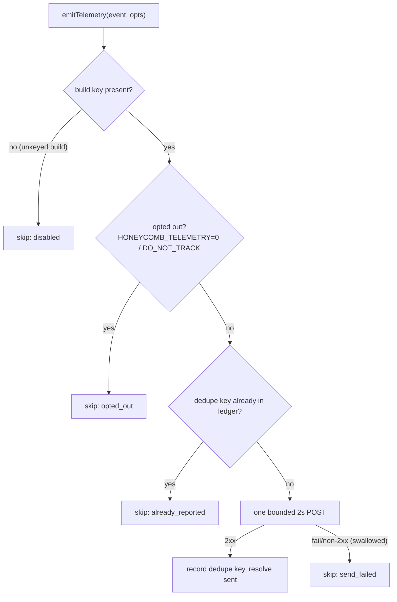

# Telemetry Egress

> Category: Telemetry | Version: 1.0 | Date: July 2026 | Status: Active | Author: Mario Aldayuz

Read this before touching `src/telemetry/emit.ts` or anything that fires a lifecycle event: it documents the single telemetry-egress chokepoint, the four events, the closed property allow-list, the opt-out gates, the dedupe ledger, and the bounded fire-and-forget POST that can never change a CLI verb's exit code.

**Related:**
- [../operations/on-disk-footprint.md](../operations/on-disk-footprint.md)
- [../operations/cli-and-runbook.md](../operations/cli-and-runbook.md)
- [../architecture/doctor-registration-and-lifecycle.md](../architecture/doctor-registration-and-lifecycle.md)
- [../infrastructure/build-and-release.md](../infrastructure/build-and-release.md)
- [../security/trust-boundaries.md](../security/trust-boundaries.md)
---

## One chokepoint, by design

`emitTelemetry` in `src/telemetry/emit.ts` is the only place in the package that posts to the telemetry endpoint. The four lifecycle emit sites all funnel through it, so the allow-list, the opt-out gates, the dedupe ledger, and the bounded POST live in one module you can audit in one read. This mirrors honeycomb's and doctor's telemetry posture so all three chokepoints agree on the same env contract and the same egress discipline. The distinction to keep straight: this is telemetry hive sends out about its own lifecycle; the fleet-telemetry hive relays from doctor to the browser is a separate inbound stream (see [../frontend/fleet-telemetry-client.md](../frontend/fleet-telemetry-client.md)).

## The four events

The event vocabulary is a closed union, `HiveTelemetryEvent`, of exactly four lifecycle events, wired to the four firing points in `src/cli-commands.ts`:

| Event | Fires on | Dedupe |
|---|---|---|
| `hive_installed` | a successful `install-service`, after the user-facing success | once per machine (`dedupeKey: "hive_installed"`) |
| `hive_uninstalled` | `uninstall-service`, initiated before teardown, fire-and-forget | none (an install/uninstall/reinstall cycle legitimately re-fires) |
| `hive_first_run` | the first successful `start` | once per machine (`dedupeKey: "hive_first_run"`) |
| `hive_updated` | a `start` where the persisted last-seen version differs | per version (`dedupeKey: "hive_updated@<version>"`) |

`recordStartLifecycle` handles the `start` pair: it emits `hive_first_run` once, and when the ledger's `lastSeenVersion` differs from the current version it emits `hive_updated`, then advances the persisted version. Capturing the upgrade on `start` means an npm reinstall is detected with no updater at all. Every helper is fail-soft: `emitInstalled`, `emitUninstalled`, and `recordStartLifecycle` resolve rather than reject, so a telemetry failure never changes a verb's exit code.

## The three gates, in order

Every emit passes three gates before a byte leaves the machine. A blocked gate returns silently; telemetry never throws.



1. **Disabled.** The build-injected key `__HONEYCOMB_POSTHOG_KEY__` (via esbuild `define`) is empty in any build that did not run the define pass, and an empty key compiles to hard-disabled: a local, fork, or tsc-only build emits nothing, ever. `POSTHOG_KEY` falls through to `""` when the define is absent.
2. **Opted out.** `isOptedOut` returns true when `HONEYCOMB_TELEMETRY=0` or when `DO_NOT_TRACK` holds any value other than empty or `0`. These are the only two environment variables hive reads at all.
3. **Already reported.** A keyed emit checks the dedupe ledger and skips if the key is present.

Only past all three does a single bounded POST fire; on a 2xx the dedupe key (when supplied) is recorded in the ledger.

## The closed property allow-list

The payload is built from a closed allow-list of exactly five keys; there is no caller-supplied property path anywhere, so a leak is structurally impossible rather than merely policed:

```typescript
export const ALLOWED_PROPERTY_KEYS = ["package", "version", "os", "arch", "node"] as const;

export function buildAllowedProperties(version: string): AllowedProperties {
  return {
    package: "hive",
    version,
    os: platform(),   // OS family
    arch: arch(),     // CPU arch
    node: process.version
  };
}
```

These are the package name, the build version, and coarse platform facts. Never a hostname, never a path, never an account id, never a machine-identifying string. The `distinct_id` is anonymized: it prefers the shared `~/.honeycomb/install-id` written by the honeycomb installer (so the funnel correlates across products), falling back to hive's own generated UUID at `~/.honeycomb/hive/install-id`, and never an email, account id, hostname, or path.

## The dedupe ledger

The ledger is a small JSON file, `~/.honeycomb/hive/telemetry.json`, with a `reported` map (dedupe key to ISO timestamp) and a `lastSeenVersion`. `loadLedger` reads it fail-soft to an empty ledger on any IO or parse problem; `saveLedger` writes it, creating the state dir at mode `0o700`. After a successful send the writer reloads the ledger before marking so a concurrent emit's mark is not clobbered. A persist hiccup after a successful send is non-fatal: the send still counts, and `recordStartLifecycle` only advances `lastSeenVersion` once the current version's update event has sent (or was already sent), so a failed send leaves the ledger untouched for the next `start` to retry. The ledger's format and lifecycle are also in [../operations/on-disk-footprint.md](../operations/on-disk-footprint.md).

## The bounded POST

`postCapture` is the only function in the package that touches the telemetry network path. It issues one POST to `${host}${POSTHOG_CAPTURE_PATH}` (`POSTHOG_CAPTURE_PATH = "/i/v0/e/"`, host defaulting to `https://us.i.posthog.com`) with the body `{ api_key, event, properties, distinct_id }`, wrapped in an `AbortController` timeout of `DEFAULT_EMIT_TIMEOUT_MS = 2_000` and a try/catch that swallows everything (timeout, network error, non-2xx). A dropped lifecycle event is acceptable; a hung CLI verb is not. The whole `emitTelemetry` call resolves an `EmitOutcome` (`{ sent, skipped?, properties }`) the caller may inspect or ignore, and it never rejects.

## The key is public, and shipped on purpose

The PostHog project key is a public write-only ingest key (`phc_...`), baked into the published tarball at build time via esbuild `define`, never read from a runtime env and never logged. It carries no secret: a public write-only key can only append events, and the CI secret exists solely to keep it out of build logs and fork PRs, not because leaking it would matter. The build side of this (the `define` substitution on `dist/telemetry/emit.js`, and how an unset key compiles to hard-disabled) is documented in [../infrastructure/build-and-release.md](../infrastructure/build-and-release.md). `tests/telemetry/emit.test.ts` pins every gate, the allow-list, the dedupe behavior, and the fail-soft POST without ever hitting a real network, because the fetch is an injectable seam.

## The review-checklist invariant

If a PR touches this module, the standing invariant from [../security/trust-boundaries.md](../security/trust-boundaries.md) applies: telemetry properties stay inside the closed five-key allow-list, and no free-form property path is introduced. The allow-list is not a filter applied to a caller's bag; the payload is built from those five keys and nothing else, and that is what makes the egress boundary structural rather than aspirational.
