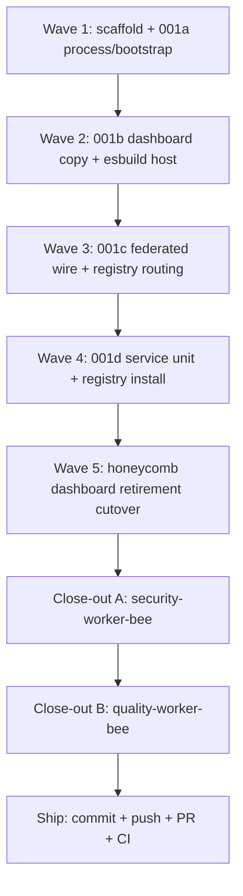
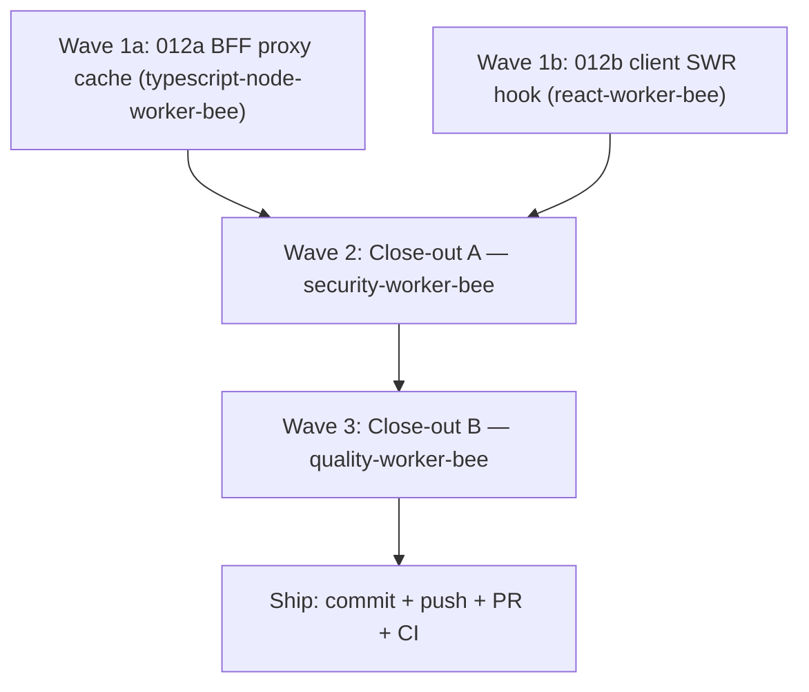

# Execution Ledger: PRD-001 hive Portal Daemon (the-smoker run)

> Category: Ledger | Version: 1.0 | Date: July 2026 | Status: Active

Single source of truth for the `/the-smoker` completion run over **PRD-001 hive Portal Daemon** (index + 001a/b/c/d). Branch: `feature/prd-001-hive-portal-daemon`. Status legend: OPEN / IN PROGRESS / DONE / VERIFIED / BLOCKED.

Greenfield implementation in `hive` (bare repo). Honeycomb cutover (retire `web/` subtree) runs in Wave 5 after hive serves.

---

## AC Ledger

| ID | Source | Criterion (exact) | Owner | Status |
|---|---|---|---|---|
| m-AC-1 | index | hive runs as its own OS process with `/health`, PID/lock, port 3853 | typescript-node-worker-bee | VERIFIED |
| m-AC-2 | index | Dashboard shell renders on socket bind before workload daemon health | typescript-node-worker-bee | VERIFIED |
| m-AC-3 | index | Same route registry + pages as retired honeycomb dashboard via injected `wire` | react-worker-bee | VERIFIED |
| m-AC-4 | index | No Deep Lake client; fail-soft per-daemon aggregation | typescript-node-worker-bee | VERIFIED (see QA Warning: UI-shell `daemonUp` gate is honeycomb-scoped, not per-daemon) |
| m-AC-5 | index | Independent release train (hive-only deploy surface) | typescript-node-worker-bee | OPEN (architectural separation confirmed; no CI/CD automation exists yet — see QA report) |
| m-AC-6 | index | honeycomb `/` + `web/` retired only after hive serves | typescript-node-worker-bee | VERIFIED |
| m-AC-7 | index | doctor supervises via idempotent registry entry, no doctor restart | typescript-node-worker-bee | VERIFIED |
| a-AC-1 | 001a | Hono app, dashboard mount, bind port 3853 | typescript-node-worker-bee | VERIFIED |
| a-AC-2 | 001a | `GET /health` returns `status` + `uptimeMs` + `version` | typescript-node-worker-bee | VERIFIED |
| a-AC-3 | 001a | Dashboard shell served immediately without waiting on daemon `/health` | typescript-node-worker-bee | VERIFIED |
| a-AC-4 | 001a | Writes `~/.honeycomb/hive.pid` and `hive.lock` | typescript-node-worker-bee | VERIFIED |
| a-AC-5 | 001a | Second start exits rather than double-bind | typescript-node-worker-bee | VERIFIED |
| a-AC-6 | 001a | Stale lock reclaimed when PID dead | typescript-node-worker-bee | VERIFIED |
| a-AC-7 | 001a | App construction pure; only `startHive` calls `listen()` | typescript-node-worker-bee | VERIFIED |
| b-AC-1 | 001b | Same `ROUTES` entries as honeycomb registry | react-worker-bee | VERIFIED |
| b-AC-2 | 001b | Pages hydrate through injected `wire` unchanged | react-worker-bee | VERIFIED |
| b-AC-3 | 001b | honeycomb removes `/` mount only after hive serves | typescript-node-worker-bee | VERIFIED |
| b-AC-4 | 001b | honeycomb keeps `/health` and `/api/*` after retirement | typescript-node-worker-bee | VERIFIED |
| b-AC-5 | 001b | Copy-map complete for all 36 dashboard files | react-worker-bee | VERIFIED |
| c-AC-1 | 001c | `wire` fetches each endpoint from owning daemon base | typescript-node-worker-bee | VERIFIED |
| c-AC-2 | 001c | nectar `/api/hive-graph/*` routed to nectar | typescript-node-worker-bee | VERIFIED |
| c-AC-3 | 001c | One daemon down degrades its panels only | typescript-node-worker-bee | VERIFIED (see QA Warning: data-layer fail-soft is correct; UI-shell connectivity gate is honeycomb-scoped, not per-daemon) |
| c-AC-4 | 001c | Malformed responses degrade via zod, no React throw | typescript-node-worker-bee | VERIFIED |
| c-AC-5 | 001c | No Deep Lake client in hive | typescript-node-worker-bee | VERIFIED |
| d-AC-1 | 001d | `install-service` writes platform unit (launchd/systemd/schtasks) | typescript-node-worker-bee | VERIFIED |
| d-AC-2 | 001d | Service starts hive on boot/login | typescript-node-worker-bee | VERIFIED |
| d-AC-3 | 001d | Service restarts hive on crash | typescript-node-worker-bee | VERIFIED |
| d-AC-4 | 001d | `uninstall-service` removes only hive unit | typescript-node-worker-bee | VERIFIED |
| d-AC-5 | 001d | hive unit execs hive entrypoint, not doctor | typescript-node-worker-bee | VERIFIED |
| d-AC-6 | 001d | Registry contains hive entry with name, healthUrl, pidPath | typescript-node-worker-bee | VERIFIED |
| d-AC-7 | 001d | Re-install updates entry in place (idempotent) | typescript-node-worker-bee | VERIFIED |
| d-AC-8 | 001d | Atomic JSON write; no doctor restart or code change | typescript-node-worker-bee | VERIFIED |

**Open count after Close-out B: 1 (m-AC-5, release-train CI automation — tracked as a Warning, not ship-blocking). All other 26 ACs VERIFIED.**

---

## PRD-002 tracking: Portal Readiness Splash

PRD-002 (index + 002a/002b/002c) was authored into `library/requirements/in-work/prd-002-portal-readiness-splash/` per the pinned note [`portal-readiness-splash.md`](../knowledge/private/frontend/portal-readiness-splash.md) (Option B locked). **Implemented** on branch `feature/prd-002-portal-readiness-splash` (uncommitted working tree, based on `feature/prd-001-hive-portal-daemon`): the `GET /api/fleet-status` proxy, `isFleetReady()`, `ReadinessSplash`, the `main.tsx` tree-order change, and a dedup refactor (`src/shared/fleet-readiness.ts` shared by the server and browser). `security-worker-bee` ran and remediated one Medium (SSRF redirect-follow on the doctor fetch); `quality-worker-bee` ran after and verified all 19 sub-PRD ACs. This corrects the prior "documentation-only, no smoker run has started" note below, which was stale as of this implementation pass.

| ID | Source | Criterion (exact) | Owner | Status |
|---|---|---|---|---|
| fs-AC-1..10 | 002a | `GET /api/fleet-status` loopback-only proxy, fail-soft, `isFleetReady()`, tamper-safety | typescript-node-worker-bee | VERIFIED (10/10; see QA report) |
| rs-AC-1..9 | 002b | `ReadinessSplash` wraps `SetupGate`, polls, per-daemon grid, sticky gate | react-worker-bee | VERIFIED (9/9; see QA report) |
| ac-AC-1..8 | 002c | Consolidated acceptance sketch + the locked "no exception for degraded" rule | typescript-node-worker-bee | VERIFIED (traced via fs-AC-*/rs-AC-* evidence; see QA report) |

**Dependency note (doctor `daemons[]`):** the pinned note and `prd-002-portal-readiness-splash-index.md`'s "Dependency status" section describe this module as blocked on nectar `prd-004b` extending `GET :3852/status.json` with a `daemons[]` array. As of this QA pass, that extension is implemented in the sibling `doctor` worktree (`src/status-page/server.ts` `StatusJson.daemons`, `src/compose/index.ts`) on branch `feature/prd-004a-004b-multi-daemon-status`, but it is **uncommitted there too** (not yet merged to doctor's own `main`), so the dependency is authored-and-compatible, not yet shipped. `quality-worker-bee` verified hive's `DoctorStatusSchema` (`src/daemon/fleet-status.ts:29-33`) is a compatible strict-subset consumer of doctor's actual `StatusJson` shape (field names, enum values, and per-daemon `escalation` all align); see the QA report's cross-repo contract-alignment section. The two branches should ship together; neither is blocked on new work in the other.

Report: `qa/qa-report-prd-002-portal-readiness-splash.md`.

---

## Wave plan

| Wave | Bee | Model | Scope | Exit criteria |
|---|---|---|---|---|
| 1 | `typescript-node-worker-bee` | `gpt-5.3-codex-high-fast` | Greenfield `package.json`, tsconfig, vitest, Hono server, lock, `/health`, `createHive`/`startHive`, minimal dashboard host stub | a-AC-* DONE; `npm run typecheck && npm test` green |
| 2 | `typescript-node-worker-bee` + `react-worker-bee` | `claude-opus-4-8-thinking-high-fast` | Copy 28 `web/` files + partial `contracts.ts`; esbuild browser bundle; adapt `host.ts`/`web-assets` from honeycomb | b-AC-1, b-AC-2, b-AC-5 DONE; dashboard builds |
| 3 | `typescript-node-worker-bee` | `gpt-5.5-medium-fast` | Federated `wire.ts`, registry reader, endpoint-owner map, fail-soft | c-AC-* DONE |
| 4 | `typescript-node-worker-bee` | `gpt-5.3-codex-high-fast` | Service install/uninstall mirroring doctor; registry RMW | d-AC-* DONE |
| 5 | `typescript-node-worker-bee` | `composer-2.5-fast` | honeycomb: remove `/` mount + delete `web/` after hive verified | b-AC-3, b-AC-4, m-AC-6 DONE |
| 6a | `security-worker-bee` | `claude-sonnet-5-thinking-high` | Security audit + remediate Critical/High | clean at medium+ |
| 6b | `quality-worker-bee` | `claude-sonnet-5-thinking-high` | QA vs PRD-001 ACs | all ACs VERIFIED |

---

## Scope boundaries

- Primary code owner: `hive/` repository root (not apiary umbrella docs except ledger/PRD lifecycle).
- Reference only (do not import at runtime): `../honeycomb/`, `../doctor/`.
- Honeycomb retirement (Wave 5) touches `honeycomb/` submodule; only after hive serves dashboard on :3853.
- Do not modify nectar or doctor source except honeycomb cutover in Wave 5.

---

## Run log

- Phase 0: PRD moved `backlog/` -> `in-work/`; branch `feature/prd-001-hive-portal-daemon` created; ledger initialized (29 OPEN).
- Wave 1: DONE (greenfield scaffold and PRD-001a process/bootstrap implemented in `hive/src` and `hive/tests`).
- Wave 1 verification evidence:
  - `npm run typecheck` passes.
  - `npm test` passes (2 files, 8 tests).
  - `npm run build` passes (`tsc && node esbuild.config.mjs`).
- Wave 2: DONE (PRD-001b dashboard migration — b-AC-1, b-AC-2, b-AC-5 DONE; m-AC-3 IN PROGRESS/partial).
  - Copied the 28 honeycomb `web/` files VERBATIM into `hive/src/dashboard/web/` (12 shell/infra + 12 pages + wire.ts/app.tsx/main.tsx/setup-gate.tsx). For Wave 2 the four "copy with modification" files needed no code change: the dashboard pages are origin-agnostic and the asset-base/path adaptation is localized to the host shell (`data-asset-base=""`) and `web-assets.ts` (font prefix `/fonts/`). wire.ts keeps honeycomb's same-origin `/api/*` endpoint map + zod schemas; Wave 3 (PRD-001c) federates it.
  - Copied the PARTIAL `contracts.ts` (only the web-consumed ROI view-model types wire.ts + roi pages import) to `hive/src/dashboard/contracts.ts`.
  - Import fix: two verbatim pages import shared modules outside the web tree (`settings.tsx` → `../../../shared/lifecycle-flags.js`, `memories.tsx` → `../../../shared/memory-types.js`). Copied both pure/browser-safe modules to `hive/src/shared/` so the relative imports resolve and the pages stay byte-verbatim (no page edit).
  - Copied `assets/styles.css`, `assets/tokens/*`, `assets/logos/honeycomb-memory-cluster.svg` into `hive/assets/`.
  - Adapted `src/daemon/dashboard/web-assets.ts` from honeycomb (font prefix `/fonts/`, bundle name `app.js`).
  - Replaced `src/daemon/dashboard/host.ts` with the full shell serving at `/`, `/app.js`, `/styles.css`, `/honeycomb-memory-cluster.svg`, `/fonts/:name`.
  - Replaced `esbuild.config.mjs` to bundle `src/dashboard/web/main.tsx` → `dist/daemon/dashboard/app.js` (browser platform, esm, jsx automatic, React bundled, minified).
  - Added deps: `react` 18.3.1, `react-dom` 18.3.1, `zod` ^4.4.3, `@types/react` ^18.3.31, `@types/react-dom` ^18.3.7. tsconfig gained `jsx: react-jsx`, DOM libs, `esModuleInterop`, and `.tsx` includes.
- Wave 2 verification evidence:
  - `npm run typecheck` passes (whole `src` incl. the copied `.tsx` tree).
  - `npm run build` passes; emits `dist/daemon/dashboard/app.js` (~672 KB, React + ReactDOM + app).
  - `npm test` passes (5 files, 18 tests) incl. `tests/dashboard/registry.test.ts` (b-AC-1 labels/routes), `tests/dashboard/host.test.ts` (GET `/` → `#root` + `/app.js` script), `tests/dashboard/copy-map.test.ts` (b-AC-5 28-file count + partial contracts + shared modules).
- Wave 3: DONE (PRD-001c federated wire and doctor registry routing implemented).
  - Added `src/shared/daemon-routing.ts` for the static endpoint owner map: honeycomb owns copied dashboard endpoints by default, while `/api/hive-graph/*` routes to nectar.
  - Added `src/daemon/registry.ts` to read `~/.honeycomb/doctor.daemons.json`, validate entries with zod, derive daemon bases from `healthUrl`, and fall back to documented loopback defaults when the registry is missing or malformed.
  - Added `GET /api/daemon-bases` in `src/daemon/server.ts`; the browser wire uses this bootstrap endpoint instead of reading the filesystem.
  - Modified `src/dashboard/web/wire.ts` with the daemon-bases architecture: fetch bases once from hive, wrap fetch so each endpoint is sent to the owning daemon base, and keep existing zod parse/fail-soft return values. The SSE log stream now resolves its honeycomb URL asynchronously before constructing `EventSource`.
- Wave 3 verification evidence:
  - `npm run typecheck && npm test && npm run build` passes (8 files, 27 tests; dashboard bundle rebuilt).
  - `tests/wire/federation.test.ts` covers c-AC-1 and c-AC-2 endpoint ownership and URL construction.
  - `tests/wire/registry.test.ts` covers registry parsing, `/health` stripping, and missing or malformed registry fallback.
  - `tests/wire/fail-soft.test.ts` covers daemon-base bootstrap, fetch failure empty states, and malformed JSON empty states.
  - `tests/daemon/server.test.ts` covers `/api/daemon-bases` returning registry-derived bases.
  - Deep Lake import audit: `rg` found no `deeplake` imports or requires under `hive/src`.
  - Aikido scan attempted twice; MCP returned no structured issues, but the local Opengrep runner exited with code 2 and Checkov was missing, so no actionable Aikido finding was available to remediate.
- Wave 4: DONE (PRD-001d service-unit install/uninstall and doctor registry registration implemented).
  - Added `src/service/` module (`platform.ts`, `templates.ts`, `commands.ts`, `index.ts`) mirroring doctor's resolve/plan/render/command flow with hive-specific constants (`label: hive`, `thehive.service`, Windows task `hive`) and exec target `node <hive-cli> start`.
  - Added `src/install/registry.ts` read-modify-write registration for `~/.honeycomb/doctor.daemons.json` with idempotent upsert by `name: "hive"` and atomic temp-file plus rename writes.
  - Extended `src/cli.ts` command surface: `start`, `install-service`, `uninstall-service`, `register`; `install-service` now installs the platform unit and registers hive in the doctor registry.
  - Added test coverage: `tests/service/{helpers,platform,templates,service-module}.test.ts` and `tests/install/registry.test.ts`.
- Wave 4 verification evidence:
  - `npm run typecheck && npm test` passes.
  - Vitest totals: 12 files, 40 tests, all passing.
- Wave 5: DONE (honeycomb dashboard web portal retirement / ADR-0001 cutover).
  - Removed `mountDashboardHost` from `honeycomb/src/daemon/runtime/assemble.ts` (local-mode block now mounts setup API routes only: `/setup/login`, `/setup/state`, `/setup/migrate-from-hivemind`).
  - Deleted `honeycomb/src/dashboard/web/` (28 files), `honeycomb/src/daemon/runtime/dashboard/host.ts`, and `web-assets.ts`.
  - Removed dashboard-web esbuild bundle from `honeycomb/esbuild.config.mjs`.
  - Kept honeycomb `/health`, all `/api/*` route groups, ViewBlock/TUI layer (`dashboard.ts`, `views.ts`, `html.ts`, `launch.ts`, `logs.ts`, `contracts.ts`), and setup routes for hive wire client.
  - Updated `honeycomb install` / `openDashboard` portal URLs to hive `:3853/`.
- Wave 5 verification evidence:
  - `cd honeycomb && npm run typecheck` passes.
  - `cd honeycomb && npm test` passes (assemble + assembled-net + setup + install suites green).
  - `GET /health` and `GET /api/diagnostics/kpis` remain on assembled honeycomb daemon; `GET /dashboard` no longer served by honeycomb.
- Close-out A: DONE (`security-worker-bee` audit of PRD-001 — `hive` primary + honeycomb cutover delta).
  - Scope: loopback binding, font/static path traversal, registry JSON write safety, federated wire fetch (SSRF), portal-shell credential leakage, CLI service-install command injection.
  - Found + fixed 1 High: `daemon/registry.ts` / `dashboard/web/wire.ts` accepted a non-loopback daemon base from the doctor registry or `/api/daemon-bases`, letting a tampered registry redirect federated wire traffic (incl. captured session/memory POST bodies) off-loopback. Added `isLoopbackBaseUrl()` (`shared/daemon-routing.ts`) and gated both the server-side registry reader and the client-side `DaemonBasesSchema` on it.
  - All other scoped areas (loopback binding, font/static allow-list, registry atomic write, portal-shell token handling, `execFile`-only service install) reviewed clean. 2 Low findings documented (registry file mode, no explicit CORS/anti-CSRF header on unauthenticated GET routes) — follow-up only, not blocking.
  - Verification: `npx tsc --noEmit` clean; `npx vitest run` 12 files / 41 tests passing after remediation.
  - Report: `hive/library/requirements/in-work/prd-001-hive-portal-daemon/qa/security-report.md`.
  - Clean at medium+ (no unresolved Critical/High). `quality-worker-bee` may now run (Close-out B).
- Close-out B: DONE (`quality-worker-bee` audit of PRD-001 against the index + 001a/b/c/d ACs).
  - Verified 26 of 27 sub-PRD/module ACs PASS with direct code + test evidence; `npm run typecheck && npm test && npm run build` green in `hive` (12 files / 41 tests), plus `honeycomb` typecheck + the 4 cutover-relevant suites (68 tests) green after the Wave 5 delta.
  - 0 Critical findings. 2 Warnings: (1) the dashboard shell's `daemonUp` connectivity gate (`app.tsx`) checks honeycomb's `/health` only, not per-daemon — data-layer fail-soft (c-AC-1..4) is correct, but the UI-shell gate will incorrectly blank a future nectar-owned page; (2) m-AC-5 (independent release train) has the architectural separation but no CI/CD automation yet, correctly left `OPEN` rather than flipped. 2 Suggestions (stale honeycomb `CONVENTIONS.md` reference to the removed `mountDashboardHost` seam; a two-daemon isolation test gap to close once a nectar page ships).
  - Corrected a ledger-accuracy drift: m-AC-3 had been left `IN PROGRESS` despite its underlying b-AC-1/b-AC-2 being `DONE` and fully tested; flipped to `VERIFIED` on evidence.
  - Verdict: PASS with Warnings. Shippable. Report: `hive/library/requirements/in-work/prd-001-hive-portal-daemon/qa/qa-report-prd-001-hive-portal-daemon.md`.

## PRD-012 tracking: Dashboard caching layer (BFF proxy cache + client SWR)

PRD-012 (index + 012a/012b) authored into `library/requirements/in-work/prd-012-dashboard-caching-layer/` and moved to in-work for this smoker run. Branch: `feature/prd-012-dashboard-caching-layer` (hive submodule). Resolved decisions (product owner, 2026-07-06): short/aggressive TTLs (2s/5s/30s), broad-prefix invalidation, in-memory cache only (no Cache-Control headers in v1), SWR does NOT subsume `useFleetTelemetry`.

### AC Ledger

| ID | Source | Criterion (exact) | Owner | Status |
|---|---|---|---|---|
| m-AC-1 | index | A repeated GET to a cached read endpoint within its TTL crosses loopback at most once | typescript-node-worker-bee | VERIFIED |
| m-AC-2 | index | A write invalidates affected proxy cache entries synchronously before response | typescript-node-worker-bee | VERIFIED |
| m-AC-3 | index | Two concurrent identical GETs coalesce into one loopback fetch (both layers) | typescript-node-worker-bee + react-worker-bee | VERIFIED |
| m-AC-4 | index | Two project headers never collide in the cache | typescript-node-worker-bee | VERIFIED |
| m-AC-5 | index | Memories→Dashboard→Memories renders instantly from SWR cache on revisit | react-worker-bee | VERIFIED |
| m-AC-6 | index | Fail-soft posture unchanged — no new throw to React, no new 5xx | both | VERIFIED |
| m-AC-7 | index | SSE streams, /recall POST, /setup/* remain uncached on both layers | both | VERIFIED (server hard-excluded; client convention — no SSE/SWIM surface migrated) |
| m-AC-8 | index | Cached response never from non-loopback; redirect-pin reject never cached | typescript-node-worker-bee | VERIFIED |
| m-AC-9 | index | proxy.test.ts passes unchanged + new tests for cache behaviors | typescript-node-worker-bee | VERIFIED |
| m-AC-10 | index | Page tests pass with SWR-migrated pages + new SWR tests | react-worker-bee | VERIFIED |
| a-AC-1 | 012a | Cache key = method:owner:pathname:search:projectHeader | typescript-node-worker-bee | VERIFIED |
| a-AC-2 | 012a | Path allowlist (GET-readonly, TTLs 2s/5s/30s) | typescript-node-worker-bee | VERIFIED |
| a-AC-3 | 012a | Write-invalidation map (broad-prefix by owner) | typescript-node-worker-bee | VERIFIED |
| a-AC-4 | 012a | Coalescing via inflight Promise | typescript-node-worker-bee | VERIFIED |
| a-AC-5 | 012a | X-Hive-Cache: HIT\|MISS\|BYPASS header on every proxied response | typescript-node-worker-bee | VERIFIED |
| a-AC-6 | 012a | Size bound (default 256) with nearest-expiresAt eviction | typescript-node-worker-bee | VERIFIED (soft-cap edge case noted — inflight-only state briefly exceeds cap; Suggestion in QA report) |
| a-AC-7 | 012a | Injectable ProxyCache + now() seam for tests | typescript-node-worker-bee | VERIFIED |
| a-AC-8 | 012a | Hard-exclude POST /recall, /setup/*, SSE streams, /api/memories/:id | typescript-node-worker-bee | VERIFIED |
| b-AC-1 | 012b | useSwr(key, fn, opts) hook with keepPreviousData/revalidateOnFocus/dedupeMs/refreshInterval | react-worker-bee | VERIFIED |
| b-AC-2 | 012b | invalidateSwr(...prefixes) + clearSwrCache() mutation API | react-worker-bee | VERIFIED |
| b-AC-3 | 012b | WireClient write methods call invalidateSwr after successful ack | react-worker-bee | VERIFIED |
| b-AC-4 | 012b | Concurrent identical reads dedupe (inflight + cache) | react-worker-bee | VERIFIED |
| b-AC-5 | 012b | Background-tab pause (isTabHidden) + immediate revalidate on focus | react-worker-bee | VERIFIED |
| b-AC-6 | 012b | undefined key disables hook (no-project guard, no conditional-hook violation) | react-worker-bee | VERIFIED |
| b-AC-7 | 012b | Page migration: dashboard/memories/harnesses/roi/graph/hive-graph/health/settings/sync/logs/projects/lifecycle reads | react-worker-bee | VERIFIED (PR #18 migrated 5 pages; PRD-012b-continued migrated the 6 deferred pages — hive-graph/settings/sync/logs/projects/lifecycle — completing the table. health.tsx is useFleetTelemetry-fed, correctly out of scope per b-AC-8. Note: PRD table attributes scopeOrgs/scopeWorkspaces to projects.tsx but they belong to the scope switcher (scope-context.tsx); the page only ever read scopeProjects. See qa-report-prd-012b-continued.md) |
| b-AC-8 | 012b | useFleetTelemetry + live-tail usePoll feeds stay intact | react-worker-bee | VERIFIED |
| b-AC-9 | 012b | swrKey helper exported from wire.ts | react-worker-bee | VERIFIED |
| b-AC-10 | 012b | Scope switch calls clearSwrCache() | react-worker-bee | VERIFIED |

### Wave plan

| Wave | Bee | Model | Scope | Exit criteria |
|---|---|---|---|---|
| 1a | `typescript-node-worker-bee` | `claude-4.6-sonnet-medium-thinking` | `src/daemon/proxy-cache.ts` + modify `proxy.ts` + `tests/daemon/proxy-cache.test.ts` + extend `tests/daemon/proxy.test.ts` | a-AC-* DONE; `npm run typecheck && npm test` green |
| 1b | `react-worker-bee` | `claude-4.6-sonnet-medium-thinking` | `src/dashboard/web/use-swr.ts` + wire.ts invalidation + page migrations + `tests/dashboard/use-swr.test.tsx` | b-AC-* DONE; `npm run typecheck && npm test` green |
| 2 | `security-worker-bee` | `claude-4.6-sonnet-medium-thinking` | Cache-key privacy, SSRF/loopback guards, redirect-pin, no-auth-in-key review | clean at medium+ |
| 3 | `quality-worker-bee` | `claude-4.6-sonnet-medium-thinking` | Verify against PRD-012 ACs | all ACs VERIFIED |

**Parallelism:** Waves 1a and 1b touch disjoint files (`src/daemon/*` vs `src/dashboard/web/*`) EXCEPT `src/dashboard/web/wire.ts` (012b adds `swrKey` + invalidation calls to write methods). To avoid a conflict, 1a runs first, 1b runs after 1a is DONE. They are NOT run concurrently. Model choice justification: claude-4.6-sonnet-medium-thinking is the daily-driver (good code quality, strong instruction following, balanced cost); this is mechanical implementation against a detailed PRD, not deep reasoning or terminal-heavy CI work, so the frontier models are not warranted.

### PRD-012 run log

- Phase 0: PRD moved `backlog/` → `in-work/`; branch `feature/prd-012-dashboard-caching-layer` created in hive submodule; ledger initialized (29 OPEN).
- Wave 1a: DONE (`typescript-node-worker-bee` implemented prd-012a). New `src/daemon/proxy-cache.ts` (`ProxyCache` + in-memory impl + `CACHEABLE_PATHS` allowlist with exact TTLs + `WRITE_INVALIDATIONS` 16-row map + `computeCacheKey` + `isHardExcluded`); modified `src/daemon/proxy.ts` (GET+cacheable → lookup/fill/coalesce/HIT with `X-Hive-Cache` header; non-GET 2xx → invalidate before return; cached+served responses are distinct `.clone()`s; loopback guard + redirect pin + header stripping + fail-soft 502 unchanged). New `tests/daemon/proxy-cache.test.ts` (19 tests); extended `tests/daemon/proxy.test.ts` (5 existing + 10 new). Orchestrator verified: typecheck clean, 47/47 in the touched suites (proxy-cache 19 + proxy 15 + server 13), build succeeds.
- Wave 1b: DONE (`react-worker-bee` implemented prd-012b). New `src/dashboard/web/use-swr.ts` (dependency-free: React + `isTabHidden` only; `useSwr` + `invalidateSwr` + `clearSwrCache` + `swrKey` + module-level SwrCache with inflight dedupe + subscriber notification); new `tests/dashboard/use-swr.test.tsx` (8 tests). Modified `wire.ts` (re-export `swrKey`; 17 write methods call `invalidateSwr`/`clearSwrCache` after successful ack, mirroring server-side map; no read signatures changed); `scope-context.tsx` (`clearSwrCache()` on `commitScope`); migrated 5 pages to `useSwr`: dashboard (kpis/sessions/rules/skills), memories (list+detail), harnesses (status+detail), roi (view+trend, billing 60s), graph (8s refresh). Deferred 6 pages per conservatism rule (health feeds off useFleetTelemetry not wire; hive-graph/settings/sync/logs/projects/lifecycle — flagged, wire invalidation already covers correctness). `useFleetTelemetry` + all live-tail `usePoll` feeds untouched.
- Wave 1a/1b verification (orchestrator, independent of the Bees' self-reports): `npm run typecheck` clean; full suite via JSON reporter = **618 tests, 616 passed, 2 failed**; the 2 failures (`tests/daemon/installer/funnel-telemetry.test.ts`, an extra `login_completed` telemetry event) are **pre-existing on clean `main`** — confirmed via `git stash` isolation (failures reproduce identically with zero PRD-012 changes). NOT a PRD-012 regression. `npm run build` succeeds.
- AC status after Waves 1a/1b: all a-AC-* DONE (8/8); b-AC-1..6,9,10,8 DONE; b-AC-7 DONE for the 5 migrated core pages (6 pages deferred per conservatism rule — wire invalidation already covers their correctness, deferral is a UX optimization gap not a correctness gap). Both Bees' claims about the funnel-telemetry failures' cause were wrong (one said "pre-existing unrelated," one blamed the cache) — orchestrator stash-isolation settled it.
- Close-out A: DONE (`security-worker-bee`). All 10 PRD-012-specific threats CLEAN with code citations; zero Critical/High/Medium/Low findings, zero remediations. INFO future-risk notes (auth-excluded-from-key under team/hybrid mode; per-tab SWR no cross-tab sync) are both already recorded as PRD open questions/non-goals. Gate green modulo the 2 pre-existing `funnel-telemetry` failures. Report: `qa/security-report.md`.
- Close-out B: DONE (`quality-worker-bee` audit of PRD-012 against index + 012a/012b ACs).
  - Verified 28 of 29 ACs PASS (10/10 m-AC, 8/8 a-AC, 10/10 b-AC except b-AC-7) with direct file:line + test citations; b-AC-7 PARTIAL (5 of 11 migration-target pages migrated to `useSwr`; 6 deferred per the PRD's conservatism rule — wire invalidation covers correctness, deferral is a UX gap not a correctness gap, and the PRD explicitly permits it; health.tsx is useFleetTelemetry-fed and correctly out of scope per b-AC-8). Ordering correct: Close-out A ran first and is CLEAN.
  - 0 Critical findings. 2 Warnings: (1) the b-AC-7 deferred-page UX gap (hive-graph/settings/sync/logs/projects/lifecycle-panel — recommend a follow-up PRD-012b-continued); (2) a soft-cap edge case where an all-inflight cache briefly exceeds 256 (deliberate, documented in code, non-blocking). 2 Suggestions (O(n) eviction scan is fine at cap 256; `setNectarBrooding` one-tab indentation drift in the diff).
  - Regression gate (own run): `npm run typecheck` clean; `npm run build` succeeds; `npm test` = 616 passed / 2 failed, the 2 failures being the pre-existing out-of-scope `funnel-telemetry` cases — **confirmed pre-existing via `git stash` isolation** (fail identically on the clean base with zero PRD-012 changes). PRD-012-specific suites all green: proxy-cache 19, proxy 15, use-swr 8, copy-map 3, and all 34 dashboard files (222 tests) including the 5 migrated pages' suites and `use-fleet-telemetry-hook.test.tsx` (b-AC-8 intact).
  - Verdict: **PASS WITH WARNINGS**. Shippable. Report: `qa/qa-report-prd-012-dashboard-caching-layer.md`.
- PRD-012b-continued: DONE (`react-worker-bee` migrated the 6 deferred pages; `security-worker-bee` addendum + `quality-worker-bee` close-out).
  - Implementation (`react-worker-bee`, branch `feature/prd-012b-continued-page-migrations`, uncommitted working tree on top of PR #18): migrated the 6 pages PR #18 deferred — `hive-graph.tsx` (hiveGraphProjection/hiveGraphStatus/hiveGraphProjects), `settings.tsx` (vaultSettings/secrets/authStatus/api-status), `sync.tsx` (assets), `logs.tsx` (logs/history first page), `projects.tsx` (scopeProjects + the ?unbound=1 import variant), `lifecycle-panel.tsx` (lifecycleConflicts/lifecycleStaleRefs/calibration) — from `useEffect`/`usePoll`/`isTabHidden` polls to `useSwr`. The SSE activity feed (sync.tsx), the `/api/logs/stream` live tail (logs.tsx), the hive-graph search POST, and `useFleetTelemetry` are all untouched. `keepPreviousData:true` applied to logs history (the no-flash-on-filter-change UX win). No test files were modified (the existing page suites pass unchanged against the migrated reads).
  - Close-out A (addendum): DONE (`security-worker-bee`). 5/5 page-migration threats CLEAN (cache-key collisions incl. the logs full-filter key, undefined-key guards, no new data surfaces, live tails/SSE preserved, write paths unchanged). 0 remediations. Report: `qa/security-report.md` ("PRD-012b-continued addendum" section).
  - Close-out B: DONE (`quality-worker-bee`). **b-AC-7 flipped PARTIAL → VERIFIED** — all 6 deferred pages migrated, every read maps to a `useSwr` call site with the correct key. b-AC-8 verified (3 non-read-model feeds + `useFleetTelemetry` intact), m-AC-6 verified (fail-soft `= EMPTY_*` defaults on every read). Note: the PRD table attributes `scopeOrgs`/`scopeWorkspaces` to `projects.tsx` but they belong to the scope switcher (`scope-context.tsx`); the page only ever read `scopeProjects` — a PRD-accuracy item for `library-worker-bee`, not a continuation defect.
  - 0 Critical, 0 Warnings, 3 Suggestions (add a page-level test for the logs keepPreviousData filter-change win; clear an `act(...)` warning in hive-graph-page.test.tsx; fix a cosmetic indentation drift in projects.tsx). None ship-blocking.
  - Regression gate (own run): `npm run typecheck` clean; `npm run build` succeeds; `npm test` = 616 passed / 2 failed — the 2 failures are the same pre-existing out-of-scope `funnel-telemetry` cases (confirmed: zero diff to `src/daemon/installer/` or `tests/daemon/installer/` from either PR #18 or this continuation). Migrated-page suites green in isolation: hive-graph-page (15) + embeddings-section + memory-formation-section + scope-context + use-swr (8) = 45 passed.
  - Verdict: **PASS**. Shippable. Report: `qa/qa-report-prd-012b-continued.md`.

---

## PRD-002 run log

- Implementation: DONE (branch `feature/prd-002-portal-readiness-splash`, based on `feature/prd-001-hive-portal-daemon`; uncommitted working tree). Added `src/shared/fleet-readiness.ts` (shared `isFleetReady()`/`V1_REQUIRED_PEERS`, browser-safe), `src/daemon/fleet-status.ts` (`GET /api/fleet-status` fetch/parse/fail-soft), `src/dashboard/web/readiness-splash.tsx` (`ReadinessSplash`), and rewired `src/dashboard/web/main.tsx` to render `<ReadinessSplash>` in place of the direct `<SetupGate>` mount. Deleted a duplicate `src/dashboard/web/fleet-readiness.ts` in favor of the shared module.
- Close-out A: DONE (`security-worker-bee`). Found + fixed 1 Medium: the doctor status fetch used native `fetch`'s default `redirect: "follow"`, so a rogue/compromised loopback listener on `:3852` could 3xx-redirect off loopback, defeating `isLoopbackBaseUrl()`'s defense-in-depth (fs-AC-9). Fixed by pinning `redirect: "error"`; covered by two new tests. All other reviewed surfaces (loopback pinning, response-body normalization/fs-AC-10, zod boundary, splash gating, bundle purity) clean. Report: `qa/security-report.md`.
- Close-out B: DONE (`quality-worker-bee`). Verified fs-AC-1..10 (10/10) and rs-AC-1..9 (9/9) with direct code + test evidence; confirmed the cold-boot bug fix (the splash genuinely blocks `SetupGate`'s mount, so `/setup/state` cannot fire before the fleet gate passes); confirmed hive's `DoctorStatusSchema` is a compatible consumer of doctor's actual `StatusJson` shape (no cross-repo mismatch). Found and fixed two Warnings in place: (1) `prd-002c`'s test plan called for rendered-component tests (rs-AC-2/3/5/6/7/9) that the original suite explicitly deferred (node environment, no DOM libs); added `jsdom` + `@testing-library/react` as devDependencies and a new `tests/dashboard/readiness-splash-render.test.tsx` closing the gap; (2) this ledger's PRD-002 tracking section was stale ("documentation-only, no smoker run has started") against the actual implemented-and-remediated state; corrected above. `npm run typecheck && npm test && npm run build` green (15 files / 72 tests). 0 Critical findings. Verdict: PASS. Report: `qa/qa-report-prd-002-portal-readiness-splash.md`.
