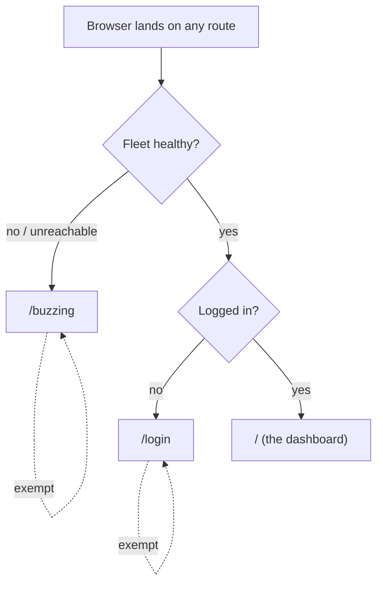

# PRD-003: Portal landing gate and path-based routing

> **Status:** Backlog
> **Priority:** P0
> **Effort:** L
> **Schema changes:** None (hive stores no credential and persists nothing new; it reads honeycomb's `/setup/state` through the existing BFF proxy)
> **Implements:** [`ADR-0004-portal-landing-gate-and-path-based-routing`](../../../knowledge/private/architecture/ADR-0004-portal-landing-gate-and-path-based-routing.md)

---

## Overview

PRD-003 implements hive [`ADR-0004`](../../../knowledge/private/architecture/ADR-0004-portal-landing-gate-and-path-based-routing.md): hive stops resolving the active screen from `location.hash` in the browser and instead serves **real, path-based routes** whose landing decision is made **server-side** on hive, health first and auth second.

Today the landing behavior lives entirely in the least-authoritative tier. `hive/src/dashboard/web/router.tsx` (`useHashRoute`, `routeFromHash`) resolves the route from the URL fragment, and `hive/src/dashboard/web/registry.tsx` declares the route set (`/`, `/projects`, `/harnesses`, `/memories`, `/graph`, `/sync`, `/logs`, `/roi`, `/settings`) with no `/login` and no `/health`. Boot flows through two nested React gates: `main.tsx` renders `ReadinessSplash` (PRD-002), which polls `GET /api/fleet-status`, then mounts `SetupGate`, which polls the proxied honeycomb `GET /setup/state` and branches on its `authenticated` bit. Because the server serves one shell for every load and never sees the fragment, nothing at the server tier can enforce that an unhealthy or logged-out visitor cannot reach a data screen, and the wrong screen can flash before a client gate resolves.

PRD-003 moves that decision onto hive's server and makes the URL authoritative. The root `/` **is** the dashboard (never blank, never `/dashboard`). `/buzzing` and `/login` become the only gate-exempt screens so the redirect always terminates.

### Decision (locked, from ADR-0004): server-side gate, path-based routes

Per [`ADR-0004`](../../../knowledge/private/architecture/ADR-0004-portal-landing-gate-and-path-based-routing.md), on landing on ANY route hive's server evaluates a three-step precedence before it serves anything:

1. **Fleet not healthy -> redirect to `/buzzing`.** "Not healthy" means doctor reports the required services unhealthy, or doctor is itself unreachable.
2. **Else not logged in -> redirect to `/login`.** "Logged in" is the presence of a valid `~/.deeplake/credentials.json`, read through the proxied honeycomb `/setup/state` `authenticated` bit. No new portal session is introduced.
3. **Else serve the requested route, defaulting to `/`, which IS the dashboard.**

`/buzzing` and `/login` are EXEMPT from the gate, so the redirect can land on them without looping.

---

## Features

| Sub-PRD | Scope | Status |
|---|---|---|
| [`prd-003a-route-model-and-server-gate`](./prd-003a-route-model-and-server-gate.md) | The path-based route model served by hive plus the server-side gate: the health-then-auth precedence, the `/buzzing` and `/login` exemptions, and the redirect logic that terminates without looping | Draft |
| [`prd-003b-login-route-device-flow`](./prd-003b-login-route-device-flow.md) | The `/login` route that renders the existing device-flow guided setup by reusing honeycomb's `/setup/login` through the BFF proxy, and the logged-in determination via the proxied `/setup/state` `authenticated` bit | Draft |
| [`prd-003c-hash-to-path-migration`](./prd-003c-hash-to-path-migration.md) | The migration from hash routing to path-based routing: retiring `useHashRoute`, converting `registry.tsx` addressing, and preserving every existing page unchanged behind the new paths | Draft |

---

## Goals

- hive serves each screen at a real path and the gate is a server redirect, replacing the hash-router-plus-nested-React-gates model.
- The gate applies the ADR-0004 precedence (health, then auth, then requested route) on every entry, including deep links and refreshes.
- The root `/` is the dashboard and is never blank; `/buzzing` and `/login` are the only exempt screens and never redirect-loop.
- `/login` reuses honeycomb's device-flow setup through the existing proxy; hive introduces no portal-specific session or credential.
- Every existing dashboard page (`/projects`, `/harnesses`, `/memories`, `/graph`, `/sync`, `/logs`, `/roi`, `/settings`) survives the migration behind its new path with no content change.

## Non-Goals

- The `/buzzing` screen's per-service loaders, status SVGs, and telemetry derivation. That is [`prd-004-buzzing-service-loaders`](../prd-004-buzzing-service-loaders/prd-004-buzzing-service-loaders-index.md); PRD-003 only guarantees the `/buzzing` route exists and is gate-exempt.
- The health rail and `/health` page. That is [`prd-005-health-rail-and-page`](../prd-005-health-rail-and-page/prd-005-health-rail-and-page-index.md); PRD-003 does not add `/health` to the route model beyond leaving room for it.
- doctor's telemetry, SSE stream, or service registry. Those are doctor concerns (doctor [`ADR-0001`](../../../../../doctor/library/knowledge/private/architecture/ADR-0001-hive-telemetry-transport-and-single-source-of-truth.md), [`ADR-0002`](../../../../../doctor/library/knowledge/private/architecture/ADR-0002-service-registration-static-registry-plus-runtime-sqlite.md)); this PRD consumes the fleet-health signal as a given.
- The device-flow protocol itself (honeycomb owns `/setup/login` and `/setup/state`); PRD-003 reuses it through the proxy unchanged.

---

## Module acceptance criteria

- [ ] Landing on any deep link (for example `/memories`) while the fleet is unhealthy or doctor is unreachable redirects to `/buzzing`, decided server-side before the browser renders dashboard chrome ([`prd-003a`](./prd-003a-route-model-and-server-gate.md)).
- [ ] Landing on any route while the fleet is healthy but no valid `~/.deeplake/credentials.json` exists redirects to `/login` ([`prd-003a`](./prd-003a-route-model-and-server-gate.md), [`prd-003b`](./prd-003b-login-route-device-flow.md)).
- [ ] An authenticated operator with a healthy fleet who lands on `/` receives the dashboard; `/` is never blank and is never served from `/dashboard` ([`prd-003a`](./prd-003a-route-model-and-server-gate.md)).
- [ ] `/buzzing` and `/login` are exempt from the gate: landing on them never redirects and never produces a redirect loop, even when the fleet is unhealthy and the operator is logged out ([`prd-003a`](./prd-003a-route-model-and-server-gate.md)).
- [ ] `/login` renders the existing device-flow guided setup sourced from honeycomb's `/setup/login` through the BFF proxy, and completing it flips the `/setup/state` `authenticated` bit that the gate reads ([`prd-003b`](./prd-003b-login-route-device-flow.md)).
- [ ] Every route previously reachable by hash (`/`, `/projects`, `/harnesses`, `/memories`, `/graph`, `/sync`, `/logs`, `/roi`, `/settings`) is reachable at its path and renders the same page content after migration ([`prd-003c`](./prd-003c-hash-to-path-migration.md)).
- [ ] A refresh or direct paste of any gated path re-runs the identical server precedence, so routing is refresh-safe and does not depend on client state ([`prd-003a`](./prd-003a-route-model-and-server-gate.md)).

---

## Overlap and supersession

- **Supersedes** honeycomb [`prd-068-portal-daemon-boot-shell`](../../../../../honeycomb/library/requirements/archive/prd-068-portal-daemon-boot-shell/prd-068-portal-daemon-boot-shell-index.md) and honeycomb [`prd-070-first-browser-load-experience`](../../../../../honeycomb/library/requirements/archive/prd-070-first-browser-load-experience/prd-070-first-browser-load-experience-index.md). Both were framed while the portal still lived inside honeycomb; ADR-0001 and ADR-0002 moved the always-on portal to hive, so the boot shell and the first-browser-load experience are hive's, decided by ADR-0004 and delivered here.
- **Refines** PRD-002's `ReadinessSplash` concept: the splash becomes the addressable `/buzzing` route this PRD guarantees, with its rendering delivered by [`prd-004`](../prd-004-buzzing-service-loaders/prd-004-buzzing-service-loaders-index.md).

---

## Related

- [`ADR-0004-portal-landing-gate-and-path-based-routing`](../../../knowledge/private/architecture/ADR-0004-portal-landing-gate-and-path-based-routing.md) - the decision this PRD implements (gate precedence, path-based serving, root-is-dashboard, `/buzzing` and `/login` exemptions).
- [`ADR-0001-retire-honeycomb-dashboard-and-copy-and-own-into-hive`](../../../knowledge/private/architecture/ADR-0001-retire-honeycomb-dashboard-and-copy-and-own-into-hive.md) - why the portal (and thus the landing decision) lives in hive.
- [`ADR-0002-server-side-bff-proxy-for-dashboard-federation`](../../../knowledge/private/architecture/ADR-0002-server-side-bff-proxy-for-dashboard-federation.md) - the proxy the gate reads `/setup/state` and `/setup/login` through; hive stays credential-free.
- [`ADR-0003-future-sse-streaming-for-dashboard-freshness`](../../../knowledge/private/architecture/ADR-0003-future-sse-streaming-for-dashboard-freshness.md) - the SSE direction ADR-0004 realizes for the health view-model.
- doctor [`ADR-0001-hive-telemetry-transport-and-single-source-of-truth`](../../../../../doctor/library/knowledge/private/architecture/ADR-0001-hive-telemetry-transport-and-single-source-of-truth.md) - the source of the fleet-health signal the gate's health step consults.
- doctor [`ADR-0002-service-registration-static-registry-plus-runtime-sqlite`](../../../../../doctor/library/knowledge/private/architecture/ADR-0002-service-registration-static-registry-plus-runtime-sqlite.md) - the service registry backing "which services are required" for the health decision.
- hive [`prd-001-hive-portal-daemon`](../../in-work/prd-001-hive-portal-daemon/prd-001-hive-portal-daemon-index.md) - the portal daemon and BFF proxy this gate extends.
- hive [`prd-002-portal-readiness-splash`](../../in-work/prd-002-portal-readiness-splash/prd-002-portal-readiness-splash-index.md) - the readiness splash whose concept becomes the `/buzzing` route.
- hive [`prd-004-buzzing-service-loaders`](../prd-004-buzzing-service-loaders/prd-004-buzzing-service-loaders-index.md) - the `/buzzing` screen this PRD makes routable.
- hive [`prd-005-health-rail-and-page`](../prd-005-health-rail-and-page/prd-005-health-rail-and-page-index.md) - the health rail and `/health` page served under this route model.
- doctor PRD-001 (telemetry transport + SSE) and PRD-002 (service registration), forthcoming under [`doctor/library/requirements/backlog/`](../../../../../doctor/library/requirements/backlog/) - the implementations of the doctor ADRs above.
- Superseded: honeycomb [`prd-068-portal-daemon-boot-shell`](../../../../../honeycomb/library/requirements/archive/prd-068-portal-daemon-boot-shell/prd-068-portal-daemon-boot-shell-index.md), honeycomb [`prd-070-first-browser-load-experience`](../../../../../honeycomb/library/requirements/archive/prd-070-first-browser-load-experience/prd-070-first-browser-load-experience-index.md).
