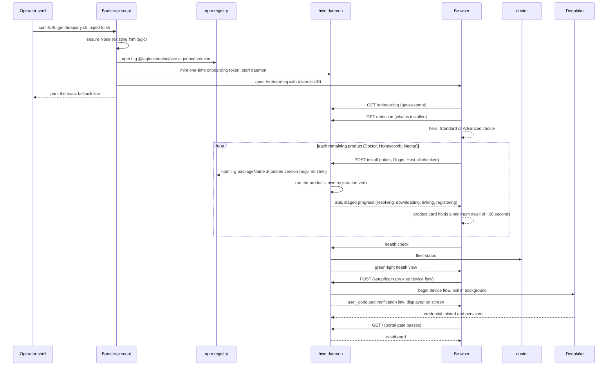

# PRD-009: The hive onboarding dashboard becomes the fleet installer

> **Status:** Backlog
> **Priority:** P0
> **Effort:** XL
> **Schema changes:** None (no new persistent store; a one-time onboarding token file under `~/.honeycomb/hive/` at mode `0600`, removed on completion)

---

## Overview

PRD-009 inverts the fleet's install model. The POSIX bootstrap script (canonical source: honeycomb repo, `scripts/install/install.sh`, mirrored as `install.ps1`, served at `https://get.theapiary.sh`) stops being the place where a human makes choices. It shrinks to a thin, zero-question bootstrap: ensure Node via the existing fnm logic, `npm i -g @legioncodeinc/hive` at the version pinned by the superproject manifest `hive-release.json` (raw URL: `https://raw.githubusercontent.com/legioncodeinc/the-apiary/main/hive-release.json`), start the hive daemon, then both open the browser to `http://127.0.0.1:3853/onboarding` and print exactly one fallback line. Every human decision, every progress signal, and the Deeplake login move into the hive portal, where they can present well.

The portal gains a `/onboarding` route that detects what is installed, offers exactly two entry choices (Standard User and Advanced User), walks the operator through a guided per-product install of the remaining fleet (Doctor, Honeycomb, Nectar) with full-screen product cards, runs a green-light health check, displays the Deeplake device-code the operator must enter (a display the shipped hive login flow does not guarantee, the gap this PRD closes), and drops the operator onto the dashboard. The browser cannot run npm, so the hive daemon gains an installer service: detection, per-product install start, SSE progress streaming (mirroring the existing doctor `/events` relay pattern in `src/daemon/telemetry-proxy.ts`), health check, and the login step. A loopback endpoint that shells out to `npm install` is a drive-by target, so three security mitigations are non-negotiable acceptance criteria: a hard product-slug allowlist with server-side `packageName@version` resolution from `hive-release.json`, Origin and Host validation, and a one-time onboarding token minted by the bootstrap and required by every installer endpoint.

### Decision (locked, user direction): bootstrap-then-portal for the human path

The human install path becomes bootstrap-then-portal. The existing flag, env, and config machinery in `install.sh` (`--products=`, `--profile=`, `--code=`, `--license=`, `--dry-run`, `--no-doctor`, with precedence flag > env > config > preset > default `honeycomb,doctor`) remains intact for CI, headless, and admin use; this PRD does not change it. The bootstrap script lives in the honeycomb repo, so its rewrite is scoped here as a cross-repo companion work item with explicit interface requirements ([`prd-009d`](./prd-009d-thin-bootstrap-companion.md)), not as hive implementation detail.

---

## Features

| Sub-PRD | Scope | Status |
|---|---|---|
| [`prd-009a-installer-service-and-security`](./prd-009a-installer-service-and-security.md) | The daemon-side installer service: detection, per-product install start, SSE progress, health check, per-product registration verbs, and the three security mitigations (allowlist plus server-side version resolution, Origin/Host validation, one-time onboarding token), with shell-safe npm invocation | Draft |
| [`prd-009b-onboarding-route-and-guided-flow`](./prd-009b-onboarding-route-and-guided-flow.md) | The `/onboarding` route: visual fleet detection, the first-run hero with animated brand SVG entrance, the two-choice Standard/Advanced entry, the guided per-product install cards with the 30-second minimum dwell and staged (never fake-percent) progress, the green-light health check, the Deeplake device-code login step, the dashboard handoff, and idempotent re-entry | Draft |
| [`prd-009c-onboarding-telemetry`](./prd-009c-onboarding-telemetry.md) | The PostHog onboarding funnel (onboarding_started through dashboard_reached), fired daemon-side through a single chokepoint consistent with the fleet's telemetry posture | Draft |
| [`prd-009d-thin-bootstrap-companion`](./prd-009d-thin-bootstrap-companion.md) | Cross-repo companion (honeycomb repo, `scripts/install/install.sh` and `install.ps1`): the zero-question bootstrap, the token mint and handoff, the browser open, the exact printed fallback line, and preservation of the flag/env/config machinery for CI and headless use | Draft |

---

## Goals

- A human who pipes the install script answers zero questions in the terminal; every choice happens in the portal at `/onboarding`.
- The bootstrap installs only hive (at the `hive-release.json` pinned version), starts the daemon, opens the browser, and prints exactly: `Click here if the portal doesn't open automatically: http://127.0.0.1:3853/onboarding`.
- `/onboarding` detects the installed fleet, presents well on first run (animated product-logo entrance), and offers exactly two choices: "Standard User" (subtext "Install the fleet (recommended)") and "Advanced User" (subtext "Custom installation").
- Each remaining product installs behind a full-screen card (logo, title, benefit copy, staged progress, npm-safety copy) that dwells a minimum of ~30 seconds and never shows a fake percentage.
- After installs: a green-light fleet health check, then the Deeplake login step that displays the device-code on screen, then the dashboard.
- The installer service is drive-by-proof: slug allowlist with server-side version resolution, Origin/Host validation, one-time onboarding token, and argv-array npm invocation with no shell interpolation of request data.
- The onboarding funnel emits the full PostHog event list while honoring the fleet's telemetry posture (anonymous install id, no PII, fail-soft, key baked at build, silent no-op when keyless).
- Re-entry is honest and idempotent: a fully-installed machine short-circuits to the dashboard; a partial failure shows the real error with a retry, never fake success.

## Non-Goals

- **No product uninstall UI.** The portal installs; removal remains a CLI concern.
- **No license or entitlement backend.** `--license=` and `--code=` stay seams in `install.sh` exactly as they are; the portal flow neither reads nor validates entitlements.
- **No changes to CI/headless flag installs.** The `install.sh` flag/env/config machinery (`--products=`, `--profile=`, `--code=`, `--license=`, `--dry-run`, `--no-doctor`, precedence flag > env > config > preset > default) is preserved untouched for non-human paths.
- **No remote or non-loopback install.** The installer service binds and answers only on `127.0.0.1:3853`; nothing in this PRD makes install reachable from another host.
- **No new device-flow protocol.** The login step reuses honeycomb's `/setup/login` and `/setup/state` through the existing BFF proxy ([`ADR-0002`](../../../knowledge/private/architecture/ADR-0002-server-side-bff-proxy-for-dashboard-federation.md)); hive still stores no credential.
- **No replacement of doctor's watchdog role.** Post-install registration reuses each product's own verb; hive does not become a supervisor.

---

## Module acceptance criteria

- [ ] The bootstrap script installs only `@legioncodeinc/hive` at the manifest-pinned version, starts the daemon, opens the browser to `/onboarding`, and prints exactly `Click here if the portal doesn't open automatically: http://127.0.0.1:3853/onboarding`, with no interactive prompt anywhere on the piped path ([`prd-009d`](./prd-009d-thin-bootstrap-companion.md)).
- [ ] `/onboarding` is reachable pre-health and pre-auth (gate-exempt alongside `/buzzing` and `/login` in `src/daemon/gate.ts`), detects the installed fleet without requiring doctor to exist, and short-circuits to the dashboard when everything is installed and healthy ([`prd-009a`](./prd-009a-installer-service-and-security.md), [`prd-009b`](./prd-009b-onboarding-route-and-guided-flow.md)).
- [ ] The first-run hero animates the product brand SVGs in and offers exactly two buttons with the verbatim copy "Standard User" / "Install the fleet (recommended)" and "Advanced User" / "Custom installation" ([`prd-009b`](./prd-009b-onboarding-route-and-guided-flow.md)).
- [ ] Each product install card dwells a minimum of ~30 seconds, shows staged observable progress (resolving, downloading, linking, registering service) with no percentage bar, and carries copy explaining that the packages are signed and provenance-verified on the public npm registry ([`prd-009b`](./prd-009b-onboarding-route-and-guided-flow.md)).
- [ ] The install endpoint accepts only the four product slugs and resolves `packageName@version` server-side from `hive-release.json`, never from the request; every installer endpoint validates Origin/Host and requires the one-time onboarding token; npm is invoked as an argv array with no request data ever interpolated into a shell string ([`prd-009a`](./prd-009a-installer-service-and-security.md)).
- [ ] Install progress streams over SSE following the `src/daemon/telemetry-proxy.ts` relay pattern, and post-install registration runs each product's own verb (`doctor install-service`, `honeycomb install`, `nectar install`), one registry writer per product ([`prd-009a`](./prd-009a-installer-service-and-security.md)).
- [ ] After the installs, a green-light fleet health check renders, then the login step displays the Deeplake device-code (`user_code`) and verification link on screen, then the operator lands on the dashboard ([`prd-009b`](./prd-009b-onboarding-route-and-guided-flow.md)).
- [ ] The funnel emits `onboarding_started`, `mode_selected` (standard|advanced), `product_install_started` / `product_install_completed` / `product_install_failed` (per product), `health_check_passed`, `login_shown`, `login_completed`, and `dashboard_reached`, consistent with the fleet telemetry posture ([`prd-009c`](./prd-009c-onboarding-telemetry.md)).
- [ ] A failed product install shows the real error and a retry affordance and is resumable on re-entry; a completed install is never re-run ([`prd-009a`](./prd-009a-installer-service-and-security.md), [`prd-009b`](./prd-009b-onboarding-route-and-guided-flow.md)).

---

## Open questions

- **Exact animation treatment of the hero.** The requirement is presentation quality ("present well"); the specific entrance choreography (stagger order, timing curves, whether the hive mark anchors the composition) is a design decision left to implementation, subject to the acceptance criteria in [`prd-009b`](./prd-009b-onboarding-route-and-guided-flow.md).
- **Advanced-mode picker layout.** The Advanced path is a product picker list followed by the same guided flow; whether the picker is a checklist, cards, or a table, and how it communicates dependencies (doctor recommended for watchdog coverage) is open.
- **Per-product benefit copy.** The cards require benefit copy per product; final wording is a content decision, with the constraint that the npm-safety line must be checkably true (all four packages publish with npm Trusted Publishing OIDC provenance).
- **Manifest fetch cadence.** [`prd-009a`](./prd-009a-installer-service-and-security.md) specifies fetch-at-onboarding-start with a build-time-bundled snapshot fallback; whether the daemon should also refresh the manifest on a timer for later re-entry sessions is open.

---

## Overlap and supersession

- **Replaces the human path of** honeycomb `scripts/install/install.sh` product selection: the browser funnel becomes the human decision surface, and the browser-based telemetry funnel replaces/augments the script's install-time telemetry (`install_started`, `install_completed`/`install_failed`, `product_installed`/`updated`/`removed`) for the human path. The script's events keep firing for CI/headless flag installs, which this PRD does not touch.
- **Extends** [`prd-003-portal-landing-gate-and-routing`](../prd-003-portal-landing-gate-and-routing/prd-003-portal-landing-gate-and-routing-index.md): `/onboarding` joins `/buzzing` and `/login` as a gate-exempt route in `src/daemon/gate.ts` (`GATE_EXEMPT_ROUTES`), because on first run the fleet is by definition unhealthy and the operator unauthenticated.
- **Closes the device-code display gap** in the login experience: the onboarding login step must display the `user_code` and verification link on screen, reusing the `/setup/login` wire contract that `src/dashboard/web/setup-gate.tsx` (`GuidedSetup`) defines, so the operator never completes onboarding without seeing the code they need to verify.
- **Reuses, does not duplicate,** fleet detection (`src/daemon/fleet-status.ts`, `/api/fleet-status`) and adds a pre-doctor detection path, since fleet-status depends on doctor being installed and reachable.

---

## Related

- [`ADR-0002-server-side-bff-proxy-for-dashboard-federation`](../../../knowledge/private/architecture/ADR-0002-server-side-bff-proxy-for-dashboard-federation.md) - the BFF posture the installer service's SSE progress stream and login proxying follow.
- [`ADR-0004-portal-landing-gate-and-path-based-routing`](../../../knowledge/private/architecture/ADR-0004-portal-landing-gate-and-path-based-routing.md) - the gate whose exemption set `/onboarding` joins.
- [`trust-boundaries`](../../../knowledge/private/security/trust-boundaries.md) - the loopback trust model the three installer mitigations defend.
- [`telemetry-egress`](../../../knowledge/private/telemetry/telemetry-egress.md) - the chokepoint, allow-list, opt-out, and fail-soft posture the onboarding funnel must match.
- hive [`prd-003-portal-landing-gate-and-routing`](../prd-003-portal-landing-gate-and-routing/prd-003-portal-landing-gate-and-routing-index.md) - the server-side gate and the `/login` device-flow route this PRD extends.
- `src/daemon/gate.ts` - `GATE_EXEMPT_ROUTES`, where `/onboarding` must be added.
- `src/daemon/fleet-status.ts` - `fetchFleetStatus` / `isFleetReady`, reused by the health check.
- `src/daemon/telemetry-proxy.ts` - the doctor `/events` SSE relay pattern the install progress stream mirrors.
- `src/dashboard/web/setup-gate.tsx` - the `GuidedSetup` grant display (`user_code`, verification link) the onboarding login step embeds.
- `src/install/registry.ts` - hive's own doctor registration, the one-registry-writer-per-product precedent.
- honeycomb `scripts/install/install.sh` (cross-repo: [`../../../../../honeycomb/scripts/install/install.sh`](../../../../../honeycomb/scripts/install/install.sh)) - the bootstrap this PRD thins, and the registration-verb handoff precedent.
- `../../../../../hive-release.json` (superproject root) - the fleet version manifest the installer resolves `packageName@version` from.
