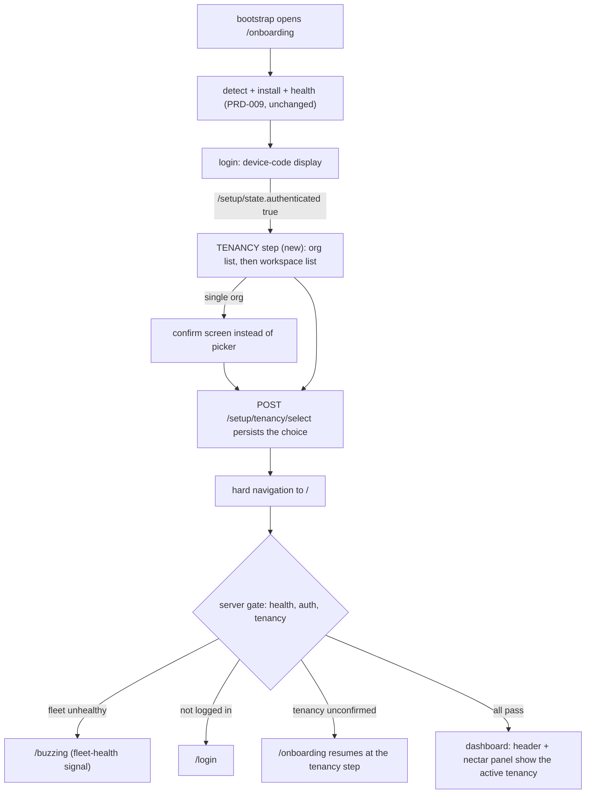

# PRD-011: Onboarding tenancy selection and active-tenancy visibility

> **Status:** Backlog
> **Priority:** P0
> **Effort:** L
> **Schema changes:** None in hive (hive holds no Deeplake client; the durable tenancy-selection marker is honeycomb-side state owned by the parallel honeycomb PRD)
> **Coordinates with:** the honeycomb PRD (dormant-by-default capture and explicit tenancy selection), authored in parallel; hive codes against the proposed `/setup/tenancy` contract below, pinned at implementation

---

## Overview

Product-owner decision (2026-07-04): picking the organization and workspace is a critical install-time step. Today it does not exist. The honeycomb device flow persists a silently-guessed tenancy the moment login completes: the org is "the account's first org" (`orgs[0]` when `HONEYCOMB_ORG_ID` is unset, honeycomb `src/daemon/runtime/auth/deeplake-issuer.ts:527`) and the workspace is hardcoded (`workspaceId: "default"`, honeycomb `src/daemon/runtime/auth/deeplake-issuer.ts:534`). Capture begins against that guess. On the owner's machine this wrote real data to the wrong org. PRD-011 makes tenancy an explicit, mandatory onboarding step and makes the active tenancy permanently visible afterward.

The PRD-009 onboarding flow currently ends at the login step: once `/setup/state.authenticated` flips true, the browser fires `dashboard_reached` and hard-navigates to `/` (`src/dashboard/web/onboarding/login-step.tsx:113-125`). PRD-011 inserts a mandatory ORG + WORKSPACE SELECTION phase between the device-code link succeeding and that navigation, so no product begins capturing against an unconfirmed tenancy. The daemon-side selection endpoints (enumerate orgs, enumerate workspaces, persist the selection, hold capture dormant until selected) belong to the parallel honeycomb PRD; hive reaches them through the existing BFF proxy (`src/daemon/proxy.ts:105`, [`ADR-0002`](../../../knowledge/private/architecture/ADR-0002-server-side-bff-proxy-for-dashboard-federation.md)) exactly as the login step reaches `/setup/login` and `/setup/state` today (`src/dashboard/web/wire.ts:97-100`).

Three surfaces change:

1. **The onboarding flow** gains a `tenancy` phase in the `OnboardingScreen` state machine (`src/dashboard/web/onboarding/onboarding-screen.tsx:47-54`), entered when login authenticates, before the hard navigation to `/`. It lists the account's orgs (a single-org account shows a confirm instead of a picker), then the chosen org's workspaces, with a create-new-workspace option (DEFAULT - confirm before implementation; contingent on the Deeplake API supporting creation), and persists the choice through the proposed `POST /setup/tenancy/select`.
2. **The dashboard** shows the active org and workspace persistently. Today the tenancy renders only as the sidebar identity sub-line (`src/dashboard/web/app.tsx:200`) fed by `GET /api/diagnostics/settings` (`SettingsSchema`, `src/dashboard/web/wire.ts:204-210`). PRD-011 adds an always-visible active-tenancy display in the shell chrome near the fleet health rail (placement DEFAULT - confirm before implementation), and the nectar projects panel (`NectarProjectsPanel`, `src/dashboard/web/pages/hive-graph.tsx:92`) displays the tenancy its projects write to. Unreachable and unlinked states render honestly, matching the existing fail-soft posture (`UNREACHABLE_RESPONSE`, `src/daemon/fleet-status.ts:16-19`; the panel's unreachable state, `src/dashboard/web/pages/hive-graph.tsx:163-169`).
3. **The gate** cannot land an operator on the dashboard while tenancy is unconfirmed. The portal landing gate's health-then-auth precedence (`src/daemon/gate.ts:148-160`) gains a tenancy check, and "waiting for tenancy selection" is a distinct signal from "fleet unhealthy" (the `/buzzing` readiness surface, PRD-002 lineage, `src/dashboard/web/buzzing-screen.tsx:1-17`).



### The proposed honeycomb contract (pinned at implementation)

The parallel honeycomb PRD-073 (dormant-by-default capture and explicit tenancy selection) owns the daemon-side endpoints, and its sub-PRD 073c now carries this contract as CANONICAL (reconciled by the orchestrator 2026-07-04; the route family below was adopted there verbatim, superseding 073c's earlier single `/setup/link/tenancy` proposal). hive mirrors it field-for-field, the same discipline PRD-009b used for the installer contract (`src/dashboard/web/onboarding/contracts.ts:1-11`). One field-name correction from the reconciliation: the select body is `{ orgId, workspaceId }` (not `{ org, workspace }`), and `GET /setup/tenancy` additionally carries `pending: boolean` and `autoSelected?: {orgId, workspaceId}` for the single-tenancy short-circuit. All routes are honeycomb-owned, local-mode-only, loopback, reached same-origin through hive's `/setup/*` BFF proxy leg (gate-exempt as data-plane traffic, `src/daemon/gate.ts:71`). No token rides any body, matching the `/setup/state` posture (honeycomb `src/daemon/runtime/dashboard/setup-state.ts:246-252`).

```
GET  /setup/tenancy
  200 { selected: boolean,
        org:       { id: string, name: string } | null,
        workspace: { id: string, name: string } | null,
        authenticated: boolean }
  `selected` is true ONLY after an explicit POST /setup/tenancy/select has persisted;
  the login-time guessed defaults (deeplake-issuer.ts:527,534) never read as selected.

GET  /setup/tenancy/orgs
  200 { orgs: [{ id: string, name: string }] }        privilege-scoped by the credential's token

GET  /setup/tenancy/workspaces?org=<id>
  200 { org: string, workspaces: [{ id: string, name: string }], canCreate: boolean }

POST /setup/tenancy/select        body { orgId: string, workspaceId: string }
  200 { selected: true,  org: { id, name }, workspace: { id, name }, reminted: boolean }
  200 { selected: false, error: string }              redacted reason; no token in any body

POST /setup/tenancy/workspaces    body { org: string, name: string }
  200 { created: true, workspace: { id, name } }
  200 { created: false, error: string }
  DEFAULT - confirm before implementation: shipped only if the Deeplake API supports
  workspace creation; the picker hides the create affordance when `canCreate` is false.
```

The daemon-side select handler is expected to reuse the same re-mint-and-persist mechanic as the existing IRD-122 scope-switch routes (honeycomb `src/daemon/runtime/projects/scope-switch-api.ts:57-59`), and the enumerations mirror the existing PRD-049e reads (honeycomb `src/daemon/runtime/projects/scope-enumeration-api.ts:58-59`). Those existing routes stay the day-2 switcher mechanics (`ScopeProvider`, `src/dashboard/web/scope-context.tsx:203`); `/setup/tenancy` is the install-time surface reachable before the dashboard exists.

---

## Features

| Sub-PRD | Scope | Status |
|---|---|---|
| [`prd-011a-onboarding-tenancy-selection-step`](./prd-011a-onboarding-tenancy-selection-step.md) | The mandatory org + workspace selection phase in the onboarding flow: the new `tenancy` phase in the state machine, the org picker (or single-org confirm), the workspace picker with the flagged create-new option, the wire client against the proposed contract, persistence, and honest failure states | Draft |
| [`prd-011b-active-tenancy-visibility`](./prd-011b-active-tenancy-visibility.md) | The persistent active-tenancy display in the dashboard shell chrome (placement default: beside the fleet health rail) and the tenancy line in the nectar projects panel, both fail-soft for unreachable/unlinked states | Draft |
| [`prd-011c-tenancy-gate-coherence`](./prd-011c-tenancy-gate-coherence.md) | The gate's tenancy check (health, then auth, then tenancy), the redirect back into the onboarding tenancy step, and the distinct "waiting for tenancy selection" signal that is never conflated with "fleet unhealthy" | Draft |

---

## Goals

- The onboarding flow blocks at a mandatory tenancy step immediately after the device-code link succeeds and before any product begins capturing; the operator explicitly picks (or, single-org, explicitly confirms) the org and workspace.
- Nothing is written to any Deeplake workspace before the tenancy is confirmed and a project is bound; the guessed login-time defaults (first org, hardcoded `default` workspace) never silently become the capture target. The daemon-side dormancy is the parallel honeycomb PRD's obligation; hive's obligation is that its UI never navigates past the step and its gate never serves the dashboard while `selected` is false.
- The active org and workspace are permanently visible on the dashboard: in the shell chrome near the health rail, and on the nectar projects panel next to the projects that write into that tenancy.
- Unreachable, unauthenticated, and unconfirmed states render honestly and distinctly, extending the existing fail-soft posture; no surface fabricates a tenancy it cannot verify.
- The dogfood protocol below passes end to end on the owner's Windows machine.

## Non-Goals

- **The daemon-side endpoints themselves.** Enumeration, persistence, the durable selected marker, and dormant-by-default capture are the parallel honeycomb PRD's scope. hive proxies and renders.
- **Changing the day-2 scope switcher.** The IRD-122 / PRD-049e org-workspace-project switcher (`src/dashboard/web/scope-context.tsx:257-303`) keeps its mechanics; PRD-011 adds the install-time selection, not a replacement for post-onboarding switching.
- **Workspace creation as a hard requirement.** The create-new-workspace affordance ships only if the Deeplake API supports it (DEFAULT - confirm before implementation); the step is complete without it.
- **Nectar's own tenancy plumbing.** If the nectar projects body gains tenancy fields, that is a nectar-side change coordinated with nectar [`prd-019c`](../../../../../nectar/library/requirements/backlog/prd-019-project-scoped-brooding-activation/prd-019c-hive-dashboard-project-activation.md); hive's panel renders leniently either way ([`prd-011b`](./prd-011b-active-tenancy-visibility.md)).
- **Multi-account or account-switching flows.** One credential, one selection; switching accounts remains `honeycomb logout` plus re-onboarding.
- **Team/hybrid deployment modes.** Like `/setup/state` and `/setup/login`, the tenancy surface is local-mode loopback only.

---

## Module acceptance criteria

- [ ] The onboarding state machine gains a `tenancy` phase entered when `/setup/state.authenticated` flips true, and the hard navigation to `/` fires only after `POST /setup/tenancy/select` acknowledges `selected: true` ([`prd-011a`](./prd-011a-onboarding-tenancy-selection-step.md)).
- [ ] A multi-org account sees its org list and must choose; a single-org account sees a confirm screen naming the org instead of a picker; both then see the org's workspace list ([`prd-011a`](./prd-011a-onboarding-tenancy-selection-step.md)).
- [ ] The workspace list offers create-new only when the daemon reports `canCreate: true` (DEFAULT - confirm before implementation) ([`prd-011a`](./prd-011a-onboarding-tenancy-selection-step.md)).
- [ ] A failed enumeration or a failed select renders an honest error with a retry affordance; the flow never advances past the step on a failure and never fabricates a selection ([`prd-011a`](./prd-011a-onboarding-tenancy-selection-step.md)).
- [ ] The dashboard shell chrome shows the active org and workspace on every in-app route, hydrated from the daemon and degrading honestly when the source is unreachable or the credential is unlinked ([`prd-011b`](./prd-011b-active-tenancy-visibility.md)).
- [ ] The nectar projects panel displays the tenancy its projects write to, with an honest "tenancy unknown" fallback when the daemon does not report it ([`prd-011b`](./prd-011b-active-tenancy-visibility.md)).
- [ ] The server gate evaluates health, then auth, then tenancy; an authenticated operator with `selected: false` is redirected to `/onboarding` (never the dashboard), and a tenancy-read failure fails closed to unconfirmed ([`prd-011c`](./prd-011c-tenancy-gate-coherence.md)).
- [ ] "Waiting for tenancy selection" is visually and semantically distinct from "fleet unhealthy": the buzzing surface keeps meaning fleet health only, and the tenancy-wait state renders inside the onboarding flow ([`prd-011c`](./prd-011c-tenancy-gate-coherence.md)).
- [ ] The dogfood protocol below passes on the owner's Windows machine, including the before/after Deeplake write probe.

---

## Test plan: dogfood on the owner's Windows machine (primary acceptance path)

Product-owner-specified. A full fresh-install protocol, run start to finish on the owner's Windows machine. Every step lists the expected observation; any deviation fails the PRD.

1. **Stop and unregister all fleet services.** For each of doctor, honeycomb, nectar, and hive: stop the running daemon and remove its service unit and scheduled task (hive's Windows task is named `hive`, `src/service/platform.ts:13`; remove each sibling product's task/unit by its own registered name, enumerable from the doctor registry before deletion). Expected: `schtasks /Query` lists no fleet task; no fleet process remains in Task Manager; `http://127.0.0.1:3853/health` refuses connection.
2. **Clear all local state.** Delete `%USERPROFILE%\.apiary`, `%USERPROFILE%\.honeycomb`, `%USERPROFILE%\.deeplake`, and `%USERPROFILE%\.nectar` (legacy). Expected: all four directories are gone; no credential, registry, pid, lock, or projection file survives.
3. **Record the pre-install Deeplake baseline.** Using out-of-band access to the owner's Deeplake account (the Deeplake console or an API query from another machine), record the row counts / dataset state of every workspace in every org the account can reach. Expected: a written baseline exists before any fleet code runs.
4. **Run the bootstrap end to end.** Execute the `get.theapiary.sh` bootstrap (the Windows mirror of honeycomb `scripts/install/install.sh` per hive [`prd-009d`](../../in-work/prd-009-onboarding-installer/prd-009d-thin-bootstrap-companion.md)). Expected: zero terminal questions; the browser opens `http://127.0.0.1:3853/onboarding`; exactly one fallback line prints.
5. **Complete the guided flow through login.** Walk detection, installs, and the health check; enter the device code at the verification link. Expected: the device-code display renders (PRD-009 ob-AC-14); the code is accepted.
6. **Observe the flow BLOCK at the tenancy step.** Expected: after `/setup/state.authenticated` flips true the screen advances to the tenancy step, not the dashboard; no hard navigation to `/` occurs; refreshing `http://127.0.0.1:3853/` redirects back to `/onboarding` (the gate's tenancy check).
7. **Observe the org list render.** Expected: every org the owner's account belongs to is listed by name (the owner's account has more than one; the wrong-org incident org must be visibly distinct from the intended org). No org is preselected as chosen.
8. **Choose the intended org and observe the workspace list render.** Expected: the chosen org's workspaces are listed; the create-new affordance appears only if the daemon reports `canCreate: true`.
9. **Select the workspace and confirm.** Expected: the step acknowledges the persisted selection (`selected: true`) and only then navigates to the dashboard.
10. **Verify the selection persisted.** Restart the hive daemon (or reboot), reload `http://127.0.0.1:3853/`. Expected: the dashboard serves without re-prompting; the displayed tenancy matches step 9's choice exactly.
11. **Probe that NOTHING was written before a project is bound.** Re-run the step 3 probe. Expected: every workspace's row counts / dataset state are byte-identical to the baseline; specifically the guessed tenancy (first org, `default` workspace) received no writes at any point between step 4 and now. Then bind one project and re-probe: writes appear only in the selected org and workspace.
12. **Verify the dashboard header shows the chosen tenancy.** Expected: the shell chrome displays the step 9 org and workspace on every route.
13. **Verify the nectar projects panel shows it.** Open the hive-graph page. Expected: the `NectarProjectsPanel` displays the same tenancy for its projects; if nectar is stopped, the panel shows its honest unreachable state, never a fabricated tenancy.

---

## Open questions

- **Workspace creation (DEFAULT - confirm before implementation).** Default: the picker includes a create-new-workspace affordance gated on the daemon's `canCreate` bit; if the Deeplake API does not support workspace creation, the daemon reports `canCreate: false` and the affordance never renders. Confirm whether creation is in or out of scope for the first ship.
- **Header placement (DEFAULT - confirm before implementation).** Default: a compact org and workspace readout in the shell chrome bar beside the "Pollinate now" action (`src/dashboard/web/app.tsx:231-244`), directly under the health rail mount (`src/dashboard/web/app.tsx:228`). Alternatives (inside the health rail itself, or promoting the sidebar identity line) are noted in [`prd-011b`](./prd-011b-active-tenancy-visibility.md).
- **Nectar panel tenancy source (DEFAULT - confirm before implementation).** Default: hive parses tenancy fields leniently from the proxied `GET /api/hive-graph/projects` body when nectar ships them (coordinate with nectar [`prd-019c`](../../../../../nectar/library/requirements/backlog/prd-019-project-scoped-brooding-activation/prd-019c-hive-dashboard-project-activation.md)) and falls back to the honeycomb `/setup/tenancy` read labeled as the fleet-shared credential's tenancy.
- **Contract pinning.** The whole `/setup/tenancy` family above is a proposed shape; the parallel honeycomb PRD owns the final contract. hive's zod schemas mirror it field-for-field and are pinned at implementation, the same integration discipline as PRD-009b's installer contracts.
- **Gate redirect target (DEFAULT - confirm before implementation).** Default: tenancy-unconfirmed redirects to `/onboarding` (already gate-exempt, `src/daemon/gate.ts:52-55`), whose detect logic resumes at the tenancy step for an installed, authenticated, unselected machine. A dedicated `/tenancy` route was considered and rejected as a second gate-exempt surface to maintain.
- **Re-entry after logout.** `honeycomb logout` removes the credential; on the next login the selected marker's fate (cleared with the credential, or retained as a suggestion) is honeycomb-side behavior to settle in the parallel PRD. hive renders whatever `selected` reports.

---

## Overlap and supersession

- **Extends** hive [`prd-009-onboarding-installer`](../../in-work/prd-009-onboarding-installer/prd-009-onboarding-installer-index.md): the tenancy phase slots into the PRD-009b state machine between login and the dashboard handoff; the PRD-009 flow through login is unchanged. The PRD-009c funnel gains tenancy events ([`prd-011a`](./prd-011a-onboarding-tenancy-selection-step.md)).
- **Extends** hive [`prd-002-portal-readiness-splash`](../../in-work/prd-002-portal-readiness-splash/prd-002-portal-readiness-splash-index.md) / PRD-003's gate lineage: the health-then-auth precedence (`src/daemon/gate.ts:148-160`) gains a third, tenancy check; `/buzzing` keeps meaning fleet health only ([`prd-011c`](./prd-011c-tenancy-gate-coherence.md)).
- **Coordinates with** the honeycomb PRD (dormant-by-default capture and explicit tenancy selection), authored in parallel: honeycomb owns the endpoints, the durable marker, and capture dormancy; hive owns the UI, the gate check, and the visibility surfaces.
- **Complements** nectar [`prd-019`](../../../../../nectar/library/requirements/backlog/prd-019-project-scoped-brooding-activation/prd-019-project-scoped-brooding-activation-index.md) (project-scoped activation: nothing broods until a project is explicitly activated) with the tenancy analogue: nothing captures until a tenancy is explicitly selected. The [`prd-019c`](../../../../../nectar/library/requirements/backlog/prd-019-project-scoped-brooding-activation/prd-019c-hive-dashboard-project-activation.md) panel gains the tenancy display ([`prd-011b`](./prd-011b-active-tenancy-visibility.md)).
- **Leaves intact** the IRD-122 / PRD-049e day-2 scope switcher; the install-time selection and the day-2 switch share the daemon-side persist mechanic but are distinct surfaces.

---

## Related

- [`ADR-0002-server-side-bff-proxy-for-dashboard-federation`](../../../knowledge/private/architecture/ADR-0002-server-side-bff-proxy-for-dashboard-federation.md) - the BFF posture every `/setup/tenancy` call rides.
- [`ADR-0004-portal-landing-gate-and-path-based-routing`](../../../knowledge/private/architecture/ADR-0004-portal-landing-gate-and-path-based-routing.md) - the gate whose precedence gains the tenancy check.
- [`ADR-0005-fleet-directory-ownership-and-neutral-state-root`](../../../knowledge/private/architecture/ADR-0005-fleet-directory-ownership-and-neutral-state-root.md) (mirror of fleet ADR-0003) - the state-root context for the dogfood protocol's clear-all-state step; PRD-010 relocates hive state to `~/.apiary/hive/`, so the protocol clears both the new and legacy roots.
- `src/dashboard/web/onboarding/onboarding-screen.tsx:47-54` - the phase state machine the tenancy phase joins.
- `src/dashboard/web/onboarding/login-step.tsx:113-125` - the authenticated-to-dashboard handoff the tenancy step interposes on.
- `src/dashboard/web/onboarding/onboarding-client.ts:77` and `contracts.ts:1-11` - the local-contract-mirroring discipline the tenancy wire client follows.
- `src/daemon/gate.ts:52-55,148-160` - the exemption set and the precedence.
- `src/daemon/setup-auth.ts:49-76` - the fail-closed proxied-read pattern the gate's tenancy check mirrors.
- `src/daemon/proxy.ts:105` - the BFF proxy the tenancy endpoints ride.
- `src/dashboard/web/app.tsx:200,211,228,231-244` - the identity line, ScopeProvider mount, health-rail mount, and chrome bar (the visibility surfaces).
- `src/dashboard/web/pages/hive-graph.tsx:92,163-169` - the nectar projects panel and its unreachable posture.
- `src/dashboard/web/wire.ts:112-131,204-210,1294-1321,1429-1450` - the existing scope enumeration/switch wire surface and the settings identity read.
- honeycomb `src/daemon/runtime/auth/deeplake-issuer.ts:523-534` - the silently-guessed tenancy this PRD retires from the human path.
- honeycomb `src/daemon/runtime/projects/scope-enumeration-api.ts:58-59` and `scope-switch-api.ts:57-59` - the existing daemon mechanics the parallel PRD's select handler is expected to reuse.
- The honeycomb PRD (dormant-by-default capture and explicit tenancy selection), authored in parallel - the daemon-side owner of the `/setup/tenancy` contract.
