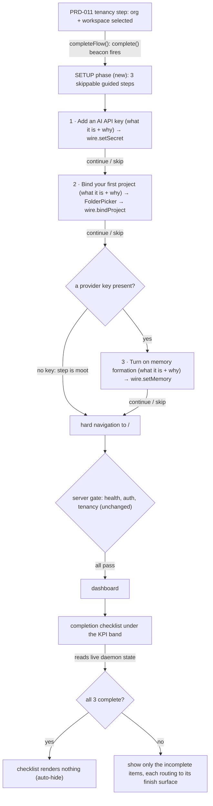

# PRD-013: Guided onboarding setup and completion checklist

> **Status:** Backlog
> **Priority:** P1
> **Effort:** M
> **Schema changes:** None in hive (hive holds no Deeplake client; every write below rides the existing authenticated `/api/*` surface owned by honeycomb/nectar)
> **Date:** 2026-07-08

---

## Overview

Product-owner decision (2026-07-08): the guided flow gets a beginner to a *linked, tenancy-selected* daemon, then drops them on a dashboard that does almost nothing yet. Three things still have to happen before Hive is actually useful, and today the operator has to discover them on their own by hunting through the Settings and Projects pages:

1. **An AI API key** must be stored in the vault so Nectar/Honeycomb can call a model (nothing summarizes, forms memories, or ranks recall without one).
2. **A first project** must be bound so capture has somewhere to write (until a folder is bound, every project-scoped surface is empty).
3. **Memory formation** must be turned on so sessions actually distill into durable memories (it is provider-gated and off by default; enabling it applies on the next daemon restart).

PRD-013 makes these three the tail of the guided wizard — each **skippable**, each with a plain-language explanation of *what it is and why it is worth doing* — and then adds a **self-clearing completion checklist** to the top of the dashboard so anything skipped or unfinished is never lost. The design principle is beginner-first: a new user should be able to reach a fully-working Hive without reading docs, and should never be blocked by a step they were not ready for.

Every capability these steps drive **already exists** as a wire method and a tested Settings/Projects control; PRD-013 does not build new daemon surface, it *sequences and surfaces* what is already there for the first-run user:

| Step | Existing plumbing (reused, not rebuilt) |
|---|---|
| Add an AI API key | `wire.setSecret(name, value)` (`POST /api/secrets/:name`, write-only) + `wire.secretNames()` for names-only presence; provider→key-name map `PROVIDER_KEY_NAME` (`src/dashboard/web/panels.tsx:463`); the Settings `ProviderKeysSection` (`src/dashboard/web/pages/settings.tsx`) is the day-2 analogue |
| Bind a first project | `FolderPicker` (`src/dashboard/web/folder-picker.tsx`) → `wire.bindProject({ path, name })` (`POST /api/diagnostics/projects/bind`); `wire.scopeProjects()` (`GET /api/diagnostics/scope/projects`) reports each project's `boundLocally` bit; the `FirstRunBindCTA` (`src/dashboard/web/needs-project.tsx`) is the day-2 analogue |
| Turn on memory formation | `wire.setMemory(enabled)` (`POST /api/actions/memory`, applies on next daemon restart), gated on `reasons.memory.provider === "configured"` read from `wire.status()` (`GET /api/status`, proxied to honeycomb); the Settings `MemoryFormationSection` (`src/dashboard/web/pages/settings.tsx`) is the day-2 analogue |

Two surfaces change:

1. **The onboarding flow** gains three phases in the `OnboardingScreen` state machine (`src/dashboard/web/onboarding/onboarding-screen.tsx`), entered **after** the PRD-011 `tenancy` phase persists and **before** the hard navigation to `/`. The `tenancy` step's terminal handoff (`completeFlow` → `onComplete` in `src/dashboard/web/onboarding/tenancy-step.tsx`) today runs `onboardingClient.complete()` then hard-navigates to `/`; PRD-013 keeps the funnel-completion beacon at tenancy (core onboarding is done there) but redirects the handoff into a new post-tenancy `setup` phase that runs the three steps, each skippable, before the final navigation. These steps talk to the authenticated `WireClient` the onboarding screen already constructs for the login/tenancy legs — reachable from `/onboarding` because `/api/*` and `/setup/*` are gate-exempt data-plane traffic (`src/daemon/gate.ts`), not gated page routes ([`prd-013a`](./prd-013a-post-tenancy-setup-steps.md)).
2. **The dashboard** gains a completion checklist as a new landmark **between the KPI band and the recall area** — `<section data-area="kpi-band">` and `<section data-area="recall-area">` in `src/dashboard/web/pages/dashboard.tsx`. It derives each item's done/not-done state from **live daemon reads** (a stored key, a bound project, memory enabled), renders only the incomplete items with a one-click route to where each is finished, and **removes itself entirely once all three are complete**. There is no persisted "skipped" flag — completion is the honest truth of daemon state, so an item the user finishes later from Settings/Projects clears from the checklist on the next read ([`prd-013b`](./prd-013b-dashboard-setup-checklist.md)).

### Why the steps live *after* tenancy (and why refresh is safe)

The three actions are all **post-authentication**: `setSecret`, `bindProject`, and `setMemory` hit the authenticated `/api/*` surface, which only answers once a credential is present. That is exactly the state the wizard is in immediately after the PRD-011 tenancy selection persists. Appending the steps there — rather than as a separate first-run panel on the dashboard — keeps one continuous guided flow and reuses the `WireClient` already in hand, with no new gate decision or persisted flag.

Because the funnel-completion beacon (`onboardingClient.complete()`) and the durable tenancy marker are both written **at** tenancy, the setup steps are strictly *additive enrichment*: if the operator refreshes or closes the tab mid-step, the server gate (`src/daemon/gate.ts`) serves the dashboard as normal (healthy + authed + tenancy-selected), and the dashboard checklist ([`prd-013b`](./prd-013b-dashboard-setup-checklist.md)) surfaces whatever remains. The checklist is the backstop that makes every step in the wizard safely skippable — nothing is ever a dead end.

---

## Features

| Sub-PRD | Scope | Status |
|---|---|---|
| [`prd-013a-post-tenancy-setup-steps`](./prd-013a-post-tenancy-setup-steps.md) | The three skippable guided steps appended after the PRD-011 tenancy phase: the new `setup` phase in the state machine, the API-key step (explainer + provider choice + write-only save), the first-project step (explainer + `FolderPicker` bind), the provider-gated memory-formation step (explainer + `setMemory` with applies-on-restart honesty), the per-step skip/continue affordances, the funnel events, and the final handoff to `/` | Draft |
| [`prd-013b-dashboard-setup-checklist`](./prd-013b-dashboard-setup-checklist.md) | The auto-derived, auto-hiding completion checklist under the KPI band: the three live-state reads (key present, project bound, memory enabled), the incomplete-only render with per-item route-to-finish, the all-complete auto-hide, and the honest fail-soft when a read is unavailable | Draft |

---

## Goals

- A first-run operator is guided through adding an AI API key, binding a first project, and turning on memory formation as the tail of the wizard — each step **explains what it is and why it matters** in plain language before asking for anything.
- Every step is **skippable** with a single obvious action; skipping never blocks the flow and never loses the item (the dashboard checklist recovers it).
- The dashboard shows a **completion checklist at the top, under the KPIs and above the rest of the content**, listing only the steps that are still incomplete, each with a one-click path to finish it.
- The checklist **derives from live daemon state and removes itself** the moment all three are complete; there is no stale "you have 0 steps left" banner and no persisted skip-state to drift out of sync.
- The whole surface is **beginner-legible**: no jargon without a one-line gloss, no dead ends, no step that fails silently. Reuse the existing tested Settings/Projects controls and copy conventions rather than forking new ones.
- The dogfood protocol below passes end to end on the owner's Windows machine.

## Non-Goals

- **New daemon endpoints or schema.** Every write reuses an existing authenticated route (`/api/secrets/:name`, `/api/diagnostics/projects/bind`, `/api/actions/memory`) and an existing read (`/api/secrets`, `/api/diagnostics/scope/projects`, `/api/status`). hive stores no new state; the `firstTimeSetupComplete` field already present in the setup-state schema (`src/dashboard/web/wire.ts:1300`, currently unused) is **not** adopted as a gate — completion is derived, not flagged.
- **Replacing the Settings / Projects day-2 controls.** `ProviderKeysSection`, `FolderPicker`/`FirstRunBindCTA`, and `MemoryFormationSection` keep their roles as the steady-state management surfaces; PRD-013 sequences the same wire calls for the first-run user and routes the checklist *to* those controls.
- **Provider/model routing or the Portkey gateway.** The API-key step stores a key; choosing the active provider/model and the PRD-063 Portkey path stay on the Settings "Search & inference" section.
- **Making memory formation take effect without a restart.** `setMemory` is persisted and applies on the next daemon restart (the ack carries `appliesOnRestart: true`); the step surfaces that honestly and does not attempt a live actuation.
- **A blocking or mandatory setup.** Unlike the PRD-011 tenancy step (mandatory), all three PRD-013 steps are optional by design; the flow completes with zero of them done.
- **Team/hybrid deployment modes.** Like the rest of the onboarding surface, this is local-mode loopback only.

---

## Module acceptance criteria

- [ ] The onboarding state machine gains a `setup` phase entered when the PRD-011 tenancy selection acknowledges `selected: true`; the hard navigation to `/` fires only after the operator advances through (or skips) the setup steps ([`prd-013a`](./prd-013a-post-tenancy-setup-steps.md)).
- [ ] Each setup step renders a plain-language explanation of what the step is and why it is valuable, a primary action, and a visible **Skip** affordance; skipping advances to the next step without side effects ([`prd-013a`](./prd-013a-post-tenancy-setup-steps.md)).
- [ ] The API-key step stores the entered key write-only via `wire.setSecret(...)` and reflects presence via a re-read of `wire.secretNames()`; the value is never echoed back and is cleared from component state on a successful save ([`prd-013a`](./prd-013a-post-tenancy-setup-steps.md)).
- [ ] The first-project step binds a chosen folder via the reused `FolderPicker` → `wire.bindProject(...)` and treats a successful bind as completion; a failed bind renders an honest error and does not advance on failure ([`prd-013a`](./prd-013a-post-tenancy-setup-steps.md)).
- [ ] The memory-formation step is shown only when a provider key is present (`reasons.memory.provider === "configured"`); it turns memory on via `wire.setMemory(true)` and states honestly that it applies on the next daemon restart. When no key was added, the step is skipped automatically ([`prd-013a`](./prd-013a-post-tenancy-setup-steps.md)).
- [ ] The dashboard renders a completion checklist as a landmark between `data-area="kpi-band"` and `data-area="recall-area"`, listing only the incomplete steps, each with a control that routes to where the step is finished ([`prd-013b`](./prd-013b-dashboard-setup-checklist.md)).
- [ ] Each checklist item's done/not-done state is derived from a live daemon read (`secretNames`/`status` for the key, `scopeProjects` for the project, `status.reasons.memory` for memory); no persisted skip-state exists ([`prd-013b`](./prd-013b-dashboard-setup-checklist.md)).
- [ ] When all three items are complete, the checklist renders nothing (the whole landmark's contents are absent, not merely hidden); when a read is unavailable, the checklist degrades to hidden rather than showing a false "incomplete" ([`prd-013b`](./prd-013b-dashboard-setup-checklist.md)).
- [ ] The memory checklist item appears only once a key is present and memory is still off, mirroring the wizard gate; before a key exists, the API-key item is the visible prerequisite ([`prd-013b`](./prd-013b-dashboard-setup-checklist.md)).
- [ ] The dogfood protocol below passes on the owner's Windows machine.

---

## Test plan: dogfood on the owner's Windows machine (primary acceptance path)

Product-owner-specified. Run start to finish on the owner's Windows machine. Every step lists the expected observation; any deviation fails the PRD. This protocol assumes the PRD-011 tenancy protocol has just been completed (fresh install, credential linked, tenancy selected).

1. **Reach the setup phase.** Complete the guided flow through the tenancy selection. Expected: instead of landing on the dashboard, the flow advances to the first setup step (the API-key step); the funnel already recorded onboarding completion at tenancy.
2. **Read the API-key explainer.** Expected: the step names what an AI API key is for (Nectar/Honeycomb calling a model to summarize, form memories, and rank recall) and why it is worth adding, in plain language, before any input is requested; a **Skip** affordance is visible.
3. **Skip the API-key step, then observe the memory step is bypassed.** Expected: skipping advances to the project step; after the project step, the memory step does **not** appear (no provider key present), and the flow proceeds to the dashboard.
4. **From the dashboard, observe the checklist.** Expected: a checklist appears under the KPIs and above the recall bar, listing "Add an AI API key" and — if no project was bound — "Add your first project"; the memory item is absent (its prerequisite, a key, is not met).
5. **Re-run the flow adding a key.** Repeat a fresh install (per the PRD-011 protocol) and this time, at the API-key step, paste a valid provider key and save. Expected: the step reflects "key set" and the value is never shown back; continue advances to the project step.
6. **Bind a project in the project step.** Expected: the `FolderPicker` browses folders, binds the chosen folder, and the step treats the bind as complete; capture begins for that folder (the PRD-059 gate opens on bind).
7. **Turn on memory formation.** Expected: because a key is present, the memory step appears; enabling it acknowledges the change and states it applies on the next daemon restart. Continue navigates to the dashboard.
8. **Observe the checklist is gone.** Expected: with a key stored, a project bound, and memory enabled, the dashboard renders **no** checklist between the KPI band and the recall area.
9. **Restart the daemon and re-check.** Expected: after a restart the daemon reads memory as enabled; the dashboard still shows no checklist; recall and capture work end to end.
10. **Skip everything, then finish from the day-2 surfaces.** On a fresh install, skip all three steps. Expected: the dashboard checklist lists the incomplete items; clicking each routes to its finish surface (Settings for the key/memory, Projects for the folder); completing an item there clears it from the checklist on the next dashboard read, and clearing the last item removes the checklist.

---

## Decisions (confirmed 2026-07-08)

All five design questions were confirmed by the product owner on 2026-07-08. They are now binding for implementation, not open.

- **API-key step provider set → Anthropic default + selector.** The step defaults to Anthropic (the fleet's primary model provider) with a compact selector to switch to OpenAI / OpenRouter / Cohere, mirroring `PROVIDER_KEY_NAME`, plus a one-line "where to get a key" hint. *Why:* a clear beginner default without dead-ending users who already have a different provider, reusing the exact provider set the Settings page supports.
- **Memory step restart handling → note only, no inline restart.** The step turns memory on and surfaces the applies-on-restart honesty as a note; restarting is left to Settings/normal daemon lifecycle. *Why:* a daemon restart mid-onboarding is disruptive — it can bounce the very page the operator is on and re-trigger the gate — so the note keeps the flow honest without that risk.
- **Checklist project item → kept.** The checklist includes a project item; it self-hides once a project is bound. The dashboard `Outlet` still owns the **zero**-project case via `FirstRunBindCTA` (`src/dashboard/web/app.tsx`), so the item is usually already satisfied and absent. *Why:* robust and honest — covers edge cases (e.g. only the `__unsorted__` inbox bound) with no downside, since it self-hides when satisfied.
- **Checklist actions → route to the day-2 surface.** Each item navigates (via `usePathRoute().navigate`) to the page that owns it (Settings for key/memory, Projects for a folder), reusing the tested controls. *Why:* zero duplication of write logic, one source of truth per action, and the target pages already handle the edge cases (restart honesty, folder browse, key validation).
- **Funnel-completion timing → `complete()` stays at tenancy + additive `setup_*` events.** The `onboardingClient.complete()` beacon stays at the tenancy step (core onboarding complete); the three setup steps emit their own additive events (`setup_apikey_*`, `setup_project_*`, `setup_memory_*`). *Why:* preserves the existing PRD-009c funnel definition (no regression in historical "completed onboarding" numbers), models the setup steps as optional enrichment, and keeps refresh-safety clean since completion is recorded before the skippable steps.
- **Step order → Key → Project → Memory.** The setup steps run in this fixed order. *Why:* it front-loads the single most enabling action (the key unlocks summarization, memory, and recall), keeps the dependency chain forward-only (memory is last, after its key prerequisite), and matches the checklist's prerequisite order so the wizard and dashboard tell the same story.
- **Key-present signal → `reasons.memory.provider === "configured"` is authoritative.** The dashboard checklist's "AI key" item and the memory gate both key off `wire.status().reasons.memory.provider === "configured"` (honeycomb's own answer to "is a usable model provider present for memory formation"), NOT merely a non-empty `secretNames`. *Why:* it is the single honest source of truth — it will not misreport "key set" for a key that cannot actually drive memory (e.g. a rerank-only or gateway-only key). The wizard's own step-3 gate may additionally treat an in-session successful `setSecret` as key-present for immediacy (avoiding a lag between saving and the daemon reflecting `configured`), but the durable/authoritative signal everywhere is `provider === "configured"`.
- **Skip model → per-step skip only.** Each setup step has its own Skip; there is no global "skip all setup" escape. *Why:* the feature exists to put a short what/why explainer in front of a beginner at each step; per-step skip already makes full bypass just three clicks, and the dashboard checklist recovers anything skipped, so a global escape would only pull users past the guidance with no upside.

---

## Overlap and supersession

- **Extends** hive [`prd-011-onboarding-tenancy-selection`](../../completed/prd-011-onboarding-tenancy-selection/prd-011-onboarding-tenancy-selection-index.md): the `setup` phase slots into the state machine **after** the tenancy phase, interposing on the `completeFlow` → `/` handoff exactly as PRD-011 interposed on the PRD-009 login → `/` handoff. The tenancy step's completion beacon is unchanged ([`prd-013a`](./prd-013a-post-tenancy-setup-steps.md)).
- **Extends** hive [`prd-009-onboarding-installer`](../../completed/prd-009-onboarding-installer/prd-009-onboarding-installer-index.md): the PRD-009c funnel gains the setup-step events; the PRD-009b state machine gains the `setup` phase ([`prd-013a`](./prd-013a-post-tenancy-setup-steps.md)).
- **Reuses** the Settings provider-keys surface (`ProviderKeysSection`), the Projects folder-bind surface (`FolderPicker` / `FirstRunBindCTA`), and the Settings memory-formation surface (`MemoryFormationSection`) as the day-2 analogues the wizard steps and checklist route to; PRD-013 adds no competing controls.
- **Coordinates with** honeycomb (the owner of `/api/secrets`, `/api/actions/memory`, and `/api/status.reasons.memory`) and nectar (the owner of project binding via the proxied `/api/diagnostics/*` surface): hive stores nothing new and renders whatever these report, extending the existing fail-soft posture.
- **Leaves intact** the dashboard KPI band, recall area, and harness area (`src/dashboard/web/pages/dashboard.tsx`); the checklist is a new landmark inserted between the first two, not a rework of any existing zone.
- **Reshaped by** apiary fleet [`PRD-008 unified fleet inference credential`](../../../../../library/requirements/backlog/prd-008-unified-fleet-inference-credential/prd-008-unified-fleet-inference-credential-index.md): the API-key step's multi-provider framing becomes a single "fleet inference provider" pick + one key (adding Gemini), and the whole fleet shares one inference credential instead of the current two-store split (honeycomb vault + Nectar `NECTAR_PORTKEY_*` env). PRD-008c owns that rework of this step; the what/why explainer, skip model, and single `provider === "configured"` completion signal are unchanged.

---

## Related

- [`ADR-0002-server-side-bff-proxy-for-dashboard-federation`](../../../knowledge/private/architecture/ADR-0002-server-side-bff-proxy-for-dashboard-federation.md) — the BFF posture every `/api/*` and `/setup/*` call in these steps rides.
- [`ADR-0004-portal-landing-gate-and-path-based-routing`](../../../knowledge/private/architecture/ADR-0004-portal-landing-gate-and-path-based-routing.md) — the gate whose `/api/*` + `/setup/*` exemptions make the authenticated surface reachable from `/onboarding`, and the path router (`usePathRoute`) the checklist navigates through.
- `src/dashboard/web/onboarding/onboarding-screen.tsx` — the phase state machine the `setup` phase joins.
- `src/dashboard/web/onboarding/tenancy-step.tsx` — `completeFlow` / `onComplete`, the tenancy → dashboard handoff the setup phase interposes on; the `sendEvent` funnel pattern the setup steps mirror.
- `src/dashboard/web/onboarding/onboarding-client.ts` — `sendEvent` / `complete`, the funnel chokepoint.
- `src/dashboard/web/pages/settings.tsx` — `ProviderKeysSection` (write-only key rows), `MemoryFormationSection` (provider-gated toggle + applies-on-restart honesty), the day-2 analogues.
- `src/dashboard/web/panels.tsx:463` — `PROVIDER_KEY_NAME`, the provider→vault-key-name map the API-key step reuses.
- `src/dashboard/web/folder-picker.tsx` and `src/dashboard/web/needs-project.tsx` — `FolderPicker` and `FirstRunBindCTA`, reused for the project step and complemented by the checklist.
- `src/dashboard/web/pages/dashboard.tsx` — the `data-area="kpi-band"` / `data-area="recall-area"` landmarks the checklist is inserted between.
- `src/dashboard/web/page-frame.tsx` — `PageProps` (`wire`, `assetBase`, `healthReasons`; no `navigate` — the checklist calls `usePathRoute` for its own).
- `src/dashboard/web/router.tsx` — `usePathRoute` / the route-change broadcast the checklist uses to navigate.
- `src/dashboard/web/registry.tsx` — `PROJECTS_ROUTE` and the settings route the checklist items target.
- `src/dashboard/web/app.tsx` — the `Outlet` that swaps in `FirstRunBindCTA` for zero-project workspaces (the checklist's complement).
- `src/daemon/gate.ts` — the `/api/*` + `/setup/*` gate-exempt prefixes that let the authenticated wire answer from `/onboarding`.
- `src/dashboard/web/wire.ts` — `setSecret` / `secretNames`, `bindProject` / `scopeProjects`, `setMemory` / `status` / `HealthReasonsSchema.memory`, and the currently-unused `firstTimeSetupComplete` field.
