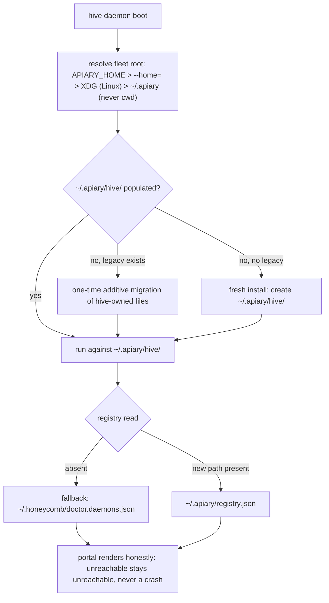

# PRD-010: Migrate hive's runtime state to the neutral fleet root `~/.apiary/hive/`

> **Status:** Completed
> **Priority:** P1
> **Effort:** L
> **Schema changes:** None (no Deeplake change; this PRD relocates hive's local on-disk runtime state and its doctor-registry coordination paths)
> **Implements:** [`ADR-0005-fleet-directory-ownership-and-neutral-state-root`](../../../knowledge/private/architecture/ADR-0005-fleet-directory-ownership-and-neutral-state-root.md) (mirror of superproject ADR-0003), hive's slice of the four-repo migration

---

## Overview

PRD-010 implements hive's slice of fleet ADR-0003 (mirrored locally as [`ADR-0005`](../../../knowledge/private/architecture/ADR-0005-fleet-directory-ownership-and-neutral-state-root.md)): hive's on-disk runtime state moves out of the legacy shared `~/.honeycomb` directory into its own per-product subdirectory `~/.apiary/hive/` under the brand-neutral fleet root `~/.apiary/`, and hive's participation in the fleet-shared coordination surface (doctor's registry, the shared install-id) follows those files to their new fleet-root locations.

The decisions are locked (user-approved 2026-07-04): the fleet root is `~/.apiary/` (confirmed over the `~/.doctor` alternative); each product owns exactly one subdirectory (`~/.apiary/hive/` for hive); the fleet-shared coordination surface (`~/.apiary/registry.json`, `device.json`, `install-id`) is doctor-managed (hive writes its own registry entry there but does not own the file); and `~/.deeplake/` does not move.

Today every piece of hive state hangs off one constant: `HONEYCOMB_HOME_DIR = join(homedir(), ".honeycomb")` (`src/shared/constants.ts:20`). The full inventory this PRD migrates:

| Legacy path | New path | Defined at |
|---|---|---|
| `~/.honeycomb/hive.pid` | `~/.apiary/hive/hive.pid` | `src/shared/constants.ts:21` (`HIVE_PID_PATH`), consumed by `src/lock.ts:20-25` |
| `~/.honeycomb/hive.lock` | `~/.apiary/hive/hive.lock` | `src/shared/constants.ts:22` (`HIVE_LOCK_PATH`), consumed by `src/lock.ts:20-25` |
| `~/.honeycomb/hive/` (state dir: `install-id`, `telemetry.json`, onboarding session ledger) | `~/.apiary/hive/` | `src/telemetry/emit.ts:96` (`HIVE_STATE_DIR`), `src/telemetry/onboarding-session-ledger.ts:98` |
| `~/.honeycomb/hive/onboarding-token` | `~/.apiary/hive/onboarding-token` | `src/daemon/installer/config.ts:29` (`ONBOARDING_TOKEN_PATH`); contract doc at `src/daemon/installer/token.ts:4` |
| `~/.honeycomb/hive/hive-task.xml` (staged Windows task unit) | `~/.apiary/hive/hive-task.xml` | `src/service/index.ts:101-103` (`stagedWindowsTaskPath`) |
| `${home}/.honeycomb/hive/launchd.out.log`, `launchd.err.log` | `${home}/.apiary/hive/launchd.out.log`, `launchd.err.log` | `src/service/templates.ts:46,48` (`renderLaunchdPlist`) |
| `~/.honeycomb/doctor.daemons.json` (write side: hive's own registry entry) | `~/.apiary/registry.json` (doctor-owned; hive upserts its entry) | `src/install/registry.ts:6` (`DOCTOR_REGISTRY_PATH`), writer at `src/install/registry.ts:121-152` |
| `~/.honeycomb/doctor.daemons.json` (read side: daemon-base + service-name resolution) | `~/.apiary/registry.json` with legacy fallback | `src/daemon/registry.ts:8` (second `DOCTOR_REGISTRY_PATH`), readers at `src/daemon/registry.ts:113-134` |
| `"~/.honeycomb/hive.pid"` (literal tilde string written INTO hive's registry entry for doctor's watchdog) | `"~/.apiary/hive/hive.pid"` | `src/install/registry.ts:10` (`HIVE_REGISTRY_PID_PATH`) |
| `~/.honeycomb/install-id` (shared, read-only for funnel correlation) | `~/.apiary/install-id` (doctor/installer-managed; hive keeps a legacy fallback read) | `src/telemetry/emit.ts:102` (`SHARED_INSTALL_ID_PATH`), read at `src/telemetry/emit.ts:275-282` |

What does NOT move: `~/.deeplake/` (credentials and the folder-binding `projects.json` are a Deeplake-family surface; hive never touches them directly, it reads auth state only through the proxied honeycomb `/setup/state`, `src/daemon/setup-auth.ts:53`), and per-project committed `.honeycomb/` folders inside user repos (the shared family format; hive has no code path that reads them). hive also reads no `device.json` today (no reference anywhere in `src/`); if a future telemetry surface needs the device id, it reads the doctor-managed `~/.apiary/device.json` with a legacy fallback, and this PRD introduces no such read.

hive is the always-on portal, so this migration has one obligation the workload daemons do not: the dashboard must stay honest through a mid-migration window in which sibling products (doctor, honeycomb, nectar) may be mid-move themselves. hive's existing posture already fail-softs an unreachable supervisor (`UNREACHABLE_RESPONSE`, `src/daemon/fleet-status.ts:16-19`) and a missing/corrupt registry (`resolveDaemonBases` falls back to documented loopback defaults, `src/daemon/registry.ts:124-134`); PRD-010 extends that same posture across the path window, never a crash and never fake health.

---

## Features

| Sub-PRD | Scope | Status |
|---|---|---|
| [`prd-010a-shared-root-helper-and-path-constants`](./prd-010a-shared-root-helper-and-path-constants.md) | The fleet-root resolution helper (the ADR precedence chain, home-anchored, never cwd) and the rewiring of every hive path constant onto it: pid/lock, state dir, onboarding token, staged Windows task unit, launchd log paths | Draft |
| [`prd-010b-first-boot-migration-and-legacy-fallback`](./prd-010b-first-boot-migration-and-legacy-fallback.md) | The one-time, idempotent, additive first-boot migration of hive-owned files, pid/lock continuity across the upgrade boot, and the legacy-fallback reads (shared install-id, onboarding token) that hold until the fleet finishes migrating | Draft |
| [`prd-010c-registry-coordination-and-portal-honesty`](./prd-010c-registry-coordination-and-portal-honesty.md) | hive's registry-entry write into the doctor-owned `~/.apiary/registry.json` (coordinated with doctor's parallel PRD and its compatibility window), dual-location registry reads, and the mid-migration dashboard honesty requirements | Draft |

---

## Goals

- Every hive-owned runtime file lives under `~/.apiary/hive/`, resolved through one root helper implementing the canonical `resolveFleetRoot` chain in the fleet ADR's "Resolved decisions" (confirmed 2026-07-04): `APIARY_HOME` env (the installer's `--home=` pin is delivered as `APIARY_HOME` in the service environment), then `$XDG_STATE_HOME/apiary` on Linux only when `$XDG_STATE_HOME` is explicitly set, then `<os.homedir()>/.apiary`. There is no `~/.local/state` default. Never `process.cwd()`.
- First boot after upgrade performs a one-time, idempotent, additive migration: legacy hive files move into the new layout; a legacy file that fails to migrate is never deleted.
- pid/lock continuity holds across the upgrade boot: the running daemon's single-instance guarantee (`src/lock.ts:50-90`) is never violated during the path move, and doctor's watchdog never kill-loops hive because the registry `pidPath` and the actual pid file disagree.
- hive's registry entry lands in `~/.apiary/registry.json` per doctor's compatibility window; hive reads the registry at the new path with a legacy fallback so a partially-migrated fleet keeps resolving daemon bases and service names.
- The shared install-id read follows the fleet root (`~/.apiary/install-id`) with a legacy fallback read at `~/.honeycomb/install-id`, preserving funnel correlation for existing installs.
- The dashboard renders honestly during the mid-migration window: sources unreachable or paths mid-move degrade fail-soft exactly as hive's existing unreachable-source posture does today (`src/daemon/fleet-status.ts:16-19`, `src/daemon/registry.ts:124-134`); no crash, no fabricated health, no redirect loop.
- `~/.deeplake/` and per-project committed `.honeycomb/` folders are untouched.

## Non-Goals

- **Relocating the fleet-shared coordination surface itself.** `~/.apiary/registry.json`, `device.json`, and `install-id` are doctor-managed; doctor's parallel PRD owns creating, migrating, and formatting them. hive only upserts its own registry entry and performs read-only fallback reads.
- **Migrating other products' state.** honeycomb, nectar, and doctor each migrate their own subdirectories in their own parallel PRDs. Where hive's installer service (`src/daemon/installer/`) spawns those products' registration verbs (`src/daemon/installer/products.ts:40-42`), each product's own verb writes wherever that product's migration PRD says; hive's proxy/aggregation reads only need to tolerate both locations during the window.
- **Changing the bootstrap script.** The onboarding-token mint lives in the honeycomb repo's `install.sh` (hive PRD-009d); its write-path update is a coordination item called out in [`prd-010b`](./prd-010b-first-boot-migration-and-legacy-fallback.md), not hive implementation.
- **Renaming service units or labels.** `com.legioncode.hive`, `hive.service`, and the `hive` scheduled task (`src/service/platform.ts:11-13`) keep their names; only file paths inside rendered units change.
- **Any Deeplake data or schema change.** This is a local filesystem relocation only.
- **Removing the legacy fallback reads.** Fallback removal has its own fleet-wide criterion (all supported install paths ship the migration, per the ADR) and is deliberately out of scope here.

---

## Module acceptance criteria

- [ ] A single root helper resolves the fleet root with the exact ADR precedence (`APIARY_HOME` > `--home=` flag/config > XDG on Linux > `~/.apiary`), is anchored on `os.homedir()`, and has no code path that consults `process.cwd()`; every path constant in the inventory table above resolves through it ([`prd-010a`](./prd-010a-shared-root-helper-and-path-constants.md)).
- [ ] On first boot after upgrade with legacy state present and `~/.apiary/hive/` absent, hive migrates its owned files (state dir contents, staged task XML) into `~/.apiary/hive/`, and a second boot performs no further migration work (idempotent) ([`prd-010b`](./prd-010b-first-boot-migration-and-legacy-fallback.md)).
- [ ] No migration step deletes a legacy file it did not successfully move; a partial failure leaves the legacy file in place and the daemon still boots and serves ([`prd-010b`](./prd-010b-first-boot-migration-and-legacy-fallback.md)).
- [ ] Across the upgrade boot, exactly one hive instance can hold the lock at any moment, and doctor's watchdog observes a consistent `pidPath` (the registry entry and the actual pid file location never disagree in a way that triggers a restart loop) ([`prd-010b`](./prd-010b-first-boot-migration-and-legacy-fallback.md), [`prd-010c`](./prd-010c-registry-coordination-and-portal-honesty.md)).
- [ ] `resolveDistinctId` prefers `~/.apiary/install-id`, falls back to the legacy `~/.honeycomb/install-id`, and only then generates its own id, preserving funnel correlation for existing installs ([`prd-010b`](./prd-010b-first-boot-migration-and-legacy-fallback.md)).
- [ ] `registerHiveWithDoctor` upserts hive's entry into `~/.apiary/registry.json` per the coordination contract with doctor's parallel PRD, with the entry's `pidPath` naming the new location; registry reads (`resolveDaemonBases`, `resolveRegisteredServiceNames`) consult the new path first and fall back to the legacy path when absent ([`prd-010c`](./prd-010c-registry-coordination-and-portal-honesty.md)).
- [ ] With the fleet mid-migration (registry at either location, any sibling daemon unreachable), the portal serves: the gate still terminates on `/buzzing`, fleet status degrades to its existing `unreachable` posture, and no route crashes or fabricates health ([`prd-010c`](./prd-010c-registry-coordination-and-portal-honesty.md)).
- [ ] Freshly rendered service units reference only `~/.apiary/hive/` paths (launchd log paths, staged Windows task XML), and an already-installed unit keeps working until the next `hive install` re-render ([`prd-010a`](./prd-010a-shared-root-helper-and-path-constants.md), [`prd-010b`](./prd-010b-first-boot-migration-and-legacy-fallback.md)).
- [ ] `~/.deeplake/` is never read, written, or moved by any code this PRD touches, and no code path references per-project committed `.honeycomb/` folders ([`prd-010a`](./prd-010a-shared-root-helper-and-path-constants.md)).

---

## Open questions

- **Registry write target during the compatibility window.** RESOLVED per the fleet ADR's "Resolved decisions" registry compatibility window contract (confirmed 2026-07-04): hive writes its entry to `~/.apiary/registry.json` when the fleet root directory exists (same atomic temp-and-rename discipline as `src/install/registry.ts:137-146`), otherwise to the legacy `~/.honeycomb/doctor.daemons.json`; never dual-writes. Doctor migrates the shared file wholesale on its own first boot and its reader merges both locations during the window (new wins per daemon `name`, legacy-only entries merge additively).
- **Root-helper distribution (DEFAULT - confirm before implementation).** Default: hive mirrors the shared root helper as its own `src/shared/` module (matching the fleet's mirror-not-import posture; hive imports no sibling repo at runtime). If the fleet instead ships the helper as a published package, hive adopts it and deletes the mirror.
- **`--home=` surface on hive (DEFAULT - confirm before implementation).** Default: hive honors `APIARY_HOME` everywhere, and accepts `--home=` only on `hive install` (where the installer pins the resolved root into the rendered unit for the Windows LocalSystem enterprise opt-in edge described in the ADR); the plain `hive start` path resolves from env/XDG/home only.
- **Onboarding-token window.** The token is minted by the bootstrap (honeycomb repo, PRD-009d contract, `src/daemon/installer/token.ts:4-11`). Until the bootstrap ships its own path update, a new hive reading only the new path would reject a token written to the legacy path. [`prd-010b`](./prd-010b-first-boot-migration-and-legacy-fallback.md) requires a dual-location token read during the window; confirm the bootstrap's cut-over ordering with the honeycomb-repo parallel work.
- **Legacy-fallback removal criterion.** The ADR sets the fleet-wide criterion (all supported install paths ship the migration) but no date. This PRD ships the fallbacks; their removal is a future PRD gated on that criterion.

---

## Overlap and supersession

- **Implements** hive's slice of superproject ADR-0003 ([`ADR-0005` mirror](../../../knowledge/private/architecture/ADR-0005-fleet-directory-ownership-and-neutral-state-root.md)). doctor, honeycomb, and nectar each carry a parallel PRD for their own slices; doctor's owns the shared-surface relocation (`registry.json`, `device.json`, `install-id`).
- **Touches, does not change, PRD-009's contracts.** The onboarding token path (`src/daemon/installer/config.ts:29`) and the funnel state dir (`src/daemon/installer/funnel-telemetry.ts:112`) move with `HIVE_STATE_DIR`; the token's mode-0600 lazy-read contract, the installer security mitigations, and the funnel event set are unchanged from [`prd-009`](../../in-work/prd-009-onboarding-installer/prd-009-onboarding-installer-index.md).
- **Extends the decision-#32 precedent.** hive already ships a best-effort legacy-unit migration on `hive install` (`src/service/index.ts:160-169`, `legacyUnitPath` at `src/service/platform.ts:65-74`); PRD-010's one-time state migration follows the same never-block, best-effort-cleanup discipline for a different axis (state paths instead of unit names).
- **Coordinates with doctor's registry contract** (doctor `ADR-0002-service-registration-static-registry-plus-runtime-sqlite`, referenced from the fleet ADR): the registry file's path changes; its schema and hive's one-writer-per-product entry discipline do not.

---

## Related

- [`ADR-0005-fleet-directory-ownership-and-neutral-state-root`](../../../knowledge/private/architecture/ADR-0005-fleet-directory-ownership-and-neutral-state-root.md) - the decision this PRD implements (hive-local mirror of superproject ADR-0003).
- Superproject `library/knowledge/private/architecture/ADR-0003-fleet-directory-ownership-and-neutral-state-root.md` - the authoritative fleet-wide ADR.
- `src/shared/constants.ts:20-22` - `HONEYCOMB_HOME_DIR`, `HIVE_PID_PATH`, `HIVE_LOCK_PATH`, the anchor constants this PRD rewires.
- `src/lock.ts:20-25` - `resolveLockPaths`, the pid/lock consumer whose defaults move.
- `src/install/registry.ts:6,10,121-152` - `DOCTOR_REGISTRY_PATH`, `HIVE_REGISTRY_PID_PATH`, and `registerHiveWithDoctor`, hive's registry write side.
- `src/daemon/registry.ts:8,113-134` - the registry read side (`resolveRegisteredServiceNames`, `resolveDaemonBases`) and its existing fail-soft fallback.
- `src/telemetry/emit.ts:96,102,275-301` - `HIVE_STATE_DIR`, `SHARED_INSTALL_ID_PATH`, and `resolveDistinctId`, the telemetry state surface.
- `src/telemetry/onboarding-session-ledger.ts:98` - `DEFAULT_ONBOARDING_LEDGER_DIR`, riding on `HIVE_STATE_DIR`.
- `src/daemon/installer/config.ts:29` and `src/daemon/installer/token.ts:4-11` - the onboarding token path and its bootstrap contract.
- `src/service/index.ts:101-103`, `src/service/templates.ts:46-48`, `src/service/platform.ts:35-41` - the service-unit surfaces that render `~/.honeycomb` paths today.
- `src/daemon/fleet-status.ts:16-19` - the `unreachable` fail-soft posture the mid-migration window must match.
- hive [`prd-009-onboarding-installer`](../../in-work/prd-009-onboarding-installer/prd-009-onboarding-installer-index.md) - the installer/onboarding surfaces whose state paths move with this PRD.
- Parallel PRDs (cross-repo, forthcoming or in flight): doctor (shared-surface relocation and registry migration), honeycomb, and nectar (their own per-product state migrations, including nectar's `RUNTIME_DIR_NAME` at `nectar/src/config.ts:15`).
