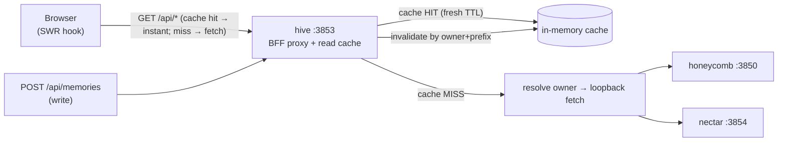

# PRD-012: Dashboard caching layer (server-side BFF proxy cache + client SWR)

> **Status:** Completed
> **Priority:** P1
> **Effort:** L
> **Schema changes:** None (no new Deeplake tables; hive holds no client. The cache is in-memory on the server and in React state on the client.)
> **Refines:** [`ADR-0002`](../../../knowledge/private/architecture/ADR-0002-server-side-bff-proxy-for-dashboard-federation.md) (the BFF proxy gains a read cache + write invalidation), hive [`prd-001c-api-aggregation-wire`](../../in-work/prd-001-hive-portal-daemon/prd-001c-api-aggregation-wire.md) (the wire layer's fetch contract), and the per-page `usePoll` recipe in `src/dashboard/web/page-frame.tsx:133`

---

## Overview

Every dashboard read today is a fresh round trip. The BFF proxy (`src/daemon/proxy.ts:105-144`) is a pure pass-through — no `Cache-Control` on `/api/*`, no ETag, no in-memory store — so each `GET /api/diagnostics/kpis` re-crosses loopback to honeycomb even if hive served the identical body 200 ms ago. The client is no better: every page mounts its own `useEffect` + `usePoll` pair and re-hydrates from scratch, and several endpoints (`harnesses`, `kpis`, `/api/logs`, fleet status) are requested independently by every consumer with no deduplication. The result is that route-switching and remounts feel slow for no data-quality reason — the data is usually identical to what was just fetched.

PRD-012 adds two complementary caching layers, designed to stack:

1. **Server-side BFF proxy cache** ([`prd-012a`](./prd-012a-bff-proxy-read-cache.md)). An in-memory TTL cache inside the proxy, keyed by `${method}:${owner}:${path}:${search}:${projectHeader}`, scoped to GET reads on the diagnostics/memories-list/graph/roi/harnesses endpoints. POST/`/recall`/SSE are hard-excluded. Writes (`POST/PUT/DELETE` on `/api/memories*`, `/api/diagnostics/*` mutators, `/api/actions/*`) bust the relevant keys by owner+path-prefix. This is the layer that removes the loopback latency the operator is actually feeling.
2. **Client-side stale-while-revalidate hook** ([`prd-012b`](./prd-012b-client-swr-hook.md)). A small (~80-line, dependency-free, "copy-and-own" per [`ADR-0001`](../../../knowledge/private/architecture/ADR-0001-retire-honeycomb-dashboard-and-copy-and-own-into-hive.md)) SWR hook that replaces the per-page `useEffect`-on-mount + `usePoll` ad-hocery for read models. It deduplicates in-flight requests, serves the cached value instantly, and revalidates in the background. This is the layer that makes "click Memories, click Dashboard, click Memories" not flash empty each time.

The two layers compose: the client SWR makes warm navigation instant, the proxy cache makes the cold refetch cheap, and the proxy's write-invalidations keep the SWR cache from going stale after a write without requiring the client to know the invalidation map.

This PRD does **not** change the data contract. Every endpoint's zod schema in `src/dashboard/web/wire.ts` is unchanged; the cache stores the raw `Response` (server) or the validated typed value (client) and returns it verbatim. Fail-soft behavior is preserved — a cache miss/stale entry degrades exactly as today (empty/zero state via the existing `.catch()` defaults), never to a throw.

---

## Goals

- A dashboard read that was served within the last few seconds is served again without re-crossing loopback to the owning daemon. The operator-perceived latency of route-switching and remounts drops to "instant for warm data, one cheap round trip for cold data."
- No dashboard page issues two concurrent requests for the same endpoint+scope; the SWR hook deduplicates in flight and shares the result.
- A write (`addMemory`, `forgetMemory`, `modifyMemory`, `compact`, `pollinate`, sync actions, `actionsEmbeddings`/`actionsMemory`/`actionsLogout`) busts the affected cache entries on both layers within the same request lifecycle, so the next read sees the new truth without a manual refresh and without a stale-flash.
- The cache is correct under the existing project-scoping header (`x-honeycomb-project`, `src/dashboard/web/wire.ts:174`) and the nectar `?project=` query (`hiveGraphProjectQuery`, `src/dashboard/web/wire.ts:182`): two projects' reads never collide in the cache.
- The fail-soft posture is unchanged: a cache miss, a stale entry, or a malformed cached body degrades to the same empty/zero state today's code already produces. The cache never introduces a throw into React or a 5xx into the proxy.
- The proxy cache honors the loopback-trust + redirect-pin guards already in place (`isLoopbackBaseUrl`, `redirect: "error"`). A cached response is never served from a non-loopback origin, and a redirect-during-the-original-fetch never enters the cache.

## Non-Goals

- **Persistent/on-disk caching.** The server cache is in-memory and per-process; a hive restart empties it. Persistence is a non-goal (the data is already authoritative in honeycomb/nectar; the cache only saves the round trip).
- **Distributed cache / multi-instance hive.** hive is single-instance by PID/lock (`src/lock.ts`); there is no second hive to coordinate with. A shared cache (Redis, etc.) is out of scope.
- **A new dependency (TanStack Query, SWR, etc.).** The client layer is hand-rolled and owned, matching the "copy-and-own, minimal deps" posture in `ADR-0001` and the existing `package.json` dependency surface (hono, react, zod only).
- **Caching POST/`/recall`/SSE.** Recall is a per-query compute; the telemetry SSE stream (`/api/telemetry/stream`) and the logs SSE tail (`/api/logs/stream`) are inherently non-cacheable streams. All three are hard-excluded.
- **Changing any wire zod schema or endpoint shape.** The cache is transparent to the contract. No endpoint adds, removes, or renames a field.
- **Optimistic writes with rollback.** Memories stays re-read-after-write (`src/dashboard/web/pages/memories.tsx:732` — "RE-READ, never optimistic"). PRD-012 makes the re-read cheap via cache invalidation, not optimistic. Optimism is a separate future PRD.
- **Caching the onboarding/setup flow.** `/setup/*` reads (`setupState`, `setupTenancy`, `setupLogin`, `setupMigrate`) are auth-flow-critical and intentionally always-fresh. They are excluded from both layers.
- **Caching hive's own routes.** `/health`, `/api/fleet-status`, `/api/registered-services`, `/api/telemetry/stream`, and `/api/onboarding/*` are hive-owned and already have their own freshness posture (`no-cache` / `no-store`); they are untouched.

---

## Sub-features

| Sub-PRD | Scope | Status |
|---|---|---|
| [`prd-012a-bff-proxy-read-cache`](./prd-012a-bff-proxy-read-cache.md) | The server-side in-memory TTL cache inside `createApiProxy`: the cache key shape, the GET-readonly + path-allowlist, the per-endpoint TTLs, write-path invalidation by owner+prefix, loopback/redirect guards, and the injectable cache seam for tests | Draft |
| [`prd-012b-client-swr-hook`](./prd-012b-client-swr-hook.md) | The client-side stale-while-revalidate hook (`useSwr` / a `SwrCache` provider), the per-endpoint `revalidateOnFocus`/`keepPreviousData`/`dedupe` behavior, mutation-driven invalidation via a shared bus, and the migration of `dashboard.tsx`/`memories.tsx`/`harnesses.tsx`/`roi.tsx` reads off the `useEffect`+`usePoll` pattern | Draft |

---

## Module acceptance criteria

- [ ] A repeated GET to a cached read endpoint (`/api/diagnostics/kpis`, `…/sessions`, `…/settings`, `…/rules`, `…/skills`, `/api/graph`, `/api/diagnostics/memory-graph`, `/api/memories` list, `/api/diagnostics/harnesses`, `/api/diagnostics/roi`, `/api/diagnostics/roi/trend`) within its TTL crosses loopback to the owning daemon **at most once**; subsequent reads are served from the proxy cache ([`prd-012a`](./prd-012a-bff-proxy-read-cache.md)).
- [ ] A write to `/api/memories*` (store/modify/forget), `/api/diagnostics/compact`, `/api/diagnostics/pollinate`, `/api/diagnostics/sync/*`, or `/api/actions/*` invalidates the affected proxy cache entries synchronously within the same request, so the immediately-following read reflects the write ([`prd-012a`](./prd-012a-bff-proxy-read-cache.md)).
- [ ] Two concurrent identical GETs (same method+owner+path+search+project header) from different page components result in exactly one loopback fetch to the owning daemon (request coalescing), both in the proxy ([`prd-012a`](./prd-012a-bff-proxy-read-cache.md)) and in the client SWR layer ([`prd-012b`](./prd-012b-client-swr-hook.md)).
- [ ] Reads scoped to two different `x-honeycomb-project` values (or two different nectar `?project=` values) never return each other's cached body — the project header/query is part of the cache key ([`prd-012a`](./prd-012a-bff-proxy-read-cache.md)).
- [ ] After PRD-012b, navigating Memories → Dashboard → Memories renders the Memories list instantly from the SWR cache on the second visit (no empty flash, no loading spinner for warm data) while a background revalidate refreshes it ([`prd-012b`](./prd-012b-client-swr-hook.md)).
- [ ] The fail-soft posture is unchanged: a proxy cache miss/stale entry and a client SWR error both degrade to the same empty/zero render today's code produces. No new throw reaches React; no new 5xx reaches the browser ([`prd-012a`](./prd-012a-bff-proxy-read-cache.md), [`prd-012b`](./prd-012b-client-swr-hook.md)).
- [ ] The telemetry SSE stream (`/api/telemetry/stream`), the logs SSE tail (`/api/logs/stream`), `/api/memories/recall` (POST), and every `/setup/*` read remain uncached and always-fresh on both layers ([`prd-012a`](./prd-012a-bff-proxy-read-cache.md), [`prd-012b`](./prd-012b-client-swr-hook.md)).
- [ ] A cached response never originates from a non-loopback base, and a response whose original fetch hit the redirect-pin (`redirect: "error"` reject) never enters the cache ([`prd-012a`](./prd-012a-bff-proxy-read-cache.md)).
- [ ] The existing `tests/daemon/proxy.test.ts` suite passes unchanged, and new tests cover cache-hit, cache-miss→fill, write-invalidation, project-scoping isolation, coalescing, and the loopback/redirect guards ([`prd-012a`](./prd-012a-bff-proxy-read-cache.md)).
- [ ] The existing page tests (`tests/dashboard/*`) pass with the SWR-migrated pages, and new tests cover dedupe, keepPreviousData, focus-revalidate, and mutation-driven invalidation ([`prd-012b`](./prd-012b-client-swr-hook.md)).

---

## Design principles (both layers)

These hold for both sub-PRDs and are the lens every implementation decision is judged against.

1. **Fail-soft, always.** A cache that cannot serve (miss, stale, malformed) degrades to the exact behavior today's code has — an empty/zero render on the client, a 502/empty on the proxy. The cache is a performance optimization, never a correctness dependency.
2. **Transparent to the contract.** No zod schema changes. No endpoint shape changes. A consumer that does not know the cache exists should observe identical data, identical types, identical fail-soft behavior.
3. **Writes invalidate; they do not pre-warm.** A write busts the affected reads; the next read refetches. The cache never speculatively populates entries it thinks a write will affect (that way lies staleness bugs).
4. **Scope is part of the key.** `x-honeycomb-project` and nectar `?project=` are load-bearing scoping dimensions today (`wire.ts:174-184`); they must be part of the cache key on both layers or two projects' data will collide.
5. **No new runtime dependencies.** hive ships hono + react + zod. The client SWR hook is hand-rolled and owned (the same posture `usePoll` and `useFleetTelemetry` already take). A future swap to TanStack Query is not precluded but is not this PRD.
6. **The cache is observable enough to debug, not to surveil.** A `X-Hive-Cache: HIT|MISS|BYPASS` response header on the proxy and an optional debug overlay on the client suffice. No metrics pipeline, no external reporting.

---

## Resolved decisions (product owner, 2026-07-06)

These were the open questions; the product owner's resolution is recorded here so the implementer does not re-litigate them.

- **TTL strategy — SHORT/AGGRESSIVE (confirmed).** 2 s for hot read models (`kpis`, `sessions`, `logs` snapshot, `harnesses`, `status`), 5 s for `graph`/`memoryGraph`/`roi`/`roiTrend`/`assets`, 30 s for `settings`/`rules`/`skills`/`secrets`/`authStatus`/scope enums. Matches the existing poll cadences (`LOG_POLL_MS`, `HARNESS_POLL_MS`, billing ~60 s on ROI) — the cache never lies longer than polling already allows. Rejected: a longer/conservative 5 s / 15 s / 60 s tier (more hits, but a write could take up to 15 s to propagate to other open pages).
- **Invalidation granularity — BROAD-PREFIX (confirmed).** A write to one memory invalidates the whole `/api/memories` family on that owner PLUS `/api/diagnostics/kpis` (the derived memory count). Simple, no risk of a stale derived value; cost is a few extra refetches after a write (cheap, since the proxy cache serves them fast). Rejected: narrow per-id invalidation (fewer refetches but must track every derived field per-write; more code, more correctness surface).
- **Cache-Control headers on proxied reads — DEFER (confirmed).** v1 ships the in-memory proxy cache + the `X-Hive-Cache: HIT|MISS|BYPASS` debug header only. The client SWR layer handles warm-navigation; the browser HTTP cache is a third layer not needed yet. A future sub-PRD may add `Cache-Control: private, max-age=2, stale-while-revalidate=10` if a full-reload remount proves worth optimizing.
- **SWR subsuming `useFleetTelemetry` — NO (confirmed).** The SWR hook covers `usePoll`-style reads only. `useFleetTelemetry` (`src/dashboard/web/use-fleet-telemetry.ts`) stays intact — it is SSE-first with a REST fallback and a reducer-based ring buffer, a different shape than a read model. One mechanism for read models, another for live tails. Revisit only if the SWR hook grows an SSE mode.

## Open questions (still unresolved)

- **`/api/logs` snapshot vs `/api/logs/stream` precision.** The snapshot (`GET /api/logs`, polled) is cacheable for 2 s; the SSE tail (`/api/logs/stream`) and paginated history (`/api/logs/history`) are not. Confirm the proxy's path-allowlist distinguishes them precisely (`/api/logs` exact vs `/api/logs/stream` and `/api/logs/history`) — a fuzzy prefix match would wrongly cache the SSE tail.
- **Background-tab behavior on re-focus.** `usePoll` already pauses ticks when `document.visibilityState === "hidden"` (`page-frame.tsx:130`). The SWR hook inherits this for its background-revalidate path (no refetches in a hidden tab) and keeps serving cached data. Confirm the desired behavior on re-focus (default: immediate revalidate, matching `usePoll`).

---

## Overlap and supersession

- **Refines** [`ADR-0002`](../../../knowledge/private/architecture/ADR-0002-server-side-bff-proxy-for-dashboard-federation.md): the BFF proxy's contract is unchanged (loopback-only, pass-through, fail-soft 502) but gains an internal read cache + write invalidation. The ADR's "hive is now on the data path for every dashboard read" consequence is partially mitigated (a cache HIT short-circuits the loopback leg).
- **Refines** hive [`prd-001c-api-aggregation-wire`](../../in-work/prd-001-hive-portal-daemon/prd-001c-api-aggregation-wire.md): the wire client's per-method shape is unchanged; the SWR hook wraps the read methods, the proxy cache wraps the fetch leg. Neither redefines the wire contract.
- **Does not supersede** [`ADR-0003-future-sse-streaming-for-dashboard-freshness`](../../../knowledge/private/architecture/ADR-0003-future-sse-streaming-for-dashboard-federation.md). SSE-based freshness for live read models (logs, fleet telemetry) remains the future direction; PRD-012's cache layers are compatible with it (SSE endpoints are hard-excluded, and a future SSE-driven model can opt out of the SWR hook the way `useFleetTelemetry` already does).
- **Leaves intact** the IRD-122 / PRD-049e scope-switching mechanics. A scope switch (org/workspace/project change) must invalidate the affected reads; default is to invalidate the whole client SWR cache on a scope change (cheap — it's all warm data anyway) and let the proxy's per-project keying handle the rest.

---

## Related

- [`ADR-0002-server-side-bff-proxy-for-dashboard-federation`](../../../knowledge/private/architecture/ADR-0002-server-side-bff-proxy-for-dashboard-federation.md) — the proxy contract both layers refine.
- [`ADR-0001-retire-honeycomb-dashboard-and-copy-and-own-into-hive`](../../../knowledge/private/architecture/ADR-0001-retire-honeycomb-dashboard-and-copy-and-own-into-hive.md) — the copy-and-own posture that drives "hand-rolled SWR, no TanStack Query."
- [`ADR-0003-future-sse-streaming-for-dashboard-freshness`](../../../knowledge/private/architecture/ADR-0003-future-sse-streaming-for-dashboard-freshness.md) — the future direction PRD-012 stays compatible with.
- `src/daemon/proxy.ts:105-144` — the proxy handler the read cache extends.
- `src/daemon/server.ts:128-183` — the route registration order the cache must respect (hive-owned routes win, then proxy).
- `src/shared/daemon-routing.ts:11-15` — `resolveEndpointOwner`, the owner dimension of the cache key.
- `src/dashboard/web/wire.ts:42-165,174-184,2295-2411` — the endpoint map, the project-header/query helpers, and the wire client methods the SWR hook wraps.
- `src/dashboard/web/page-frame.tsx:105-159` — `usePoll` and `isTabHidden`, the recipe the SWR hook replaces for read models and whose background-pause behavior it inherits.
- `src/dashboard/web/pages/dashboard.tsx:229-251` — the per-page `useEffect`+`usePoll` hydrations PRD-012b migrates.
- `src/dashboard/web/pages/memories.tsx:605-610,732` — the memories page's read-after-write pattern PRD-012a's invalidation makes cheap.
- `src/dashboard/web/use-fleet-telemetry.ts:283-395` — the SSE-first hook PRD-012b deliberately does NOT subsume.
- `src/daemon/dashboard/host.ts:142-196` — the existing `cache-control` precedents (`no-cache` shell, `max-age=3600` hashed assets, `no-store` SSE) PRD-012a's posture aligns with.
- `tests/daemon/proxy.test.ts` — the proxy suite PRD-012a extends.
- `tests/dashboard/*` — the page suites PRD-012b keeps green.
