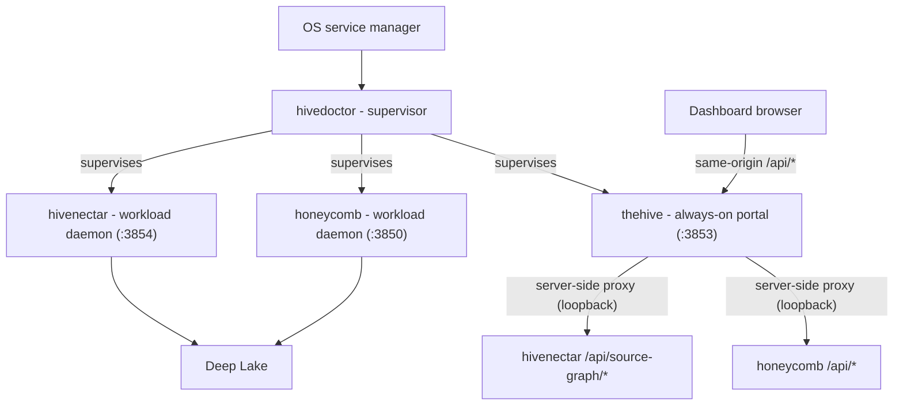

# PRD-001: thehive Portal Daemon

> **Status:** In Work
> **Priority:** P0
> **Effort:** L
> **Schema changes:** None (thehive holds no Deep Lake client; it aggregates workload daemon APIs)

---

## Overview

PRD-001 is the foundational module for **thehive**, the always-on **portal daemon** of the Apiary's three-daemon topology. thehive boots with the device, is supervised by hivedoctor like the other daemons, and serves the **unified dashboard** by aggregating each workload daemon's HTTP API rather than touching storage itself. It is the single source of always-on UI truth: the dashboard is up the moment the device boots, regardless of which workload daemon is healthy.

This module implements, as a **first-class product in the `the-hive` repository**, the four binding decisions recorded in hivenectar [`ADR-0004`](../../../../../hivenectar/library/knowledge/private/architecture/ADR-0004-thehive-portal-daemon-role-and-boundaries.md), the dashboard-migration decision in this repo's [`ADR-0001`](../../../knowledge/private/architecture/ADR-0001-retire-honeycomb-dashboard-and-copy-and-own-into-thehive.md), and the server-side federation decision in [`ADR-0002`](../../../knowledge/private/architecture/ADR-0002-server-side-bff-proxy-for-dashboard-federation.md) (with [`ADR-0003`](../../../knowledge/private/architecture/ADR-0003-future-sse-streaming-for-dashboard-freshness.md) recording the future SSE freshness direction).

It adapts (does not paste) the contract from hivenectar's [`prd-004c-thehive-portal-daemon`](../../../../../hivenectar/library/requirements/backlog/prd-004-hivedoctor-registry-and-thehive/prd-004c-thehive-portal-daemon.md) and [`prd-004d-thehive-service-unit-and-registration`](../../../../../hivenectar/library/requirements/backlog/prd-004-hivedoctor-registry-and-thehive/prd-004d-thehive-service-unit-and-registration.md). Two framings from those source PRDs are inverted here, per the two locked decisions below.

### Decision A (locked): honeycomb's dashboard is retired and moved to thehive

The source PRD-004c hedged that "honeycomb may still serve its dashboard directly" and that thehive "imports honeycomb's dashboard module rather than forking it." Both are superseded. honeycomb's `/` dashboard mount (`honeycomb/src/daemon/runtime/server.ts:108`) and its `honeycomb/src/dashboard/web/` subtree are **retired**; thehive becomes the only dashboard. honeycomb keeps its data plane (`/api/*` + `/health`) because thehive aggregates it. See [`ADR-0001`](../../../knowledge/private/architecture/ADR-0001-retire-honeycomb-dashboard-and-copy-and-own-into-thehive.md) Decision A.

### Decision B (locked): copy-and-own, not runtime import

Because thehive is a separate repository from honeycomb and honeycomb's dashboard is retired, thehive **copies** `honeycomb/src/dashboard/web/` into `the-hive` and owns it, rather than importing honeycomb's module at runtime. This is a one-time ownership transfer with source retirement, not a live fork. See [`ADR-0001`](../../../knowledge/private/architecture/ADR-0001-retire-honeycomb-dashboard-and-copy-and-own-into-thehive.md) Decision B. The file-by-file copy-map is [`prd-001b`](./prd-001b-dashboard-migration-and-copy-map.md).

### Decision C (locked): federate server-side (BFF proxy), not client-side

The source PRD-004c framed aggregation as thehive's browser `wire` fetching each workload daemon's origin directly. That is superseded. The dashboard browser talks to **thehive's origin only**; thehive's **server** proxies each `/api/*` and `/setup/*` request over loopback to the owning daemon (`the-hive/src/daemon/proxy.ts`). This removes the CORS allowance every workload daemon would otherwise owe (honeycomb's dashboard CORS middleware is deleted) and keeps the loopback-trust decision server-side. Auth is transparent pass-through; thehive stores no credential. See [`ADR-0002`](../../../knowledge/private/architecture/ADR-0002-server-side-bff-proxy-for-dashboard-federation.md); full design in [`prd-001c`](./prd-001c-api-aggregation-wire.md).

### Framing inversion (locked): first-class, not out-of-band

The source PRDs declared themselves "an out-of-band sub-PRD; it lands in the honeycomb repo, not hivenectar." In `the-hive`, thehive **is the product**. Every "out-of-band / lands in honeycomb" framing is dropped; code citations into honeycomb and hivedoctor carry a submodule prefix (`honeycomb/src/...`, `hivedoctor/src/...`).

---

## Topology

thehive holds no Deep Lake client. Every row it renders comes from a registered daemon's API, aggregated fail-soft per daemon.

---

## Features

| Sub-PRD | Scope | Status |
|---|---|---|
| [`prd-001a-thehive-process-and-bootstrap`](./prd-001a-thehive-process-and-bootstrap.md) | thehive's own OS process: Hono daemon, `/health`, single-instance PID/lock, port 3853, `startThehive` entrypoint | Draft |
| [`prd-001b-dashboard-migration-and-copy-map`](./prd-001b-dashboard-migration-and-copy-map.md) | The file-by-file copy-map from `honeycomb/src/dashboard/**` into thehive, plus honeycomb's retirement + cutover sequencing | Draft |
| [`prd-001c-api-aggregation-wire`](./prd-001c-api-aggregation-wire.md) | thehive's server-side BFF proxy: same-origin `wire`, per-daemon routing over hivedoctor's registry, fail-soft aggregation, transparent auth pass-through | Draft |
| [`prd-001d-service-unit-and-registration`](./prd-001d-service-unit-and-registration.md) | thehive's OS service unit (launchd/systemd/schtasks) + its idempotent registry entry in hivedoctor's daemon registry | Draft |

---

## Module acceptance criteria

- [ ] thehive runs as its own OS process with its own `/health`, PID/lock, and port (3853), independent of honeycomb and hivenectar (see [`prd-001a`](./prd-001a-thehive-process-and-bootstrap.md)).
- [ ] The dashboard shell renders the moment thehive's socket binds, before any workload daemon is confirmed healthy; an unanswered daemon renders as "starting," not as a broken page (ADR-0004 decision #1).
- [ ] thehive serves the same route registry and pages as the retired honeycomb dashboard, hydrating through the injected `wire` (see [`prd-001b`](./prd-001b-dashboard-migration-and-copy-map.md)).
- [ ] thehive holds no Deep Lake client; every dashboard row is fetched from the owning daemon's `/api/*` server-side (the browser is same-origin to thehive, which proxies) and aggregated fail-soft per daemon (ADR-0004 decision #2 + ADR-0002; see [`prd-001c`](./prd-001c-api-aggregation-wire.md)).
- [ ] thehive ships on its own release train: a dashboard change requires no hivedoctor, honeycomb, or hivenectar release, and hivedoctor's updates do not force a thehive redeploy (ADR-0004 decision #4).
- [ ] honeycomb's `/` dashboard mount and `web/` subtree are retired only after thehive is serving, so operators are never dashboard-less (ADR-0001 Decision A + cutover sequencing).
- [ ] thehive is supervised by hivedoctor via an idempotent registry entry, installed by thehive's own installer with no hivedoctor restart (see [`prd-001d`](./prd-001d-service-unit-and-registration.md)).

---

## Port + path contract (inherited, single source of truth)

thehive's port and paths are fixed by hivenectar's locked contract in [`prd-001b-hivenectar-process-and-health`](../../../../../hivenectar/library/requirements/backlog/prd-001-three-daemon-topology/prd-001b-hivenectar-process-and-health.md). This module cites, does not re-derive.

| Surface | Value | Status |
|---|---|---|
| thehive port | `3853` | CONFIRMED (next free after hivedoctor status page 3852; honeycomb 3850, embeddings 3851, hivenectar 3854) |
| thehive PID file | `~/.honeycomb/thehive.pid` | DEFAULT, confirm before implementation |
| thehive lock file | `~/.honeycomb/thehive.lock` | DEFAULT, confirm before implementation |
| thehive health | `GET http://127.0.0.1:3853/health` | Derived from port |
| hivedoctor registry | `~/.honeycomb/hivedoctor.daemons.json` | Owned by hivedoctor PRD-004a; thehive appends its entry |

---

## Non-Goals

- The hivedoctor daemon registry implementation (config schema, per-daemon supervisor instances). That is hivedoctor's [`prd-004a`](../../../../../hivenectar/library/requirements/backlog/prd-004-hivedoctor-registry-and-thehive/prd-004a-hivedoctor-registry-config-and-supervisor-instances.md) concern; thehive consumes it as a given and appends one entry.
- Dashboard **page content** beyond the migrated surface. New pages (for example hivenectar's Source Graph page) are their own PRDs; this module delivers the portal process, the migrated dashboard, and the aggregation seam that any new page hydrates through.
- honeycomb's non-web ViewBlock/TUI dashboard layer (`honeycomb/src/dashboard/dashboard.ts` and siblings), which powers the `honeycomb dashboard` CLI and stays in honeycomb.
- Runtime daemon registration. Registration is an install-time file edit (see [`prd-001d`](./prd-001d-service-unit-and-registration.md)).

---

## Related

- [`ADR-0001-retire-honeycomb-dashboard-and-copy-and-own-into-thehive`](../../../knowledge/private/architecture/ADR-0001-retire-honeycomb-dashboard-and-copy-and-own-into-thehive.md) - the retirement + copy-and-own decision this module implements.
- [`ADR-0002-server-side-bff-proxy-for-dashboard-federation`](../../../knowledge/private/architecture/ADR-0002-server-side-bff-proxy-for-dashboard-federation.md) - the server-side proxy federation decision (supersedes client-side federation).
- [`ADR-0003-future-sse-streaming-for-dashboard-freshness`](../../../knowledge/private/architecture/ADR-0003-future-sse-streaming-for-dashboard-freshness.md) - the future SSE freshness direction (polling stays for now).
- [hivenectar ADR-0003](../../../../../hivenectar/library/knowledge/private/architecture/ADR-0003-three-daemon-topology-and-thehive-portal.md) - the three-daemon topology.
- [hivenectar ADR-0004](../../../../../hivenectar/library/knowledge/private/architecture/ADR-0004-thehive-portal-daemon-role-and-boundaries.md) - thehive's four binding decisions.
- [hivenectar PRD-004c](../../../../../hivenectar/library/requirements/backlog/prd-004-hivedoctor-registry-and-thehive/prd-004c-thehive-portal-daemon.md) - the portal-daemon contract this module adapts.
- [hivenectar PRD-004d](../../../../../hivenectar/library/requirements/backlog/prd-004-hivedoctor-registry-and-thehive/prd-004d-thehive-service-unit-and-registration.md) - the service-unit + registration contract this module adapts.
